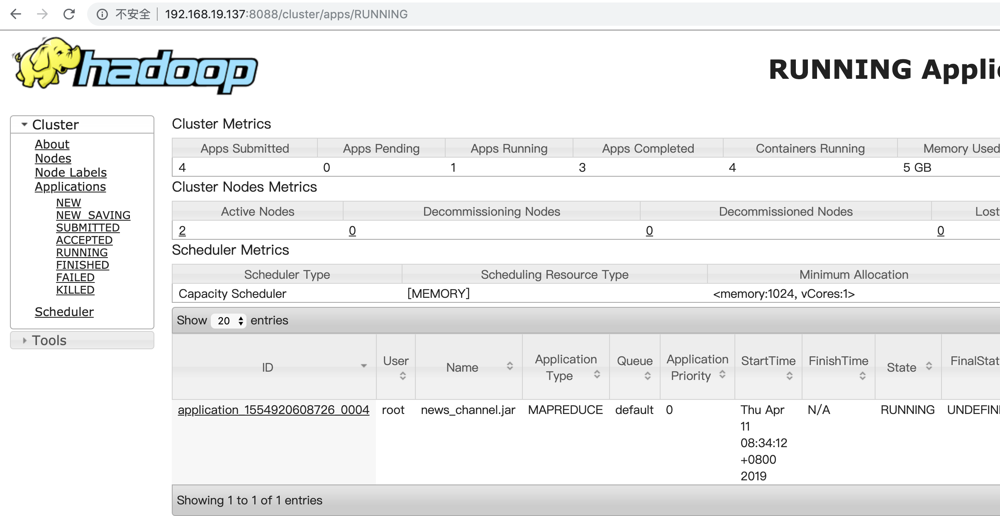
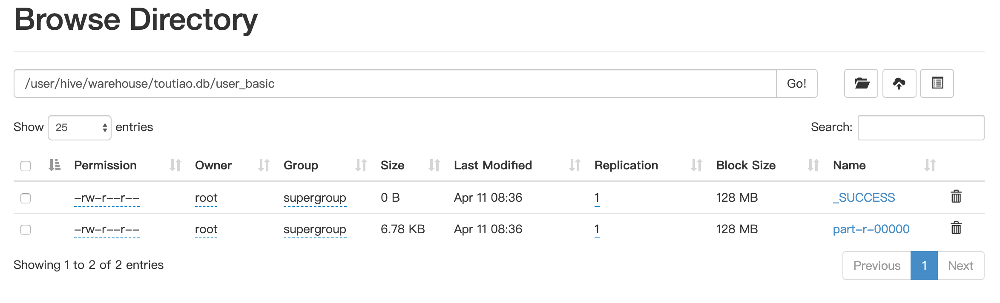

# 2.2 数据库迁移

## 学习目标

- 目标
  - 了解头条数据库迁移需求
  - 知道Sqoop导入工具的测试
  - 记忆Sqoop数据导入的增量导入形式
- 应用
  - 应用Sqoop完成头条业务数据到HIVE的导入

### 2.2.1 数据库迁移需求

业务mysql数据库中的数据，会同步到我们的hadoop的hive数据仓库中。

* 为了避免直接连接、操作业务数据
* 同步一份数据在集群中方便进行数据分析操作

```python
hive> show databases;
OK
default
profile
toutiao
Time taken: 0.017 seconds, Fetched: 3 row(s)
hive>
```

- 创建hive业务数据库toutiao

```mysql
create database if not exists toutiao comment "user,news information of 136 mysql" location '/user/hive/warehouse/toutiao.db/';
```

### 2.2.2 sqoop迁移Mysql业务数据

#### 2.2.2.1 Mysql业务数据

这里我们默认mysql业务数据库就在本地ymysql中(真实生产肯定在头条Web业务所在服务器)。

* hadoop-master
  * docker exec -it mysql bash
  * mysql -uroot -p
    * 密码：password

```python
MariaDB [toutiao]> show tables;
+------------------------------+
| Tables_in_toutiao            |
+------------------------------+
| global_announcement          |
| mis_administrator            |
| mis_administrator_group      |
| mis_group_permission         |
| mis_operation_log            |
| mis_permission               |
| news_article_basic           |
| news_article_content         |
| news_article_statistic       |
| news_attitude                |
| news_channel                 |
| news_collection              |
| news_comment                 |
| news_comment_liking          |
| news_read                    |
| news_report                  |
| news_user_channel            |
| recommend_sensitive_word     |
| statistics_basic             |
| statistics_read_source_total |
| statistics_sales_total       |
| statistics_search            |
| statistics_search_total      |
| user_basic                   |
| user_blacklist               |
| user_legalize_log            |
| user_material                |
| user_profile                 |
| user_qualification           |
| user_relation                |
| user_search                  |
+------------------------------+
```

这些数据库并不是所有都需要，我们会同步其中后面业务中会用到的5张表(文章推荐用到，如果其他分析场景可能会需要同步更多表)

增量更新业务数据库到当前hive中，获取用户的资料更新画像，更新文章

- 用户资料信息呢两张表：user_profile，user_basic
- 文章内容基本信息、频道三张表：news_article_basic，news_article_content，news_channel

用户的：

```
MariaDB [toutiao]> select * from user_profile limit 1;
+---------+--------+------------+-----------+---------------------+---------------------+---------------------+-----------+---------------+--------------+------------------+------+---------+--------+
| user_id | gender | birthday   | real_name | create_time         | update_time         | register_media_time | id_number | id_card_front | id_card_back | id_card_handheld | area | company | career |
+---------+--------+------------+-----------+---------------------+---------------------+---------------------+-----------+---------------+--------------+------------------+------+---------+--------+
|       1 |      1 | 2019-04-10 | NULL      | 2018-12-28 14:26:32 | 2019-04-10 20:02:56 | NULL                | NULL      | NULL          | NULL         | NULL             | NULL | NULL    | NULL   |
+---------+--------+------------+-----------+---------------------+---------------------+---------------------+-----------+---------------+--------------+------------------+------+---------+--------+


MariaDB [toutiao]> select * from user_basic limit 1;
+---------+-------------+----------+-----------------+------------------------------+---------------------+----------+---------------+-----------------+------------+------------+------------+-----------------+-------------+-------------+---------+-------------+--------+
| user_id | mobile      | password | user_name       | profile_photo                | last_login          | is_media | article_count | following_count | fans_count | like_count | read_count | introduction    | certificate | is_verified | account | email       | status |
+---------+-------------+----------+-----------------+------------------------------+---------------------+----------+---------------+-----------------+------------+------------+------------+-----------------+-------------+-------------+---------+-------------+--------+
|       1 | 18516952650 | NULL     | 黑马头条号      | Fob52h_THjiZ47sJAHu_-iu0TO24 | 2018-11-29 11:46:10 |        0 |         46150 |               5 |          1 |          0 |        631 | 测试头条号      |             |           1 | NULL    | 1233@qq.com |      1 |
+---------+-------------+----------+-----------------+------------------------------+---------------------+----------+---------------+-----------------+------------+------------+------------+-----------------+-------------+-------------+---------+-------------+--------+
```

文章的：

```
MariaDB [toutiao]> select * from news_article_basic limit 1;
+------------+---------+------------+-------------------------------+-------------------------+----------------+---------------------+--------+-------------+-------------+-------------+---------------+---------------+---------------------+---------------+
| article_id | user_id | channel_id | title                         | cover                   | is_advertising | create_time         | status | reviewer_id | review_time | delete_time | comment_count | allow_comment | update_time         | reject_reason |
+------------+---------+------------+-------------------------------+-------------------------+----------------+---------------------+--------+-------------+-------------+-------------+---------------+---------------+---------------------+---------------+
|          1 |       1 |         17 | Vue props用法小结
原
荐       | {"type":0, "images":[]} |              0 | 2018-11-29 15:02:17 |      2 |        NULL | NULL        | NULL        |             0 |             1 | 2019-02-18 11:08:16 | NULL          |
+------------+---------+------------+-------------------------------+-------------------------+----------------+---------------------+--------+-------------+-------------+-------------+---------------+---------------+---------------------+---------------+


MariaDB [toutiao]> select * from news_channel limit 1;
+------------+--------------+---------------------+---------------------+----------+------------+------------+
| channel_id | channel_name | create_time         | update_time         | sequence | is_visible | is_default |
+------------+--------------+---------------------+---------------------+----------+------------+------------+
|          1 | html         | 2018-11-29 13:58:53 | 2019-03-15 15:26:30 |        1 |          1 |          0 |
+------------+--------------+---------------------+---------------------+----------+------------+------------+
```

#### 2.2.2.2 Sqoop 迁移

```
sqoop list-databases --connect jdbc:mysql://192.168.19.137:3306/ --username root -P
```

会显示连接到的数据库

```python
information_schema
hive
mysql
performance_schema
sys
toutiao
```

#### 业务数据导入问题

* 问题：每天会有新的用户，文章内容更新
  * 新增的用户、文章
  * 修改的用户信息、文章信息

* 两种导入形式，我们选择增量，定期导入新数据

  * sqoop全量导入

  ```shell
  #!/bin/bash
  
  array=(user_profile user_basic news_user_channel news_channel user_follow user_blacklist user_search news_collection news_article_basic news_article_content news_read news_article_statistic user_material)
  
  for table_name in ${array[@]};
  do
      sqoop import \
          --connect jdbc:mysql://192.168.19.137/toutiao \
          --username root \
          --password password \
          --table $table_name \
          --m 5 \
          --hive-home /root/bigdata/hive \
          --hive-import \
          --create-hive-table  \
          --hive-drop-import-delims \
          --warehouse-dir /user/hive/warehouse/toutiao.db \
          --hive-table toutiao.$table_name
  done
  ```

  * sqoop增量导入

    * append：即通过指定一个递增的列，如：--incremental append  --check-column num_iid --last-value 0

    * incremental： 时间戳，比如：

      ```
      --incremental lastmodified \
      --check-column column \
      --merge-key key \
      --last-value '2012-02-01 11:0:00'
      ```

    * **就是只导入check-column的列比'2012-02-01 11:0:00'更大的数据,按照key合并**

* 导入最终结果两种形式，选择后者
  * 直接sqoop导入到hive(–incremental lastmodified模式不支持导入Hive )
  * **sqoop导入到hdfs，然后建立hive表关联**
    * --target-dir /user/hive/warehouse/toutiao.db/

#### 2.2.2.3 Sqoop 迁移案例

- 避坑指南：
  - 导入数据到hive中，需要在创建HIVE表加入 row format delimited fields terminated by ','

hadoop数据在hive中查询就全是NULL,原因： sqoop 导出的 hdfs 分片数据，都是使用逗号 `,` 分割的，由于 hive 默认的分隔符是 `/u0001`（Ctrl+A）,为了平滑迁移，需要在创建表格时指定数据的分割符号。

```python
8,false,null,null,2019-01-10 17:44:32.0,2019-01-10 17:44:32.0,null,null,null,null,null,null,null,null
9,false,null,null,2019-01-15 23:41:13.0,2019-01-15 23:41:13.0,null,null,null,null,null,null,null,null
```

hive中查询

```
NULL	NULL	NULL	NULL	NULL	NULL	NULL	NULL	NULL	NULL	NULL	NULL	NULL	NULL
NULL	NULL	NULL	NULL	NULL	NULL	NULL	NULL	NULL	NULL	NULL	NULL	NULL	NULL
NULL	NULL	NULL	NULL	NULL	NULL	NULL	NULL	NULL	NULL	NULL	NULL	NULL	NULL
```

* 1、user_profile表: 
  * 使用lastmodified模式
  * mysql数据库中更新时候update_time会修改最近时间，按照user_id合并(增量导入进去会有新的重复的数据，需要合并)
  * 指定last_time时间
* 2、user_basic表：
  * 使用lastmodified模式
  * last_login作为更新时间
  * 指定last_time时间，按照user_id合并

Mysql导入对应hive类型:

```mysql
MySQL(bigint) --> Hive(bigint) 
MySQL(tinyint) --> Hive(boolean) 
MySQL(int) --> Hive(int) 
MySQL(double) --> Hive(double) 
MySQL(bit) --> Hive(boolean) 
MySQL(varchar) --> Hive(string) 
MySQL(decimal) --> Hive(double) 
MySQL(date/timestamp) --> Hive(string)
```

```mysql
create table user_profile(
user_id BIGINT comment "userID",
gender BOOLEAN comment "gender",
birthday STRING comment "birthday",
real_name STRING comment "real_name",
create_time STRING comment "create_time",
update_time STRING comment "update_time",
register_media_time STRING comment "register_media_time",
id_number STRING comment "id_number",
id_card_front STRING comment "id_card_front",
id_card_back STRING comment "id_card_back",
id_card_handheld STRING comment "id_card_handheld",
area STRING comment "area",
company STRING comment "company",
career STRING comment "career")
COMMENT "toutiao user profile"
row format delimited fields terminated by ','
LOCATION '/user/hive/warehouse/toutiao.db/user_profile';


create table user_basic(
user_id BIGINT comment "user_id",
mobile STRING comment "mobile",
password STRING comment "password",
profile_photo STRING comment "profile_photo",
last_login STRING comment "last_login",
is_media BOOLEAN comment "is_media",
article_count BIGINT comment "article_count",
following_count BIGINT comment "following_count",
fans_count BIGINT comment "fans_count",
like_count BIGINT comment "like_count",
read_count BIGINT comment "read_count",
introduction STRING comment "introduction",
certificate STRING comment "certificate",
is_verified BOOLEAN comment "is_verified")
COMMENT "toutiao user basic"
row format delimited fields terminated by ','
LOCATION '/user/hive/warehouse/toutiao.db/user_basic';
```

导入脚本，创建一个脚本文件执行import_incremental.sh脚本：

* -m：指定同时导入的线程数量
* 连接地址以及账号密码，表、目录
* 指定要导入的时间

```shell
time=`date +"%Y-%m-%d" -d "-1day"`
declare -A check
check=([user_profile]=update_time [user_basic]=last_login [news_channel]=update_time)
declare -A merge
merge=([user_profile]=user_id [user_basic]=user_id [news_channel]=channel_id)

for k in ${!check[@]}
do
    sqoop import \
        --connect jdbc:mysql://192.168.19.137/toutiao \
        --username root \
        --password password \
        --table $k \
        --m 4 \
        --target-dir /user/hive/warehouse/toutiao.db/$k \
        --incremental lastmodified \
        --check-column ${check[$k]} \
        --merge-key ${merge[$k]} \
        --last-value ${time}
done
```

当我们运行脚本并成功时候：





* 避坑指南：
* 如果运行失败：请检查相关问题
  * 1、连接JDBC的IP 地址 或者主机名是否错误
  * 2、确认mysql数据库打开并且能够sqoop测试成功

运行一段时间完成之后，回到HIVE数据中查询，能查询到内容并且内容无误

```mysql
hive> show tables;
OK
news_article_basic
news_channel
user_basic
user_profile
Time taken: 0.647 seconds, Fetched: 4 row(s)
hive> select * from user_profile limit 1;
OK
1       false   null    null    2018-12-28 14:26:32.0   2018-12-28 14:26:32.0   null    null    null   null     null    null    null    null
Time taken: 3.516 seconds, Fetched: 1 row(s)
```

* 3、文章表导入news_article_basic，news_article_content、news_channel
* news_article_basic:
  * 按照键review_time更新
  * 合并按照article_id
  * 指定时间

```mysql
create table news_article_basic(
article_id BIGINT comment "article_id",
user_id BIGINT comment "user_id",
channel_id BIGINT comment "channel_id",
title STRING comment "title",
status BIGINT comment "status",
update_time STRING comment "update_time")
COMMENT "toutiao news_article_basic"
row format delimited fields terminated by ','
LOCATION '/user/hive/warehouse/toutiao.db/news_article_basic';
```

**原mysql数据库中某些字段的值存在一些特定的字符，如","、"\t", "\n"这些字符都会导致导入到hadoop被hive读取失败，解析时会认为另一条数据或者多一个字段**

* 解决方案：
  * 在导入时，加入—query参数，从数据库中选中对应字段，过滤相应内容，使用REPLACE、CHAR(或者CHR)进行替换字符
  * 并且mysql表中存在tinyibt,必须在connet中加入:  ?tinyInt1isBit=false
    * 防止默认到HIVE中,字段默认会被转化为boolean数据类型

导入脚本：

```mysql
# 方案：导入方式，过滤相关字符
sqoop import \
    --connect jdbc:mysql://192.168.19.137/toutiao?tinyInt1isBit=false \
    --username root \
    --password password \
    --m 4 \
    --query 'select article_id, user_id, channel_id, REPLACE(REPLACE(REPLACE(title, CHAR(13),""),CHAR(10),""), ",", " ") title, status, update_time from news_article_basic WHERE $CONDITIONS' \
    --split-by user_id \
    --target-dir /user/hive/warehouse/toutiao.db/news_article_basic \
    --incremental lastmodified \
    --check-column update_time \
    --merge-key article_id \
    --last-value ${time}
```

* 4、news_channel
  * 跟上面用户的表处理方式相同，按照update_time键更新
  * 按照channel_id合并
  * 更新时间

```mysql
create table news_channel(
channel_id BIGINT comment "channel_id",
channel_name STRING comment "channel_name",
create_time STRING comment "create_time",
update_time STRING comment "update_time",
sequence BIGINT comment "sequence",
is_visible BOOLEAN comment "is_visible",
is_default BOOLEAN comment "is_default")
COMMENT "toutiao news_channel"
row format delimited fields terminated by ','
LOCATION '/user/hive/warehouse/toutiao.db/news_channel';
```

* 5、由于news_article_content文章内容表中含有过多特殊字符，选择直接全量导入

```mysql
# 全量导入(表只是看结构，不需要在HIVE中创建，因为是直接导入HIVE，会自动创建news_article_content)
create table news_article_content(
article_id BIGINT comment "article_id",
content STRING comment "content")
COMMENT "toutiao news_article_content"
row format delimited fields terminated by ','
LOCATION '/user/hive/warehouse/toutiao.db/news_article_content';
```

直接导入到HIVE汇总，导入脚本为：

```shell
sqoop import \
    --connect jdbc:mysql://192.168.19.137/toutiao \
    --username root \
    --password password \
    --table news_article_content \
    --m 4 \
    --hive-home /root/bigdata/hive \
    --hive-import \
    --hive-drop-import-delims \
    --hive-table toutiao.news_article_content \
    --hive-overwrite
```

### 2.2.3 crontab-shell脚本定时运行

`crontab` 是用来安装、卸载或者列出定时任务列表的命令。每个用户都可以拥有自己的 crontab 文件，虽然这些文件都位于 `/var/spool/cron/` 目录中，并不需要直接编辑它们。需要通过 `crontab` 命令来编辑或者配置你自己的定时任务。

要编辑你的 crontab 文件，需要在 Linux 或 Unix 的 shell 提示符后键入以下命令：

```python
crontab -e
```

输入的格式：

```python
* * * * * 要执行的命令
----------------
| | | | |
| | | | ---- 周当中的某天 (0 - 7) (周日为 0 或 7)
| | | ------ 月份 (1 - 12)
| | -------- 一月当中的某天 (1 - 31)
| ---------- 小时 (0 - 23)
------------ 分钟 (0 - 59)

# 如
### 每隔 5 分钟运行一次 backupscript 脚本 ##
*/5 * * * * /root/backupscript.sh
### 每天的凌晨 1 点运行 backupscript 脚本 ##
0 1 * * * /root/backupscript.sh
### 每月的第一个凌晨 3:15 运行 backupscript 脚本 ##
15 3 1 * * /root/backupscript.sh
```

我们在这里可以选择定时每隔半小时增量导入一次

```
*/30 * * * * /root/toutiao_project/scripts/import_incremental.sh
```

常见服务常看调用命令

```python
crontab –e     //修改 crontab 文件，如果文件不存在会自动创建。 
crontab –l      //显示 crontab 文件。 
crontab -r      //删除 crontab 文件。
crontab -ir     //删除 crontab 文件前提醒用户。

service crond status     //查看crontab服务状态
service crond start     //启动服务 
service crond stop     //关闭服务 
service crond restart     //重启服务 
service crond reload     //重新载入配置
```

### 2.2.3 总结

* sqoop导入业务数据到hadoop操作
* 增量导入形式

