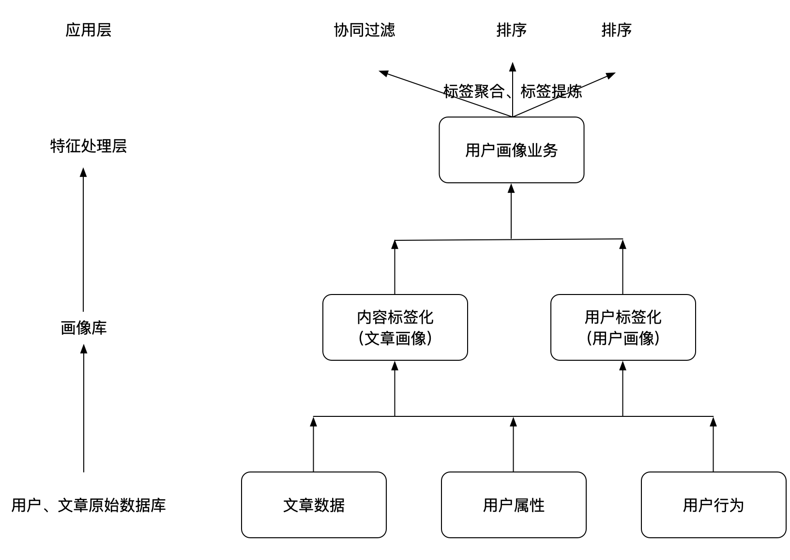

# 2.1 离线画像业务介绍

## 学习目标

- 目标
  - 了解画像的构建
- 应用
  - 无

### 2.1.2 离线画像流程

画像构建流程位置：

画像构建内容：

画像的构建作为推荐系统非常重要的环节，画像可以作为整个产品的推荐或者营销重要依据。需要通过各种方法来构建。

* **文章内容标签化：内容标签化，根据内容定性的制定一系列标签，这些标签可以是描述性标签。针对于文章就是文章相关的内容词语。**
  * 文章：频道ID内容，关键词、主题词

* 用户标签化：这个过程就是需要研究用户对内容的喜好程度，用户喜欢的内容即当作用户喜好的标签。
  * 在用户行为记录表中，我们所记下用户的行为在此时就发挥出重要的作用了。用户的浏览（时长/频率）、点击、分享/收藏/关注、其他商业化或关键信息均不同程度的代表的用户对这个内容的喜好程度。

