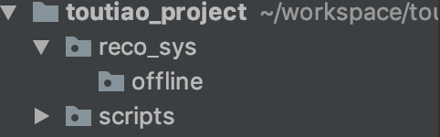
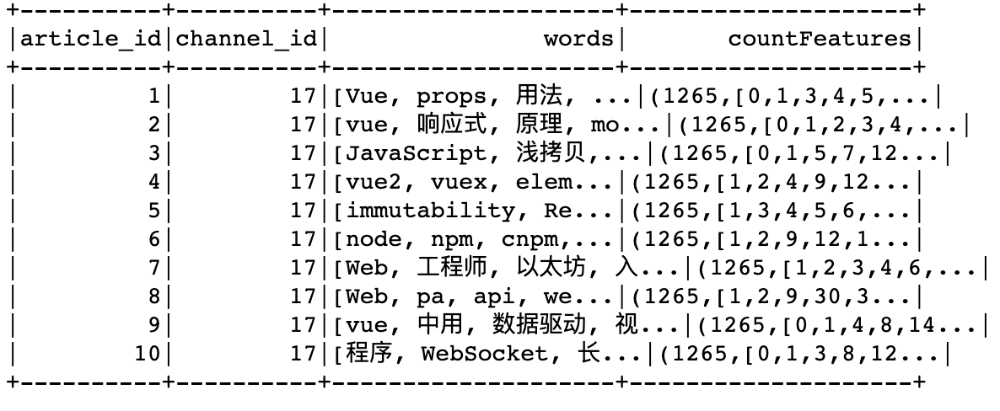
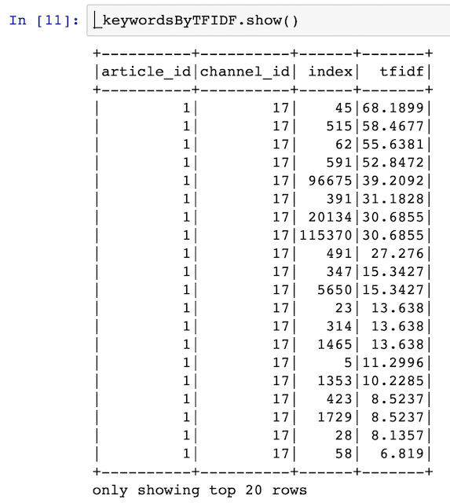
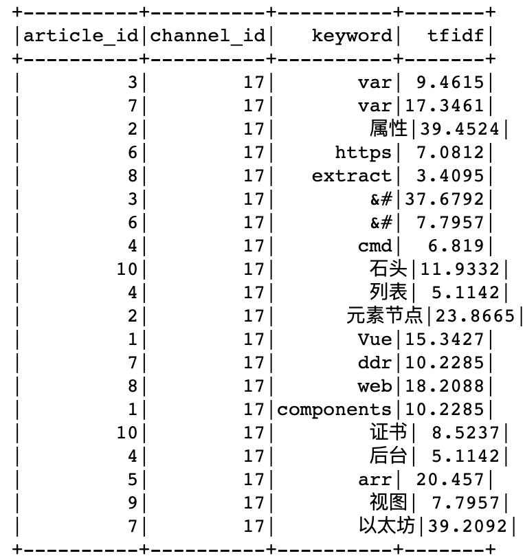
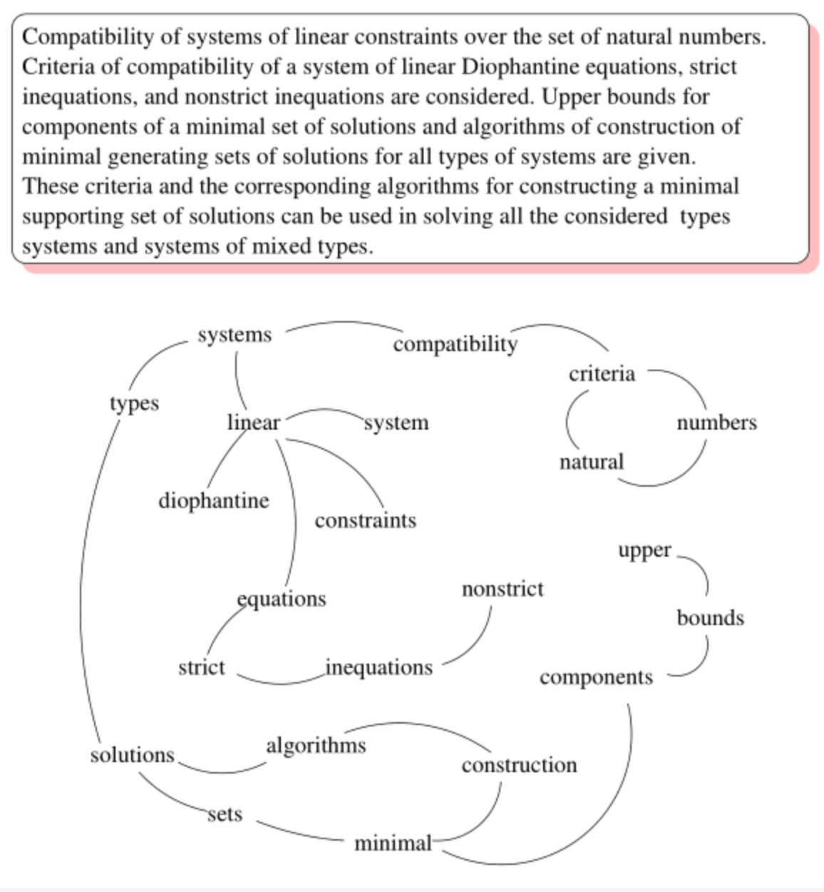

# 2.4 离线文章画像计算

## 学习目标

- 目标
  - 了解文章画像构成
  - 知道spark tfidf以及TextRank计算工具使用
  - 知道文章画像的计算和构建
- 应用
  - 应用spark完成文章Tfidf值计算
  - 应用spark完成文章TextRank值计算
  - 应用spark完成文章画像结果值计算与存储

工程目录如下



### 离线文章画像组成需求

文章画像，就是给每篇文章定义一些词。主题词与关键词最大的区别就是主题词经过了规范化处理。

关键词：文章中一些词的权重高的。主题词：是进行规范化处理的，文章中出现的同义词，计算结果出现次数高的词。

- 关键词：TEXTRANK计算出的结果TOPK个词以及权重
- 主题词：TEXTRANK的TOPK词 与 ITFDF计算的TOPK个词的交集

查看结果：

```mysql
hive> desc article_profile;
OK
article_id              int                     article_id          
channel_id              int                     channel_id          
keywords                map<string,double>      keywords            
topics                  array<string>           topics      

hive> select * from article_profile limit 1;
OK
26      17      {"策略":0.3973770571351729,"jpg":0.9806348975390871,"用户":1.2794959063944176,"strong":1.6488457985625076,"文件":0.28144603583387057,"逻辑":0.45256526469610714,"形式":0.4123994242601279,"全自":0.9594604850547191,"h2":0.6244481634710125,"版本":0.44280276959510817,"Adobe":0.8553618185108718,"安装":0.8305037437573172,"检查更新":1.8088946300014435,"产品":0.774842382276899,"下载页":1.4256311032544344,"过程":0.19827163395829256,"json":0.6423301791599972,"方式":0.582762869780791,"退出应用":1.2338671268242603,"Setup":1.004399549339134}   ["Electron","全自动","产品","版本号","安装包","检查更新","方案","版本","退出应用","逻辑","安装过程","方式","定性","新版本","Setup","静默","用户"]
Time taken: 0.322 seconds, Fetched: 1 row(s)
```

**步骤：**

**1、原始文章表数据合并得到文章所有的词语句信息**

* 文章标题+文章频道名称+文章内容组成文章完整内容

**2、所有历史文章Tfidf计算**

**3、所有历史文章TextRank计算**

### 2.4.1 原始文章数据的合并

为了方便与进行文章数据操作，将文章相关重要信息表合并在一起。通过spark sql 来进行操作

* 步骤：
  * 创建Spark初始化相关配置
  * 进行合并计算，合并结果

#### 2.4.1.1 创建Spark初始化相关配置

在\__init__文件中，创建一个经常用到的基类

* 定义好spark启动的类别，以及相关内存设置

```python
SPARK_APP_NAME = None # APP的名字
SPARK_URL = "yarn" # 启动运行方式

SPARK_EXECUTOR_MEMORY = "2g" # 执行内存
SPARK_EXECUTOR_CORES = 2 # 每个EXECUTOR能够使用的CPU core的数量
SPARK_EXECUTOR_INSTANCES = 2 # 最多能够同时启动的EXECUTOR的实例个数

ENABLE_HIVE_SUPPORT = False
```

* 创建相关配置、包，建立基类

```python
from pyspark import SparkConf
from pyspark.sql import SparkSession
import os


class SparkSessionBase(object):

    SPARK_APP_NAME = None
    SPARK_URL = "yarn"

    SPARK_EXECUTOR_MEMORY = "2g"
    SPARK_EXECUTOR_CORES = 2
    SPARK_EXECUTOR_INSTANCES = 2

    ENABLE_HIVE_SUPPORT = False

    def _create_spark_session(self):

        conf = SparkConf()  # 创建spark config对象
        config = (
            ("spark.app.name", self.SPARK_APP_NAME),  # 设置启动的spark的app名称，没有提供，将随机产生一个名称
            ("spark.executor.memory", self.SPARK_EXECUTOR_MEMORY),  # 设置该app启动时占用的内存用量，默认2g
            ("spark.master", self.SPARK_URL),  # spark master的地址
            ("spark.executor.cores", self.SPARK_EXECUTOR_CORES),  # 设置spark executor使用的CPU核心数，默认是1核心
            ("spark.executor.instances", self.SPARK_EXECUTOR_INSTANCES)
        )

        conf.setAll(config)

        # 利用config对象，创建spark session
        if self.ENABLE_HIVE_SUPPORT:
            return SparkSession.builder.config(conf=conf).enableHiveSupport().getOrCreate()
        else:
            return SparkSession.builder.config(conf=conf).getOrCreate()
```

新建一个目录，用于进行文章内容相关计算目录，创建reco_sys推荐系统相关计算主目录：下面建立离线offline以及full_cal

```python
[root@hadoop-master reco_sys]# 
[root@hadoop-master reco_sys]# tree
.
└── offline
    ├── full_cal
    └── __init__.py
```

#### 2.4.1.2 进行合并计算

由于每次调试运行spark时间较长，我们最终代码放在pycharm开发目录中，使用jupyter notebook进行开发

在项目目录开启

```
jupyter notebook --allow-root --ip=192.168.19.137
```

* 注意：本地内存不足的情况下，尽量不要同时运行多个Spark APP，否则比如查询HVIE操作会很慢，磁盘也保证足够


* 1、新建文章数据库，存储文章数据、中间计算结果以及文章画像结果

```mysql
create database if not exists article comment "artcile information" location '/user/hive/warehouse/article.db/';
```

- 1、原始文章数据合并表结构,在article数据库中
  - sentence:文章标题+内容+频道名字的合并结果

```mysql
CREATE TABLE article_data(
article_id BIGINT comment "article_id",
channel_id INT comment "channel_id", 
channel_name STRING comment "channel_name",
title STRING comment "title",
content STRING comment "content",
sentence STRING comment "sentence")
COMMENT "toutiao news_channel"
LOCATION '/user/hive/warehouse/article.db/article_data';
```

```
hive> select * from article_data limit 1;
OK
1       17      前端    Vue props用法小结原荐   <p><strong>Vue props用法详解</strong>组件接受的选项之一 props 是 Vue 中非常重要的一个选项。父子组件的关系可以总结为
```

* 3、新建merge_data.ipynb文件
  * 初始化spark信息

```python
import os
import sys
# 如果当前代码文件运行测试需要加入修改路径，避免出现后导包问题
BASE_DIR = os.path.dirname(os.path.dirname(os.getcwd()))
sys.path.insert(0, os.path.join(BASE_DIR))
PYSPARK_PYTHON = "/miniconda2/envs/reco_sys/bin/python"
# 当存在多个版本时，不指定很可能会导致出错
os.environ["PYSPARK_PYTHON"] = PYSPARK_PYTHON
os.environ["PYSPARK_DRIVER_PYTHON"] = PYSPARK_PYTHON
from offline import SparkSessionBase
```

创建合并文章类，集成sparksessionbase

```python
class OriginArticleData(SparkSessionBase):


    SPARK_APP_NAME = "mergeArticle"
    SPARK_URL = "yarn"

    ENABLE_HIVE_SUPPORT = True

		def __init__(self):
        self.spark = self._create_spark_session()
```

  * 读取文章进行处理合并

```python
oa = OriginArticleData()
oa.spark.sql("use toutiao")
# 由于运行速度原因，选择一篇文章部分数据进行测试
basic_content = oa.spark.sql(
            "select a.article_id, a.channel_id, a.title, b.content from news_article_basic a inner join news_article_content b on a.article_id=b.article_id where a.article_id=116636")
```

合并数据

```python
import pyspark.sql.functions as F
import gc

# 增加channel的名字，后面会使用
basic_content.registerTempTable("temparticle")
channel_basic_content = oa.spark.sql(
  "select t.*, n.channel_name from temparticle t left join news_channel n on t.channel_id=n.channel_id")

# 利用concat_ws方法，将多列数据合并为一个长文本内容（频道，标题以及内容合并）
oa.spark.sql("use article")
sentence_df = channel_basic_content.select("article_id", "channel_id", "channel_name", "title", "content", \
                                           F.concat_ws(
                                             ",",
                                             channel_basic_content.channel_name,
                                             channel_basic_content.title,
                                             channel_basic_content.content
                                           ).alias("sentence")
                                          )
del basic_content
del channel_basic_content
gc.collect()

# sentence_df.write.insertInto("article_data")
```

运行需要时间等待成功，如果还有其他程序运行，手动释放内存，避免不够

```python
del basic_content
del channel_basic_content
gc.collect()
```

然后执行查询，看看是否写入选定的文章

```python
hive> select * from article_data limit 1;
```

#### 上传合并完成的所有历史数据

**以上测试在少量数据上进行测试写入合并文章数据，最终我们拿之前合并的所有文章数据直接上传到hadoop上使用**

```python
hadoop dfs -put /root/bak/hadoopbak/article.db/article_data/ /user/hive/warehouse/article.db/article_data/
```

### 2.4.2 Tfidf计算

#### 2.4.2.1 目的

* 计算出每篇文章的词语的TFIDF结果用于抽取画像

#### 2.4.2.2TFIDF模型的训练步骤

* 读取N篇文章数据
* 文章数据进行分词处理,得到分词结果
* TFIDF模型训练保存，spark使用count与idf进行计算
  * TFIDF计算方案：
  * **先计算分词之后的每篇文章的词频，得到CV模型**
  * **然后根据词频计算IDF以及词，得到IDF模型**
* 利用模型计算N篇文章数据的TFIDF值

#### 2.4.2.3 实现

想要用TFIDF进行计算，需要训练一个模型保存结果

* 新建一个compute_tfidf.ipynb的文件

```python
import os
import sys
# 如果当前代码文件运行测试需要加入修改路径，避免出现后导包问题
BASE_DIR = os.path.dirname(os.path.dirname(os.getcwd()))
sys.path.insert(0, os.path.join(BASE_DIR))
PYSPARK_PYTHON = "/miniconda2/envs/reco_sys/bin/python"
# 当存在多个版本时，不指定很可能会导致出错
os.environ["PYSPARK_PYTHON"] = PYSPARK_PYTHON
os.environ["PYSPARK_DRIVER_PYTHON"] = PYSPARK_PYTHON
from offline import SparkSessionBase

class KeywordsToTfidf(SparkSessionBase):

    SPARK_APP_NAME = "keywordsByTFIDF"
    SPARK_EXECUTOR_MEMORY = "7g"

    ENABLE_HIVE_SUPPORT = True

		def __init__(self):
        self.spark = self._create_spark_session()
```

```python
ktt = KeywordsToTfidf()
```

* 读取文章原始数据

```python
ktt.spark.sql("use article")
article_dataframe = ktt.spark.sql("select * from article_data limit 20")
words_df = article_dataframe.rdd.mapPartitions(segmentation).toDF(["article_id", "channel_id", "words"])
```

* 文章数据处理函数
  * 如果分布式环境—>结巴词典，以及停用词(词典文件，三台Centos都需要上传一份，目录相同)
  * ITKeywords.txt, stopwords.txt

```
scp -r ./words/ root@192.168.19.138:/root/words/
scp -r ./words/ root@192.168.19.139:/root/words/
```

分词部分代码：

```python
# 分词
def segmentation(partition):
    import os
    import re

    import jieba
    import jieba.analyse
    import jieba.posseg as pseg
    import codecs

    abspath = "/root/words"

    # 结巴加载用户词典
    userDict_path = os.path.join(abspath, "ITKeywords.txt")
    jieba.load_userdict(userDict_path)

    # 停用词文本
    stopwords_path = os.path.join(abspath, "stopwords.txt")

    def get_stopwords_list():
        """返回stopwords列表"""
        stopwords_list = [i.strip()
                          for i in codecs.open(stopwords_path).readlines()]
        return stopwords_list

    # 所有的停用词列表
    stopwords_list = get_stopwords_list()

    # 分词
    def cut_sentence(sentence):
        """对切割之后的词语进行过滤，去除停用词，保留名词，英文和自定义词库中的词，长度大于2的词"""
        # print(sentence,"*"*100)
        # eg:[pair('今天', 't'), pair('有', 'd'), pair('雾', 'n'), pair('霾', 'g')]
        seg_list = pseg.lcut(sentence)
        seg_list = [i for i in seg_list if i.flag not in stopwords_list]
        filtered_words_list = []
        for seg in seg_list:
            # print(seg)
            if len(seg.word) <= 1:
                continue
            elif seg.flag == "eng":
                if len(seg.word) <= 2:
                    continue
                else:
                    filtered_words_list.append(seg.word)
            elif seg.flag.startswith("n"):
                filtered_words_list.append(seg.word)
            elif seg.flag in ["x", "eng"]:  # 是自定一个词语或者是英文单词
                filtered_words_list.append(seg.word)
        return filtered_words_list

    for row in partition:
        sentence = re.sub("<.*?>", "", row.sentence)    # 替换掉标签数据
        words = cut_sentence(sentence)
        yield row.article_id, row.channel_id, words
```

* 训练模型,得到每个文章词的频率Counts结果

```python
# 词语与词频统计
from pyspark.ml.feature import CountVectorizer
# 总词汇的大小，文本中必须出现的次数
cv = CountVectorizer(inputCol="words", outputCol="countFeatures", vocabSize=200*10000, minDF=1.0)
# 训练词频统计模型
cv_model = cv.fit(words_df)
cv_model.write().overwrite().save("hdfs://hadoop-master:9000/headlines/models/CV.model")
```



* 训练idf模型，保存

```python
# 词语与词频统计
from pyspark.ml.feature import CountVectorizerModel
cv_model = CountVectorizerModel.load("hdfs://hadoop-master:9000/headlines/models/CV.model")
# 得出词频向量结果
cv_result = cv_model.transform(words_df)
# 训练IDF模型
from pyspark.ml.feature import IDF
idf = IDF(inputCol="countFeatures", outputCol="idfFeatures")
idfModel = idf.fit(cv_result)
idfModel.write().overwrite().save("hdfs://hadoop-master:9000/headlines/models/IDF.model")
```

得到了两个少量文章测试的模型，以这两个模型为例子查看结果，所有不同的词

```python
cv_model.vocabulary
['this',
 'pa',
 'node',
 'data',
 '数据',
 'let',
 'keys',
 'obj',
 '组件',
 'npm',
 'child',
 '节点',
 'log',
 '属性',
 'key',
 'console',
 'value',
 'var',
 'return',
 'div']

# 每个词的逆文档频率，在历史13万文章当中是固定的值，也作为后面计算TFIDF依据
idfModel.idf.toArray()[:20]
array([0.6061358 , 0.        , 0.6061358 , 0.6061358 , 0.45198512,
       0.78845736, 1.01160091, 1.01160091, 1.01160091, 0.78845736,
       1.29928298, 1.70474809, 0.31845373, 1.01160091, 0.78845736,
       0.45198512, 0.78845736, 0.78845736, 0.45198512, 1.70474809])
```

####上传训练13万文章的模型

* 20篇文章，计算出代表20篇文章中N个词的IDF以及每个文档的词频，最终得到的是这20片文章的TFIDF

两个模型训练需要很久，所以在这里我们上传已经训练好的模型到指定路径

```shell
hadoop dfs -mkdir /headlines

hadoop dfs -mkdir /headlines/models/

hadoop dfs -put modelsbak/countVectorizerOfArticleWords.model/ /headlines/models/
hadoop dfs -put modelsbak/IDFOfArticleWords.model/ /headlines/models/
```

最终：


#### 2.4.2.3 计算N篇文章数据的TFIDF值

* 步骤：
  * 1、**获取两个模型相关参数，将所有的13万文章中的关键字对应的idf值和索引保存**
    * 为什么要保存这些值？并且存入数据库当中？
  * 2、模型计算得出N篇文章的TFIDF值选取TOPK，与IDF索引查询得到词

#####获取两个模型相关参数，将所有的关键字对应的idf值和索引保存

* 后续计算tfidf画像需要使用，避免放入内存中占用过多，持久化使用

* 建立表

```mysql
CREATE TABLE idf_keywords_values(
keyword STRING comment "article_id",
idf DOUBLE comment "idf",
index INT comment "index");
```

然后读取13万参考文档所有词语与IDF值进行计算：

```python
from pyspark.ml.feature import CountVectorizerModel
cv_model = CountVectorizerModel.load("hdfs://hadoop-master:9000/headlines/models/countVectorizerOfArticleWords.model")

from pyspark.ml.feature import IDFModel
idf_model = IDFModel.load("hdfs://hadoop-master:9000/headlines/models/IDFOfArticleWords.model")
```

进行计算保存

```python
#keywords_list_with_idf = list(zip(cv_model.vocabulary, idf_model.idf.toArray()))
#def func(data):
#	for index in range(len(data)):
#    data[index] = list(data[index])
#    data[index].append(index)
#    data[index][1] = float(data[index][1])
#func(keywords_list_with_idf)
#sc = spark.sparkContext
#rdd = sc.parallelize(keywords_list_with_idf)
#df = rdd.toDF(["keywords", "idf", "index"])

# df.write.insertInto('idf_keywords_values')
```

存储结果：

```python
hive> select * from idf_keywords_values limit 10;
OK
&#      1.417829594344155       0
pa      0.6651385256756351      1
ul      0.8070591229443697      2
代码    0.7368239176481552      3
方法    0.7506253985501485      4
数据    0.9375297590538404      5
return  1.1584986818528347      6
对象    1.2765716628665975      7
name    1.3833429138490618      8
this    1.6247297855214076      9

hive> desc idf_keywords_values;
OK
keyword                 string                  article_id          
idf                     double                  idf                 
index                   int                     index  
```

#### 模型计算得出N篇文章的TFIDF值，IDF索引结果合并得到词

对于词频处理之后的结果进行计算

保存TFIDF的结果,在article数据库中创建表

```mysql
CREATE TABLE tfidf_keywords_values(
article_id INT comment "article_id",
channel_id INT comment "channel_id",
keyword STRING comment "keyword",
tfidf DOUBLE comment "tfidf");
```

计算tfidf值进行存储

```python
from pyspark.ml.feature import CountVectorizerModel
cv_model = CountVectorizerModel.load("hdfs://hadoop-master:9000/headlines/models/countVectorizerOfArticleWords.model")
from pyspark.ml.feature import IDFModel
idf_model = IDFModel.load("hdfs://hadoop-master:9000/headlines/models/IDFOfArticleWords.model")
cv_result = cv_model.transform(words_df)
tfidf_result = idf_model.transform(cv_result)

def func(partition):
    TOPK = 20
    for row in partition:
        # 找到索引与IDF值并进行排序
        _ = list(zip(row.idfFeatures.indices, row.idfFeatures.values))
        _ = sorted(_, key=lambda x: x[1], reverse=True)
        result = _[:TOPK]
        for word_index, tfidf in result:
            yield row.article_id, row.channel_id, int(word_index), round(float(tfidf), 4)

_keywordsByTFIDF = tfidf_result.rdd.mapPartitions(func).toDF(["article_id", "channel_id", "index", "tfidf"])   
```

结果为：



**如果要保存对应words读取idf_keywords_values表结果合并**

```python
# 利用结果索引与”idf_keywords_values“合并知道词 
keywordsIndex = ktt.spark.sql("select keyword, index idx from idf_keywords_values")
# 利用结果索引与”idf_keywords_values“合并知道词
keywordsByTFIDF = _keywordsByTFIDF.join(keywordsIndex, keywordsIndex.idx == _keywordsByTFIDF.index).select(["article_id", "channel_id", "keyword", "tfidf"])
# keywordsByTFIDF.write.insertInto("tfidf_keywords_values")
```



合并之后存储到TFIDF结果表中，便于后续读取处理

```mysql
hive> desc tfidf_keywords_values;
OK
article_id              int                     article_id          
channel_id              int                     channel_id          
keyword                 string                  keyword             
tfidf                   double                  tfidf               
Time taken: 0.085 seconds, Fetched: 4 row(s)
hive> select * from tfidf_keywords_values limit 10;
OK
98319   17      var     20.6079
98323   17      var     7.4938
98326   17      var     104.9128
98344   17      var     5.6203
98359   17      var     69.3174
98360   17      var     9.3672
98392   17      var     14.9875
98393   17      var     155.4958
98406   17      var     11.2407
98419   17      var     59.9502
Time taken: 0.499 seconds, Fetched: 10 row(s)
```

### 2.4.3 TextRank提取关键词

TextRank由Mihalcea与Tarau于EMNLP在2014年提出来，其思想非常简单。关键词抽取的任务就是从一段给定的文本中自动抽取出若干有意义的词语或词组。**TextRank算法是利用局部词汇之间关系（共现窗口）对后续关键词进行排序，直接从文本本身抽取**

* 定义:通过词之间的相邻关系构建网络，然后用[PageRank](https://link.zhihu.com/?target=http%3A//www.cnblogs.com/en-heng/p/6124526.html)迭代计算每个节点的rank值，排序rank值即可得到关键词
* 方法：利用图模型来提取文章中的关键词
* 步骤：

基于TextRank的关键词提取过程步骤如下：

* 把给定的文本T按照完整句子进行分割，对于每个句子，进行分词和词性标注处理，并过滤掉停用词，只保留指定词性的单词，如名词、动词、形容词，即，其中是保留后的候选关键词。
* 构建候选关键词图G = (V,E)，其中V为节点集，上一步生成的候选关键词组成，然后采用共现关系（co-occurrence）构造任两点之间的边，两个节点之间存在边仅当它们对应的词汇在长度为K的窗口中共现，K表示窗口大小，即最多共现K个单词。根据上面公式，迭代传播各节点的权重，直至收敛。
* 对节点权重进行倒序排序，从而得到最重要的T个单词，作为候选关键词。第二部得到最重要的T个单词，在原始文本中进行标记，若形成相邻词组，则组合成多词关键词。例如，文本中有句子“Matlab code for plotting ambiguity function”，如果“Matlab”和“code”均属于候选关键词，则组合成“Matlab code”加入关键词序列。 

例如要从下面的文本中提取关键词：

> 程序员(英文Programmer)是从事程序开发、维护的专业人员。一般将程序员分为程序设计人员和程序编码人员，但两者的界限并不非常清楚，特别是在中国。软件从业人员分为初级程序员、高级程序员、系统分析员和项目经理四大类。

对这句话分词，去掉里面的停用词，然后保留词性为名词、动词、形容词、副词的单词。得出实际有用的词语：

> 程序员, 英文, 程序, 开发, 维护, 专业, 人员, 程序员, 分为, 程序, 设计, 人员, 程序, 编码, 人员, 界限, 特别, 中国, 软件, 人员, 分为, 程序员, 高级, 程序员, 系统, 分析员, 项目, 经理

现在建立一个大小为 9 的窗口，即相当于每个单词要将票投给它身前身后距离 5 以内的单词：

```
开发=[专业, 程序员, 维护, 英文, 程序, 人员]
软件=[程序员, 分为, 界限, 高级, 中国, 特别, 人员]
程序员=[开发, 软件, 分析员, 维护, 系统, 项目, 经理, 分为, 英文, 程序, 专业, 设计, 高级, 人员, 中国]
分析员=[程序员, 系统, 项目, 经理, 高级]
维护=[专业, 开发, 程序员, 分为, 英文, 程序, 人员]
系统=[程序员, 分析员, 项目, 经理, 分为, 高级]
项目=[程序员, 分析员, 系统, 经理, 高级]
经理=[程序员, 分析员, 系统, 项目]
分为=[专业, 软件, 设计, 程序员, 维护, 系统, 高级, 程序, 中国, 特别, 人员]
英文=[专业, 开发, 程序员, 维护, 程序]
程序=[专业, 开发, 设计, 程序员, 编码, 维护, 界限, 分为, 英文, 特别, 人员]
特别=[软件, 编码, 分为, 界限, 程序, 中国, 人员]
专业=[开发, 程序员, 维护, 分为, 英文, 程序, 人员]
设计=[程序员, 编码, 分为, 程序, 人员]
编码=[设计, 界限, 程序, 中国, 特别, 人员]
界限=[软件, 编码, 程序, 中国, 特别, 人员]
高级=[程序员, 软件, 分析员, 系统, 项目, 分为, 人员]
中国=[程序员, 软件, 编码, 分为, 界限, 特别, 人员]
人员=[开发, 程序员, 软件, 维护, 分为, 程序, 特别, 专业, 设计, 编码, 界限, 高级, 中国]
```

然后开始迭代投票，直至收敛：

```
程序员=1.9249977,
人员=1.6290349,
分为=1.4027836,
程序=1.4025855,
高级=0.9747374,
软件=0.93525416,
中国=0.93414587,
特别=0.93352026,
维护=0.9321688,
专业=0.9321688,
系统=0.885048,
编码=0.82671607,
界限=0.82206935,
开发=0.82074183,
分析员=0.77101076,
项目=0.77101076,
英文=0.7098714,
设计=0.6992446,
经理=0.64640945
```

可以看到“程序员”的得票数最多，因而它是整段文本最重要的单词。我们将文本中得票数多的若干单词作为该段文本的关键词，若多个关键词相邻，这些关键词还可以构成关键短语。词性：


* 关键词评分

PageRank算法：

本算法是由谷歌的两位创始人佩奇(Larry Page)和布林(Sergey Brin)参考学术界评判学术论文重要性的方法———看论文的引用次数 而提出，算法思想：

- 如果一个网页被很多其他网页链接到的话说明这个网页比较重要，也就是PageRank值会相对较高
- 如果一个PageRank值很高的网页链接到一个其他的网页，那么被链接到的网页的PageRank值会相应地因此而提高


如：



#### 2.4.3.1 文章的TextRank计算

步骤:

* 1、TextRank存储结构
* 2、TextRank过滤计算

创建textrank_keywords_values表

```mysql
CREATE TABLE textrank_keywords_values(
article_id INT comment "article_id",
channel_id INT comment "channel_id",
keyword STRING comment "keyword",
textrank DOUBLE comment "textrank");
```

进行词的处理与存储

```python
# 计算textrank
textrank_keywords_df = article_dataframe.rdd.mapPartitions(textrank).toDF(
["article_id", "channel_id", "keyword", "textrank"])

# textrank_keywords_df.write.insertInto("textrank_keywords_values")
```

分词结果：

```python
# 分词
def textrank(partition):
    import os

    import jieba
    import jieba.analyse
    import jieba.posseg as pseg
    import codecs

    abspath = "/root/words"

    # 结巴加载用户词典
    userDict_path = os.path.join(abspath, "ITKeywords.txt")
    jieba.load_userdict(userDict_path)

    # 停用词文本
    stopwords_path = os.path.join(abspath, "stopwords.txt")

    def get_stopwords_list():
        """返回stopwords列表"""
        stopwords_list = [i.strip()
                          for i in codecs.open(stopwords_path).readlines()]
        return stopwords_list

    # 所有的停用词列表
    stopwords_list = get_stopwords_list()

    class TextRank(jieba.analyse.TextRank):
        def __init__(self, window=20, word_min_len=2):
            super(TextRank, self).__init__()
            self.span = window  # 窗口大小
            self.word_min_len = word_min_len  # 单词的最小长度
            # 要保留的词性，根据jieba github ，具体参见https://github.com/baidu/lac
            self.pos_filt = frozenset(
                ('n', 'x', 'eng', 'f', 's', 't', 'nr', 'ns', 'nt', "nw", "nz", "PER", "LOC", "ORG"))

        def pairfilter(self, wp):
            """过滤条件，返回True或者False"""

            if wp.flag == "eng":
                if len(wp.word) <= 2:
                    return False

            if wp.flag in self.pos_filt and len(wp.word.strip()) >= self.word_min_len \
                    and wp.word.lower() not in stopwords_list:
                return True
    # TextRank过滤窗口大小为5，单词最小为2
    textrank_model = TextRank(window=5, word_min_len=2)
    allowPOS = ('n', "x", 'eng', 'nr', 'ns', 'nt', "nw", "nz", "c")

    for row in partition:
        tags = textrank_model.textrank(row.sentence, topK=20, withWeight=True, allowPOS=allowPOS, withFlag=False)
        for tag in tags:
            yield row.article_id, row.channel_id, tag[0], tag[1]
```

最终存储为：

```mysql
hive> select * from textrank_keywords_values limit 20;
OK
98319   17      var     20.6079
98323   17      var     7.4938
98326   17      var     104.9128
98344   17      var     5.6203
98359   17      var     69.3174
98360   17      var     9.3672
98392   17      var     14.9875
98393   17      var     155.4958
98406   17      var     11.2407
98419   17      var     59.9502
98442   17      var     18.7344
98445   17      var     37.4689
98512   17      var     29.9751
98544   17      var     5.6203
98545   17      var     22.4813
98548   17      var     71.1909
98599   17      var     11.2407
98609   17      var     18.7344
98642   17      var     67.444
98648   15      var     20.6079
Time taken: 0.344 seconds, Fetched: 20 row(s)
hive> desc textrank_keywords_values;
OK
article_id              int                     article_id          
channel_id              int                     channel_id          
keyword                 string                  keyword             
textrank                double                  textrank 
```

### 2.5.3 文章画像结果

对文章进行计算画像

- 步骤：
  - 1、加载IDF，保留关键词以及权重计算(TextRank * IDF)
  - 2、合并关键词权重到字典结果
  - 3、将tfidf和textrank共现的词作为主题词
  - 4、将主题词表和关键词表进行合并，插入表

**加载IDF，保留关键词以及权重计算(TextRank * IDF)**

```python
idf = ktt.spark.sql("select * from idf_keywords_values")
idf = idf.withColumnRenamed("keyword", "keyword1")
result = textrank_keywords_df.join(idf,textrank_keywords_df.keyword==idf.keyword1)
keywords_res = result.withColumn("weights", result.textrank * result.idf).select(["article_id", "channel_id", "keyword", "weights"])
```

**合并关键词权重到字典结果**

```python
keywords_res.registerTempTable("temptable")
merge_keywords = ktt.spark.sql("select article_id, min(channel_id) channel_id, collect_list(keyword) keywords, collect_list(weights) weights from temptable group by article_id")

# 合并关键词权重合并成字典
def _func(row):
    return row.article_id, row.channel_id, dict(zip(row.keywords, row.weights))

keywords_info = merge_keywords.rdd.map(_func).toDF(["article_id", "channel_id", "keywords"])
```

**将tfidf和textrank共现的词作为主题词**

```python
topic_sql = """
                select t.article_id article_id2, collect_set(t.keyword) topics from tfidf_keywords_values t
                inner join 
                textrank_keywords_values r
                where t.keyword=r.keyword
                group by article_id2
                """
article_topics = ktt.spark.sql(topic_sql)
```

**将主题词表和关键词表进行合并**

```python
article_profile = keywords_info.join(article_topics, keywords_info.article_id==article_topics.article_id2).select(["article_id", "channel_id", "keywords", "topics"])

# articleProfile.write.insertInto("article_profile")
```

结果显示

```python
hive> select * from article_profile limit 1;
OK
26      17      {"策略":0.3973770571351729,"jpg":0.9806348975390871,"用户":1.2794959063944176,"strong":1.6488457985625076,"文件":0.28144603583387057,"逻辑":0.45256526469610714,"形式":0.4123994242601279,"全自":0.9594604850547191,"h2":0.6244481634710125,"版本":0.44280276959510817,"Adobe":0.8553618185108718,"安装":0.8305037437573172,"检查更新":1.8088946300014435,"产品":0.774842382276899,"下载页":1.4256311032544344,"过程":0.19827163395829256,"json":0.6423301791599972,"方式":0.582762869780791,"退出应用":1.2338671268242603,"Setup":1.004399549339134}   ["Electron","全自动","产品","版本号","安装包","检查更新","方案","版本","退出应用","逻辑","安装过程","方式","定性","新版本","Setup","静默","用户"]
Time taken: 0.322 seconds, Fetched: 1 row(s)
```

