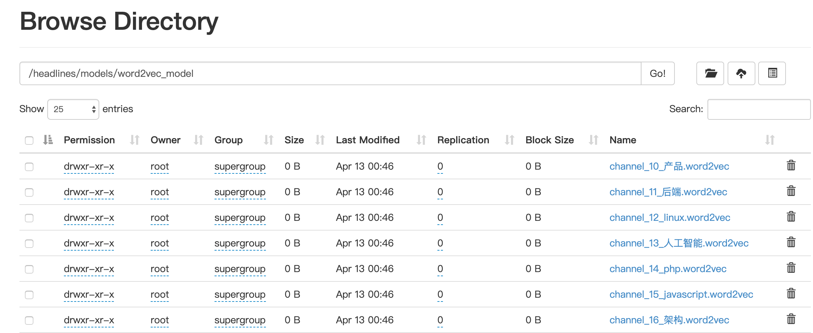
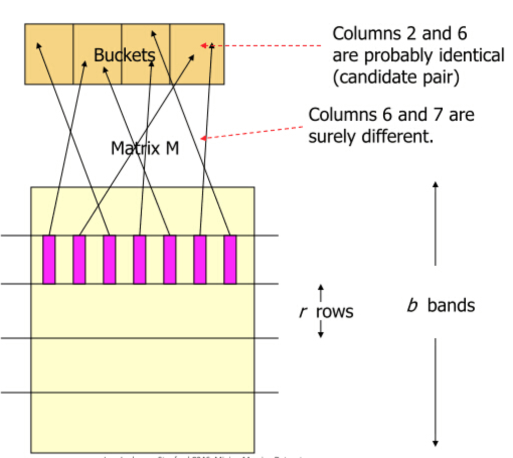

# 2.7 Word2Vec与文章相似度

## 学习目标

- 目标
  - 知道文章向量计算方式
  - 了解Word2Vec模型原理
  - 知道文章相似度计算方式
- 应用
  - 应用Spark完成文章相似度计算

### 2.7.1 文章相似度

* 在我们的黑马头条推荐中有很多地方需要推荐相似文章，包括首页频道可以推荐相似的文章，详情页猜你喜欢

* 需求
  * 首页频道推荐：每个频道推荐的时候，会通过计算两两文章相似度，快速达到在线推荐的效果，比如用户点击文章，我们可以将离线计算好相似度的文章排序快速推荐给该用户。此方式也就可以解决冷启动的问题
* 方式：
  * 1、计算两两文章TFIDF之间的相似度
  * 2、计算两两文章的word2vec或者doc2vec向量相似度

我们采用第二种方式，实践中word2vec在大量数据下达到的效果更好。

### 2.7.3 文章词向量训练

* 目的：通过大量历史文章数据，训练词的词向量

由于文章数据过多，在开始设计的时候我们会**分频道进行词向量训练，每个频道一个词向量模型。**

* 步骤：
  * 1、根据频道内容，读取不同频道号，获取相应频道数据并进行分词
  * 3、Spark Word2Vec训练保存模型

**根据频道内容，读取不同频道号，获取相应频道数据**

在setting目录汇总创建一个default.py文件，保存默认一些配置，如频道

```python
channelInfo = {
            1: "html",
            2: "开发者资讯",
            3: "ios",
            4: "c++",
            5: "android",
            6: "css",
            7: "数据库",
            8: "区块链",
            9: "go",
            10: "产品",
            11: "后端",
            12: "linux",
            13: "人工智能",
            14: "php",
            15: "javascript",
            16: "架构",
            17: "前端",
            18: "python",
            19: "java",
            20: "算法",
            21: "面试",
            22: "科技动态",
            23: "js",
            24: "设计",
            25: "数码产品",
        }
```

创建word2vec.ipynb文件，用来训练模型：

```python
import os
import sys
# 如果当前代码文件运行测试需要加入修改路径，避免出现后导包问题
BASE_DIR = os.path.dirname(os.path.dirname(os.getcwd()))
sys.path.insert(0, os.path.join(BASE_DIR))

PYSPARK_PYTHON = "/miniconda2/envs/reco_sys/bin/python"
# 当存在多个版本时，不指定很可能会导致出错
os.environ["PYSPARK_PYTHON"] = PYSPARK_PYTHON
os.environ["PYSPARK_DRIVER_PYTHON"] = PYSPARK_PYTHON

from offline import SparkSessionBase
from setting.default import channelInfo
from pyspark.ml.feature import Word2Vec


class TrainWord2VecModel(SparkSessionBase):

    SPARK_APP_NAME = "Word2Vec"
    SPARK_URL = "yarn"
    
    ENABLE_HIVE_SUPPORT = True

    def __init__(self):
        self.spark = self._create_spark_session()


w2v = TrainWord2VecModel()
```

获取数据并分词处理，注意分词函数导入(这里只选取了18号频道部分数据进行测试)

```python
# 这里训练一个频道模型演示即可
w2v.spark.sql("use article")
article = w2v.spark.sql("select * from article_data where channel_id=18 limit 2")
words_df = article.rdd.mapPartitions(segmentation).toDF(['article_id', 'channel_id', 'words'])
```

**Spark Word2Vec训练保存模型**

* 模块：from pyspark.ml.feature import Word2Vec
* API：class pyspark.ml.feature.Word2Vec(vectorSize=100, minCount=5, numPartitions=1, stepSize=0.025, maxIter=1, seed=None, inputCol=None, outputCol=None, windowSize=5, maxSentenceLength=1000)
  * vectorSize=100: 词向量长度
  * *minCount*：过滤次数小于默认5次的词
  * windowSize=5：训练时候的窗口大小
  * inputCol=None：输入列名
  * outputCol=None：输出列名

```python
new_word2Vec = Word2Vec(vectorSize=100, inputCol="words", outputCol="model", minCount=3)
new_model = new_word2Vec.fit(words_df)
new_model.save("hdfs://hadoop-master:9000/headlines/models/test.word2vec")
```

#### 上传历史数据训练的模型

在本地准备了训练一段时间每个频道的模型

```
hadoop dfs -put ./word2vec_model /headlines/models/
```



### 2.7.4 增量更新-文章向量计算

有了词向量之后，我们就可以得到一篇文章的向量了，**为了后面快速使用文章的向量，我们会将每个频道所有的文章向量保存起来。**

* 目的：保存所有历史训练的文章向量
* 步骤：
  * 1、加载某个频道模型，得到每个词的向量
  * 2、获取频道的文章画像，得到文章画像的关键词(接着之前增量更新的文章article_profile)
  * 3、计算得到文章每个词的向量
  * 4、计算得到文章的平均词向量即文章的向量

**加载某个频道模型，得到每个词的向量**

```python
from pyspark.ml.feature import Word2VecModel
channel_id = 18
channel = "python"
wv_model = Word2VecModel.load(
                "hdfs://hadoop-master:9000/headlines/models/word2vec_model/channel_%d_%s.word2vec" % (channel_id, channel))
vectors = wv_model.getVectors()
```

**获取新增的文章画像，得到文章画像的关键词**

可以选取小部分数据来进行测试

```python
# 选出新增的文章的画像做测试，上节计算的画像中有不同频道的，我们选取Python频道的进行计算测试
# 新增的文章画像获取部分
profile = w2v.spark.sql("select * from article_profile where channel_id=18 limit 10")
# profile = articleProfile.filter('channel_id = {}'.format(channel_id))

profile.registerTempTable("incremental")
articleKeywordsWeights = w2v.spark.sql(
                "select article_id, channel_id, keyword, weight from incremental LATERAL VIEW explode(keywords) AS keyword, weight")
_article_profile = articleKeywordsWeights.join(vectors, vectors.word==articleKeywordsWeights.keyword, "inner")
```

**计算得到文章每个词的向量**

* 这里用加入词的权重 * 词的向量 = weights x vector=new_vector，得到一个词的向量(包含了word2vec以及weights的结果)

```python
articleKeywordVectors = _article_profile.rdd.map(lambda row: (row.article_id, row.channel_id, row.keyword, row.weight * row.vector)).toDF(["article_id", "channel_id", "keyword", "weightingVector"])
```

**计算得到文章的平均词向量即文章的向量**

```python
def avg(row):
    x = 0
    for v in row.vectors:
        x += v
    #  将平均向量作为article的向量
    return row.article_id, row.channel_id, x / len(row.vectors)

articleKeywordVectors.registerTempTable("tempTable")
articleVector = w2v.spark.sql(
    "select article_id, min(channel_id) channel_id, collect_set(weightingVector) vectors from tempTable group by article_id").rdd.map(
    avg).toDF(["article_id", "channel_id", "articleVector"])
```

**对计算出的”articleVector“列进行处理，该列为Vector类型，不能直接存入HIVE，HIVE不支持该数据类型**

```python
def toArray(row):
    return row.article_id, row.channel_id, [float(i) for i in row.articleVector.toArray()]
    
articleVector = articleVector.rdd.map(toArray).toDF(['article_id', 'channel_id', 'articleVector'])
```

最终计算出这个18号Python频道的所有文章向量，保存到固定的表当中

* 创建文章向量表

```mysql
CREATE TABLE article_vector(
article_id INT comment "article_id",
channel_id INT comment "channel_id",
articlevector ARRAY<DOUBLE> comment "keyword");
```

保存数据到HIVE

```python
# articleVector.write.insertInto("article_vector")
```

#### 上传计算好的历史文章向量

```python
hadoop dfs -put ./article_vector /user/hive/warehouse/article.db/
```

### 2.7.5 文章相似度计算

* 目的：计算每个频道两两文章的相似度，并保存

* 分析问题：
  * 1、是否需要某频道计算所有文章两两相似度？
  * 2、相似度结果数值如何保存？

#### 2.7.4.1 问题1

我们在推荐相似文章的时候，其实并不会用到所有文章，也就是TOPK个相似文章会被推荐出去，经过排序之后的结果。如果我们的设备资源、时间也真充足的话，可以进行某频道全量所有的两两相似度计算。但是事实当文章量达到千万级别或者上亿级别，特征也会上亿级别，计算量就会很大。一下有两种类型解决方案

#### 每个频道的文章先进行聚类

可以对每个频道内N个文章聚成M类别，那么类别数越多每个类别的文章数量越少。如下pyspark代码

```python
bkmeans = BisectingKMeans(k=100, minDivisibleClusterSize=50, featuresCol="articleVector", predictionCol='group')
            bkmeans_model = bkmeans.fit(articleVector)
            bkmeans_model.save(
                "hdfs://hadoop-master:9000/headlines/models/articleBisKmeans/channel_%d_%s.bkmeans" % (channel_id, channel))
```

但是对于每个频道聚成多少类别这个M是超参数，并且聚类算法的时间复杂度并不小，当然可以使用一些优化的聚类算法二分、层次聚类。

#### 局部敏感哈希LSH(Locality Sensitive Hashing)

从海量数据库中寻找到与查询数据相似的数据是一个很关键的问题。比如在图片检索领域，需要找到与查询图像相似的图，文本搜索领域都会遇到。如果是低维的小数据集，我们通过线性查找（Linear Search）就可以容易解决，但如果是对一个海量的高维数据集采用线性查找匹配的话，会非常耗时，因此，为了解决该问题，我们需要采用一些类似索引的技术来加快查找过程，通常这类技术称为**最近邻查找（Nearest Neighbor,AN），例如K-d tree；或近似最近邻查找（Approximate Nearest Neighbor, ANN），例如K-d tree with BBF, Randomized Kd-trees, Hierarchical K-means Tree。而LSH是ANN中的一类方法。**

* 基本思想：**LSH算法基于一个假设，如果两个文本在原有的数据空间是相似的，那么分别经过哈希函数转换以后的**它们也具有很高的相似度

经常使用的哈希函数，冲突总是难以避免。LSH却依赖于冲突，在解决NNS(Nearest neighbor search )时，我们期望：


- 离得越近的对象，发生冲突的概率越高
- 离得越远的对象，发生冲突的概率越低

总结：那么我们在该数据集合中进行近邻查找就变得容易了，我们只需要将查询数据进行哈希映射得到其桶号，然后取出该桶号对应桶内的所有数据，再进行线性匹配即可查找到与查询数据相邻的数据。

**落入相同的桶内的哈希函数需要满足以下两个条件：**

1. 如果d(O1,O2)<r1，那么Pr[h(O1)=h(O2)] ≥ p1
2. 如果d(O1,O2)>r2，那么Pr[h(O1)=h(O2)] ≤ p2

LSH在线查找时间由两个部分组成： 

（1）通过LSH hash functions计算hash值（桶号）的时间；

（2）将查询数据与桶内的数据进行比较计算的时间。第（2）部分的耗时就从O(N)变成了O(logN)或O(1)（取决于采用的索引方法）。

注：**LSH并不能保证一定能够查找到与query data point最相邻的数据，而是减少需要匹配的数据点个数的同时保证查找到最近邻的数据点的概率很大。**

**实际中常见的LSH**

#### LSH详细过程

#### mini hashing

假设我们有如下四个文档D1,D2,D3,D4D1,D2,D3,D4的集合情况,每个文档有相应的词项,用{w1,w2,..w7}{w1,w2,..w7}表示。若某个文档存在这个词项,则标为1，否则标为0。


**过程**

1、Minhash的定义为:** 特征矩阵按行进行一个随机的排列后,第一个列值为1的行的行号。


* 重复上述操作
  * 矩阵按行进行多次置换,每次置换之后统计每一列(对应的是每个文档)第一个不为0位置的行号,这样每次统计的结果能构成一个与文档数等大的向量,我们称之为**签名向量**。
  * (如果两个文档足够相似,也就是说这两个文档中有很多元素是共有的,这样置换出来的签名向量,如果原来其中有一些文档的相似度很高,那么这些文档所对应的签名向量的相应的元素值相同的概率也很高。)

初始时的矩阵叫做input matrix,由m个文档m，n个词项组成.而把由t次置换后得到的一个t×mt×m矩阵叫做signature matrix。


2、对Signature每行分割成若干brand（**一个brand若干行**）,每个band计算hash值（hash函数可以md5,sha1任意），我们需要将这些hash值做处理，使之成为事先设定好的hash桶的tag，然后把这些band“扔”进hash桶中。



两个文档一共存在b个band,这b个band都不相同的概率是，r和b影响对应的概率.

概率1−(1−s^r)^b就是最终两个文档被映射到同一个hash bucket中的概率。我们发现，这样一来，实际上可以通过控制参数r,b值来控制两个文档被映射到同一个哈希桶的概率。而且效果非常好。比如，令b=20,r=5

s∈[0,1]是这两个文档的相似度，等于给的文当前提条件下：

* 当s=0.8时，两个文档被映射到同一个哈希桶的概率是
	* Pr(LSH(O1)=LSH(O2))=1−(1−0.85)5=0.9996439421094793
* 当s=0.2时，两个文档被映射到同一个哈希桶的概率是： 
  * Pr(LSH(O1)=LSH(O2))=1−(1−0.25)5=0.0063805813047682

参数环境下的概率图：


* 相似度高于某个值的时候，到同一个桶概率会变得非常大，并且快速靠近1
* 当相似度低于某个值的时候，概率会变得非常小，并且快速靠近0

#### Random Projection

Random Projection是一种随机算法.随机投影的算法有很多，如PCA、Gaussian random projection - 高斯随机投影。

随机桶投影是用于欧几里德距离的 LSH family。**其LSH family将x特征向量映射到随机单位矢量v，并将映射结果分为哈希桶中。哈希表中的每个位置表示一个哈希桶。**

### 2.7.4.2 相似度计算

* 目的：计算18号Python频道的文章之间相似度
* 步骤：
  * 1、读取数据，进行类型处理(数组到Vector)
  * 2、BRP进行FIT

**读取数据，进行类型处理(数组到Vector)**

```python
from pyspark.ml.linalg import Vectors
# 选取部分数据做测试
article_vector = w2v.spark.sql("select article_id, articlevector from article_vector where channel_id=18 limit 10")
train = articlevector.select(['article_id', 'articleVector'])

def _array_to_vector(row):
    return row.article_id, Vectors.dense(row.articleVector)
    
train = train.rdd.map(_array_to_vector).toDF(['article_id', 'articleVector'])
```

**BRP进行FIT**

* class pyspark.ml.feature.BucketedRandomProjectionLSH(inputCol=None, outputCol=None, seed=None, numHashTables=1, bucketLength=None)
  * inputCol=None：输入特征列
  * outputCol=None：输出特征列
  * numHashTables=1：哈希表数量，几个hash function对数据进行hash操作
  * bucketLength=None：桶的数量，值越大相同数据进入到同一个桶的概率越高
  * method:
    * approxSimilarityJoin(df1, df2, 2.0, distCol='EuclideanDistance')
    * 计算df1每个文章相似的df2数据集的数据

```python
from pyspark.ml.feature import BucketedRandomProjectionLSH

brp = BucketedRandomProjectionLSH(inputCol='articleVector', outputCol='hashes', numHashTables=4.0, bucketLength=10.0)
model = brp.fit(train)
```

计算相似的文章以及相似度

```python
similar = model.approxSimilarityJoin(test, train, 2.0, distCol='EuclideanDistance')

similar.sort(['EuclideanDistance']).show()
```

### 2.7.4.3 问题3

对于计算出来的相似度，是要在推荐的时候使用。那么我们所知的是，HIVE只适合在离线分析时候使用，因为运行速度慢，所以只能将相似度存储到HBASE当中

* hbase

### 2.7.5 文章相似度存储

* 目的：将所有文章对应相似度文章及其相似度保存

* 步骤：
  * 调用foreachPartition
    * **foreachPartition不同于map和mapPartition，主要用于离线分析之后的数据落地，如果想要返回新的一个数据DF，就使用map后者。**

我们需要建立一个HBase存储文章相似度的表

```python
create 'article_similar', 'similar'

# 存储格式如下：key:为article_id, 'similar:article_id', 结果为相似度
put 'article_similar', '1', 'similar:1', 0.2
put 'article_similar', '1', 'similar:2', 0.34
put 'article_similar', '1', 'similar:3', 0.267
put 'article_similar', '1', 'similar:4', 0.56
put 'article_similar', '1', 'similar:5', 0.7
put 'article_similar', '1', 'similar:6', 0.819
put 'article_similar', '1', 'similar:8', 0.28
```

定义保存HBASE函数，确保我们的happybase连接hbase启动成功，Thrift服务打开。hbase集群出现退出等问题常见原因，配置文件hadoop目录，地址等，还有

* ntpdate 0.cn.pool.ntp.org或者ntpdate ntp1.aliyun.com
* hbase-daemon.sh start thrift

```python
def save_hbase(partition):
    import happybase
    pool = happybase.ConnectionPool(size=3, host='hadoop-master')
    
    with pool.connection() as conn:
        # 建议表的连接
        table = conn.table('article_similar')
        for row in partition:
            if row.datasetA.article_id == row.datasetB.article_id:
                pass
            else:
                table.put(str(row.datasetA.article_id).encode(),
                         {"similar:{}".format(row.datasetB.article_id).encode(): b'%0.4f' % (row.EuclideanDistance)})
        # 手动关闭所有的连接
        conn.close()

similar.foreachPartition(save_hbase)
```


