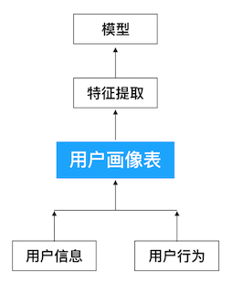
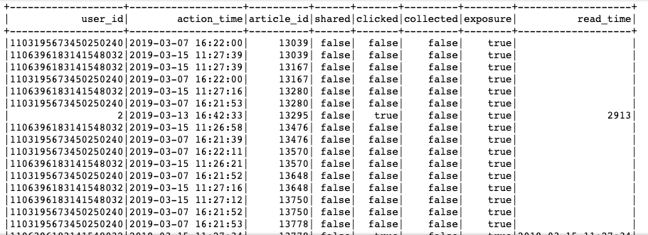

# 3.1 用户画像计算更新

## 学习目标

- 目标
  - 知道用户画像建立的流程
- 应用
  - 无

### 3.1.1 为什么要进行用户画像

要做精准推送同样可以使用多种推荐算法，例如：基于用户协同推荐、基于内容协同的推荐等其他的推荐方式，但是以上方式多是基于相似进行推荐。**而构建用户画像，不仅可以满足根据分析用户进行推荐，更可以运用在全APP所有功能上。**

建立用户画像确实是一个**一劳多得**的事情，不仅可以运用于精准推送、精准推荐、精准营销，更可以作为网站的用户属性分析，用户行为分析，商业化转化分析等。同时网站共用一套用户画像，可以对用户有统一的认知。

### 3.1.2 用户画像计算设计

#### 3.1.2.1 用户画像流程



用户画像的第一层主要是原始数据库，此数据库主要囊括后续分析所需要的所有原始数据。也是通过大量数据的分析和处理，后面能提炼成用户的画像得以运用。

* 头条画像原始数据


如数据库查询结果

```python
hive> select * from user_action limit 1;
OK
2019-03-05 10:19:40             0       {"action":"exposure","userId":"2","articleId":"[16000, 44371, 16421, 16181, 17454]","algorithmCombine":"C2"} 2019-03-05
```

对于这样的数据，我们希望处理成一个完成统计基本表格，如下



* 用户画像标签建立

用户行为原始数据，我们得到了一张庞大的行为记录表。但是想要把这个表格的内容运用起来，我们需要把用户行为更为具象化，也就是需要把用户画像构建起来。

其实用户标签并不等同于用户画像，只是用户标签是用户画像直观的呈现，并且是比较好且常用的运用方式。

构建用户标签库其实比较简单，因为我们在上述采集用户行为过程中，已经把用户喜好的内容采集下来了，所以基础标签并可以直接运用内容的标签。也就是通过用户喜欢的内容给用户贴标签。

**文章标签化**

文章标签化，即之前我们建立好的文章标签，利用这些标签给用户贴上相应标签

|       | 频道1                   | 频道2                   | 频道3                   | 频道4                   | ...  | 性别 | 年龄 |
| ----- | ----------------------- | ----------------------- | ----------------------- | ----------------------- | ---- | ---- | ---- |
| 用户1 | 标签weights,标签,标签…. | 标签weights,标签,标签…. | 标签weights,标签,标签…. | 标签weights,标签,标签…. | ...  | 1    | 10   |
| 用户2 | 标签weights,标签,标签…. | 标签weights,标签,标签…. | 标签weights,标签,标签…. | 标签weights,标签,标签…. | ...  | 1    | 20   |
| 用户3 | 标签weights,标签,标签…. | 标签weights,标签,标签…. | 标签weights,标签,标签…. | 标签weights,标签,标签…. | ...  | 0    | 30   |

