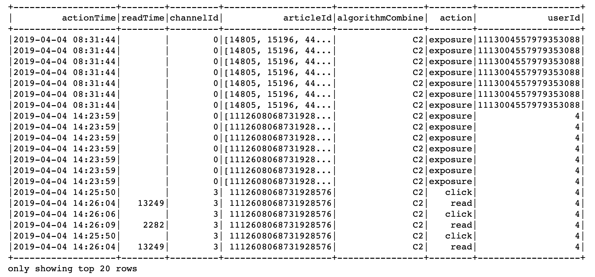
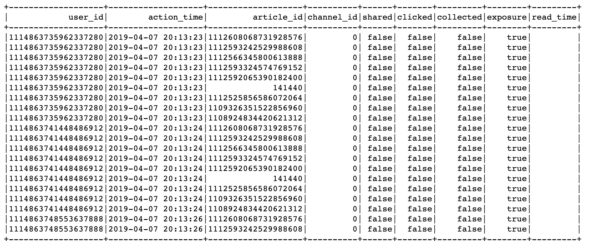
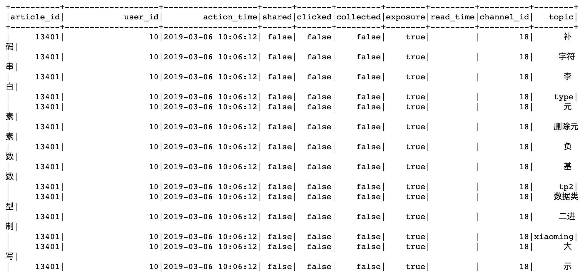

# 3.2 用户画像增量更新

## 学习目标

- 目标
  - 知道用户行为日志的处理过程
  - 知道用户画像标签权重的计算公式
  - 知道用户画像的HBase存储与Hive关联
- 应用
  - 应用Spark完成用户画像的增量定时更新

### 3.2.1 增量用户行为日志处理

这里我们对用户画像更新的频率，

* 目的：首先对用户基础行为日志进行处理过滤，解析参数，从user_action—>user_article_basic表。

日志数据分析结果:


* 步骤：
  * 1、创建HIVE基本数据表
  * 2、读取固定时间内的用户行为日志
  * 3、进行用户日志数据处理
  * 4、存储到user_article_basic表中

**1、创建HIVE基本数据表**

```mysql
create table user_article_basic(
user_id BIGINT comment "userID",
action_time STRING comment "user actions time",
article_id BIGINT comment "articleid",
channel_id INT comment "channel_id",
shared BOOLEAN comment "is shared",
clicked BOOLEAN comment "is clicked",
collected BOOLEAN comment "is collected",
exposure BOOLEAN comment "is exposured",
read_time STRING comment "reading time")
COMMENT "user_article_basic"
CLUSTERED by (user_id) into 2 buckets
STORED as textfile
LOCATION '/user/hive/warehouse/profile.db/user_article_basic';
```

**2、读取增量用户行为数据-固定时间内的用户行为日志**

```python
import os
import sys
# 如果当前代码文件运行测试需要加入修改路径，避免出现后导包问题
BASE_DIR = os.path.dirname(os.path.dirname(os.getcwd()))
sys.path.insert(0, os.path.join(BASE_DIR))

PYSPARK_PYTHON = "/miniconda2/envs/reco_sys/bin/python"
# 当存在多个版本时，不指定很可能会导致出错
os.environ["PYSPARK_PYTHON"] = PYSPARK_PYTHON
os.environ["PYSPARK_DRIVER_PYTHON"] = PYSPARK_PYTHON

from offline import SparkSessionBase
import pyhdfs
import time


class UpdateUserProfile(SparkSessionBase):
    """离线相关处理程序
    """
    SPARK_APP_NAME = "updateUser"
    ENABLE_HIVE_SUPPORT = True

    SPARK_EXECUTOR_MEMORY = "7g"

    def __init__(self):

        self.spark = self._create_spark_session()

uup = UpdateUserProfile()
```

* 关联历史日期文件

在进行日志信息的处理之前，先将我们之前建立的user_action表之间进行所有日期关联，spark hive不会自动关联

```python
# 手动关联所有日期文件
import pandas as pd
from datetime import datetime

def datelist(beginDate, endDate):
    date_list=[datetime.strftime(x,'%Y-%m-%d') for x in list(pd.date_range(start=beginDate, end=endDate))]
    return date_list

dl = datelist("2019-03-05", time.strftime("%Y-%m-%d", time.localtime()))

fs = pyhdfs.HdfsClient(hosts='hadoop-master:50070')
for d in dl:
    try:
        _localions = '/user/hive/warehouse/profile.db/user_action/' + d
        if fs.exists(_localions):
            uup.spark.sql("alter table user_action add partition (dt='%s') location '%s'" % (d, _localions))
    except Exception as e:
        # 已经关联过的异常忽略,partition与hdfs文件不直接关联
        pass
```

**读取固定时间内的用户行为日志**

每天新增的日期文件，注意都要关联一次日期文件与HIVE表

```python
# 如果hadoop没有今天该日期文件，则没有日志数据，结束
time_str = time.strftime("%Y-%m-%d", time.localtime())
_localions = '/user/hive/warehouse/profile.db/user_action/' + time_str
uup.spark.sql('use profile')
if fs.exists(_localions):
    # 如果有该文件直接关联，捕获关联重复异常
    try:
        uup.spark.sql("alter table user_action add partition (dt='%s') location '%s'" % (time_str, _localions))
    except Exception as e:
        pass
    
    sqlDF = uup.spark.sql(
"select actionTime, readTime, channelId, param.articleId, param.algorithmCombine, param.action, param.userId from user_action where dt={}".format(time_str))
else:
    pass
```

为了进行测试防止没有数据，我们选定某个时间后的行为数据

```python
sqlDF = uup.spark.sql(
"select actionTime, readTime, channelId, param.articleId, param.algorithmCombine, param.action, param.userId from user_action where dt>='2019-04-01'")	
```

**3、进行用户日志数据处理**

原始日志数据



结果:


思路：按照user_id的行为一条条处理，根据用户的行为类型判别。

* 由于sqlDF每条数据可能会返回多条结果，我们可以使用rdd.flatMap函数或者yield
  * 格式：["user_id", "action_time","article_id", "channel_id", "shared", "clicked", "collected", "exposure", "read_time"]

```python
if sqlDF.collect():
    def _compute(row):
        # 进行判断行为类型
        _list = []
        if row.action == "exposure":
            for article_id in eval(row.articleId):
                _list.append(
                    [row.userId, row.actionTime, article_id, row.channelId, False, False, False, True, row.readTime])
            return _list
        else:
            class Temp(object):
                shared = False
                clicked = False
                collected = False
                read_time = ""

            _tp = Temp()
            if row.action == "share":
                _tp.shared = True
            elif row.action == "click":
                _tp.clicked = True
            elif row.action == "collect":
                _tp.collected = True
            elif row.action == "read":
                _tp.clicked = True
            else:
                pass
            _list.append(
                [row.userId, row.actionTime, int(row.articleId), row.channelId, _tp.shared, _tp.clicked, _tp.collected,
                 True,
                 row.readTime])
            return _list
    # 进行处理
    # 查询内容，将原始日志表数据进行处理
    _res = sqlDF.rdd.flatMap(_compute)
    data = _res.toDF(["user_id", "action_time","article_id", "channel_id", "shared", "clicked", "collected", "exposure", "read_time"])
```

**4、合并历史数据，存储到user_article_basic表中**

```python
# 合并历史数据，插入表中
old = uup.spark.sql("select * from user_article_basic")
# 由于合并的结果中不是对于user_id和article_id唯一的，一个用户会对文章多种操作
new_old = old.unionAll(data)
```

* **HIVE目前支持hive终端操作ACID，不支持python的pyspark原子性操作，并且开启配置中开启原子性相关配置也不行。**

```python
new_old.registerTempTable("temptable")
# 按照用户，文章分组存放进去
uup.spark.sql(
        "insert overwrite table user_article_basic select user_id, max(action_time) as action_time, "
        "article_id, max(channel_id) as channel_id, max(shared) as shared, max(clicked) as clicked, "
        "max(collected) as collected, max(exposure) as exposure, max(read_time) as read_time from temptable "
        "group by user_id, article_id")
```

这里面需要根据用户ID和文章ID分组。



### 3.2.2 用户标签权重计算

#### 3.2.2.1 画像存储

**如何存储？**

用户画像，作为特征提供给一些算法排序，方便与快速读取使用，选择存储在Hbase当中。如果离线分析也想要使用我们可以建立HIVE到Hbase的外部表。

- 如果存到HIVE，建立HBASE关联过去，删除Hive表对HBase没有影响，但是先删除HBase表Hive就会报TableNotFoundException
- HBase中的有同样的主键的行会被更新成最新插入的。可以依靠hbase来 新增/修改单条记录， 然后利用hive这个外表来实现hbase数据统计

**HBase表设计**

```python
create 'user_profile', 'basic','partial','env'
```

示例：

```python
put 'user_profile', 'user:2', 'partial:{channel_id}:{topic}': weights

put 'user_profile', 'user:2', 'basic:{info}': value

put 'user_profile', 'user:2', 'env:{info}': value
```

**Hive关联表**

```python
create external table user_profile_hbase(
user_id STRING comment "userID",
information map<string, DOUBLE> comment "user basic information",
article_partial map<string, DOUBLE> comment "article partial",
env map<string, INT> comment "user env")
COMMENT "user profile table"
STORED BY 'org.apache.hadoop.hive.hbase.HBaseStorageHandler'
WITH SERDEPROPERTIES ("hbase.columns.mapping" = ":key,basic:,partial:,env:")
TBLPROPERTIES ("hbase.table.name" = "user_profile");
```

#### 3.2.2.2 Spark SQL关联表读取问题？

创建关联表之后，离线读取表内容需要一些依赖包。解决办法：

* 拷贝/root/bigdata/hbase/lib/下面hbase-*.jar 到 /root/bigdata/spark/jars/目录下
* 拷贝/root/bigdata/hive/lib/h*.jar 到 /root/bigdata/spark/jars/目录下

上述操作三台虚拟机都执行一遍。

#### 3.2.2.3 用户画像频道关键词获取与权重计算

* 目标：**获取用户1~25频道(不包括推荐频道)的关键词，并计算权重**
* 步骤：
  * 1、读取user_article_basic表，**合并行为表**与**文章画像中的主题词**
  * 2、进行用户权重计算公式、同时落地存储

**读取user_article_basic表**

```python
# 获取基本用户行为信息，然后进行文章画像的主题词合并
uup.spark.sql("use profile")
# 取出日志中的channel_id
user_article_ = uup.spark.sql("select * from user_article_basic").drop('channel_id')
uup.spark.sql('use article')
article_label = uup.spark.sql("select article_id, channel_id, topics from article_profile")
# 合并使用文章中正确的channel_id
click_article_res = user_article_.join(article_label, how='left', on=['article_id'])
```

对channel_id进行处理的原因：日志中的频道号，是通过Web后台进行埋点，有些并没有真正对应文章所属频道(推荐频道为0号频道，获取曝光文章列表时候埋点会将文章对应的频道在日志中是0频道。)


这样的主题词列表进行计算权重不方便对于用户的每个主题词权重计算，需要进行explode



```python
# 将字段的列表爆炸
import pyspark.sql.functions as F
click_article_res = click_article_res.withColumn('topic', F.explode('topics')).drop('topics')
```

**进行用户权重计算公式、同时落地存储。**

#### 3.2.2.4 用户画像之标签权重算法

**用户标签权重 =( 行为类型权重之和) × 时间衰减 **

**行为类型权重**

分值的确定需要整体协商

|       行为       | 分值 |
| :--------------: | :--: |
| 阅读时间(<1000)  |  1   |
| 阅读时间(>=1000) |  2   |
|       收藏       |  2   |
|       分享       |  3   |
|       点击       |  5   |

完成对关键行为赋予权重分值后，即可开始计算，首先我们把用户浏览（收听、观看）的内容全部按照上面内容标签化的方式打散成标签

**时间衰减**:1/(log(t)+1) ,t为时间发生时间距离当前时间的大小。

```python
# 计算每个用户对每篇文章的标签的权重
def compute_weights(rowpartition):
    """处理每个用户对文章的点击数据
    """
    weightsOfaction = {
        "read_min": 1,
        "read_middle": 2,
        "collect": 2,
        "share": 3,
        "click": 5
    }

    import happybase
    from datetime import datetime
    import numpy as np
    #  用于读取hbase缓存结果配置
    pool = happybase.ConnectionPool(size=10, host='192.168.19.137', port=9090)

    # 读取文章的标签数据
    # 计算权重值
    # 时间间隔
    for row in rowpartition:

        t = datetime.now() - datetime.strptime(row.action_time, '%Y-%m-%d %H:%M:%S')
        # 时间衰减系数
        time_exp = 1 / (np.log(t.days + 1) + 1)

        if row.read_time == '':
            r_t = 0
        else:
            r_t = int(row.read_time)
        # 浏览时间分数
        is_read = weightsOfaction['read_middle'] if r_t > 1000 else weightsOfaction['read_min']

        # 每个词的权重分数
        weigths = time_exp * (
                    row.shared * weightsOfaction['share'] + row.collected * weightsOfaction['collect'] + row.
                    clicked * weightsOfaction['click'] + is_read)

#        with pool.connection() as conn:
#            table = conn.table('user_profile')
#            table.put('user:{}'.format(row.user_id).encode(),
#                      {'partial:{}:{}'.format(row.channel_id, row.topic).encode(): json.dumps(
#                          weigths).encode()})
#            conn.close()

click_article_res.foreachPartition(compute_weights)
```

落地Hbase中之后，在HBASE中查询，happybase或者hbase终端

```python
import happybase
#  用于读取hbase缓存结果配置
pool = happybase.ConnectionPool(size=10, host='192.168.19.137', port=9090)

with pool.connection() as conn:
    table = conn.table('user_profile')
    # 获取每个键 对应的所有列的结果
    data = table.row(b'user:2', columns=[b'partial'])
    conn.close()
```

```
hbase(main):015:0> get 'user_profile', 'user:2'
```

同时在HIVE中查询

```python
hive> select * from user_profile_hbase limit 1;
OK
user:1  {"birthday":0.0,"gender":null}  {"18:##":0.25704484358604845,"18:&#":0.25704484358604845,"18:+++":0.23934588700996243,"18:+++++":0.23934588700996243,"18:AAA":0.2747964402379244,"18:Animal":0.2747964402379244,"18:Author":0.2747964402379244,"18:BASE":0.23934588700996243,"18:BBQ":0.23934588700996243,"18:Blueprint":1.6487786414275463,"18:Code":0.23934588700996243,"18:DIR....................................................
```

### 3.2.3 基础信息画像更新

同时对于用户的基础信息也需要更新到用户的画像中。

```python
    def update_user_info(self):
        """
        更新用户的基础信息画像
        :return:
        """
        self.spark.sql("use toutiao")

        user_basic = self.spark.sql("select user_id, gender, birthday from user_profile")

        # 更新用户基础信息
        def _udapte_user_basic(partition):
            """更新用户基本信息
            """
            import happybase
            #  用于读取hbase缓存结果配置
            pool = happybase.ConnectionPool(size=10, host='172.17.0.134', port=9090)
            for row in partition:

                from datetime import date
                age = 0
                if row.birthday != 'null':
                    born = datetime.strptime(row.birthday, '%Y-%m-%d')
                    today = date.today()
                    age = today.year - born.year - ((today.month, today.day) < (born.month, born.day))

                with pool.connection() as conn:
                    table = conn.table('user_profile')
                    table.put('user:{}'.format(row.user_id).encode(),
                              {'basic:gender'.encode(): json.dumps(row.gender).encode()})
                    table.put('user:{}'.format(row.user_id).encode(),
                              {'basic:birthday'.encode(): json.dumps(age).encode()})
                    conn.close()

        user_basic.foreachPartition(_udapte_user_basic)
        logger.info(
            "{} INFO completely update infomation of basic".format(datetime.now().strftime('%Y-%m-%d %H:%M:%S')))
```

```shell
hbase(main):016:0> get 'user_profile', 'user:2'
```

### 3.2.4 用户画像增量更新定时开启

* 用户画像增量更新代码整理
* 添加定时任务以及进程管理

在main.py和update.py文件中增加

```python
from offline.update_user import UpdateUserProfile


def update_user_profile():
    """
    更新用户画像
    """
    uup = UpdateUserProfile()
    if uup.update_user_action_basic():
        uup.update_user_label()
        uup.update_user_info()
```

```python
scheduler.add_job(update_user_profile, trigger='interval', hours=2)
```

**添加之后，进行supervisor的update。**

