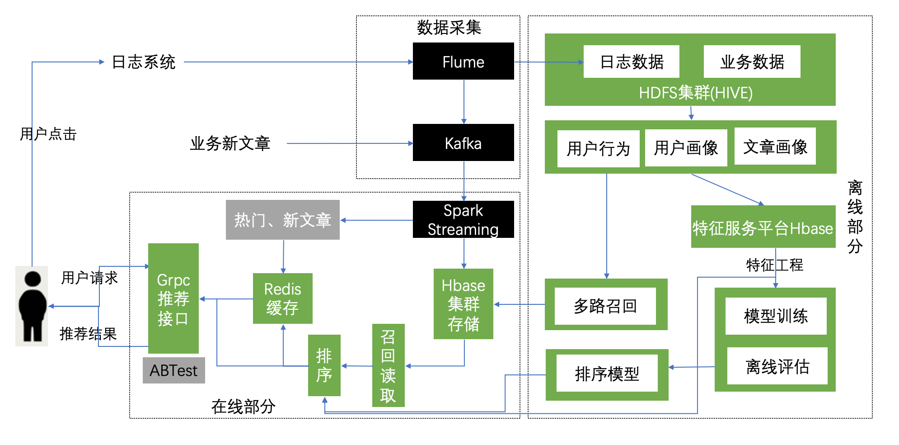
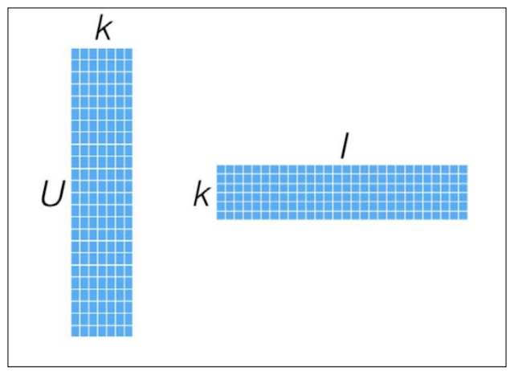
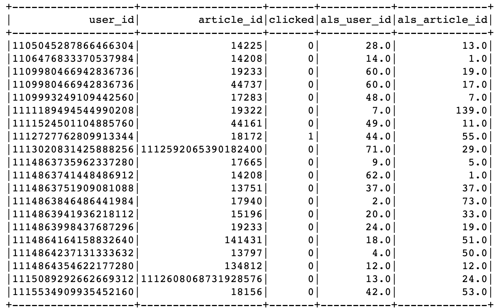
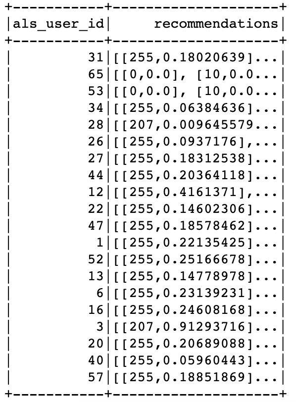

# 3.4 召回表设计与模型召回

## 学习目标

- 目标
  - 知道ALS模型推荐API使用
  - 知道StringIndexer的使用
- 应用
  - 应用spark完成离线用户基于模型的协同过滤推荐

### 3.4.1 召回表设计

我们的召回方式有很多种，多路召回结果存储模型召回与内容召回的结果需要进行相应频道推荐合并。

- 方案：基于模型与基于内容的召回结果存入同一张表，避免多张表进行读取处理
  - 由于HBASE有多个版本数据功能存在的支持
  - TTL=>7776000, VERSIONS=>999999

```python
create 'cb_recall', {NAME=>'als', TTL=>7776000, VERSIONS=>999999}
alter 'cb_recall', {NAME=>'content', TTL=>7776000, VERSIONS=>999999}
alter 'cb_recall', {NAME=>'online', TTL=>7776000, VERSIONS=>999999}

# 例子：
put 'cb_recall', 'recall:user:5', 'als:1',[45,3,5,10]
put 'cb_recall', 'recall:user:5', 'als:1',[289,11,65,52,109,8]
put 'cb_recall', 'recall:user:5', 'als:2',[1,2,3,4,5,6,7,8,9,10]
put 'cb_recall', 'recall:user:2', 'content:1',[45,3,5,10,289,11,65,52,109,8]
put 'cb_recall', 'recall:user:2', 'content:2',[1,2,3,4,5,6,7,8,9,10]


hbase(main):084:0> desc 'cb_recall'
Table cb_recall is ENABLED                                                                             
cb_recall                                                                                              
COLUMN FAMILIES DESCRIPTION                                                                            
{NAME => 'als', VERSIONS => '999999', EVICT_BLOCKS_ON_CLOSE => 'false', NEW_VERSION_BEHAVIOR => 'false'
, KEEP_DELETED_CELLS => 'FALSE', CACHE_DATA_ON_WRITE => 'false', DATA_BLOCK_ENCODING => 'NONE', TTL => 
'7776000 SECONDS (90 DAYS)', MIN_VERSIONS => '0', REPLICATION_SCOPE => '0', BLOOMFILTER => 'ROW', CACHE
_INDEX_ON_WRITE => 'false', IN_MEMORY => 'false', CACHE_BLOOMS_ON_WRITE => 'false', PREFETCH_BLOCKS_ON_
OPEN => 'false', COMPRESSION => 'NONE', BLOCKCACHE => 'true', BLOCKSIZE => '65536'}                    
{NAME => 'content', VERSIONS => '999999', EVICT_BLOCKS_ON_CLOSE => 'false', NEW_VERSION_BEHAVIOR => 'fa
lse', KEEP_DELETED_CELLS => 'FALSE', CACHE_DATA_ON_WRITE => 'false', DATA_BLOCK_ENCODING => 'NONE', TTL
 => '7776000 SECONDS (90 DAYS)', MIN_VERSIONS => '0', REPLICATION_SCOPE => '0', BLOOMFILTER => 'ROW', C
ACHE_INDEX_ON_WRITE => 'false', IN_MEMORY => 'false', CACHE_BLOOMS_ON_WRITE => 'false', PREFETCH_BLOCKS
_ON_OPEN => 'false', COMPRESSION => 'NONE', BLOCKCACHE => 'true', BLOCKSIZE => '65536'}                
{NAME => 'online', VERSIONS => '999999', EVICT_BLOCKS_ON_CLOSE => 'false', NEW_VERSION_BEHAVIOR => 'fal
se', KEEP_DELETED_CELLS => 'FALSE', CACHE_DATA_ON_WRITE => 'false', DATA_BLOCK_ENCODING => 'NONE', TTL 
=> '7776000 SECONDS (90 DAYS)', MIN_VERSIONS => '0', REPLICATION_SCOPE => '0', BLOOMFILTER => 'ROW', CA
CHE_INDEX_ON_WRITE => 'false', IN_MEMORY => 'false', CACHE_BLOOMS_ON_WRITE => 'false', PREFETCH_BLOCKS_
ON_OPEN => 'false', COMPRESSION => 'NONE', BLOCKCACHE => 'true', BLOCKSIZE => '65536'}                 
3 row(s)
```

在HIVE用户数据数据库下建立HIVE外部表,若hbase表有修改，则进行HIVE 表删除更新

```python
create external table cb_recall_hbase(
user_id STRING comment "userID",
als map<string, ARRAY<BIGINT>> comment "als recall",
content map<string, ARRAY<BIGINT>> comment "content recall",
online map<string, ARRAY<BIGINT>> comment "online recall")
COMMENT "user recall table"
STORED BY 'org.apache.hadoop.hive.hbase.HBaseStorageHandler'
WITH SERDEPROPERTIES ("hbase.columns.mapping" = ":key,als:,content:,online:")
TBLPROPERTIES ("hbase.table.name" = "cb_recall");
```

####增加一个历史召回结果表

```python
create 'history_recall', {NAME=>'channel', TTL=>7776000, VERSIONS=>999999}


put 'history_recall', 'recall:user:5', 'als:1',[1,2,3]
put 'history_recall', 'recall:user:5', 'als:1',[4,5,6,7]
put 'history_recall', 'recall:user:5', 'als:1',[8,9,10]
```

为什么增加历史召回表？



- 1、直接在存储召回结果部分进行过滤，比之后排序过滤，节省排序时间
- 2、防止Redis缓存没有消耗完，造成重复推荐，从源头进行过滤

### 3.4.2 基于模型召回集合计算

### 初始化信息

```python
import os
import sys
# 如果当前代码文件运行测试需要加入修改路径，避免出现后导包问题
BASE_DIR = os.path.dirname(os.path.dirname(os.getcwd()))
sys.path.insert(0, os.path.join(BASE_DIR))

PYSPARK_PYTHON = "/miniconda2/envs/reco_sys/bin/python"
# 当存在多个版本时，不指定很可能会导致出错
os.environ["PYSPARK_PYTHON"] = PYSPARK_PYTHON
os.environ["PYSPARK_DRIVER_PYTHON"] = PYSPARK_PYTHON

from offline import SparkSessionBase

class UpdateRecall(SparkSessionBase):

    SPARK_APP_NAME = "updateRecall"
    ENABLE_HIVE_SUPPORT = True

    def __init__(self):
        self.spark = self._create_spark_session()

ur = UpdateRecall()
```

####  3.4.2.1 ALS模型推荐实现

* 目标：利用ALS模型召回，推荐文章给用户

ALS模型复习：





* 步骤：
  * 1、数据类型转换,clicked以及用户ID与文章ID处理
  * 2、ALS模型训练以及推荐
  * 3、推荐结果解析处理
  * 4、推荐结果存储

**数据类型转换,clicked**

```python
ur.spark.sql("use profile")
user_article_click = ur.spark.sql("select * from user_article_basic").\
            select(['user_id', 'article_id', 'clicked'])
# 更换类型
def change_types(row):
    return row.user_id, row.article_id, int(row.clicked)

user_article_click = user_article_click.rdd.map(change_types).toDF(['user_id', 'article_id', 'clicked'])
```


**用户ID与文章ID处理，编程ID索引**

```python
from pyspark.ml.feature import StringIndexer
from pyspark.ml import Pipeline
# 用户和文章ID超过ALS最大整数值，需要使用StringIndexer进行转换
user_id_indexer = StringIndexer(inputCol='user_id', outputCol='als_user_id')
article_id_indexer = StringIndexer(inputCol='article_id', outputCol='als_article_id')
pip = Pipeline(stages=[user_id_indexer, article_id_indexer])
pip_fit = pip.fit(user_article_click)
als_user_article_click = pip_fit.transform(user_article_click)
```



#### 3.4.2.2 ALS 模型训练与推荐

ALS模型需要输出用户ID列，文章ID列以及点击列

```python
from pyspark.ml.recommendation import ALS
# 模型训练和推荐默认每个用户固定文章个数
als = ALS(userCol='als_user_id', itemCol='als_article_id', ratingCol='clicked', checkpointInterval=1)
model = als.fit(als_user_article_click)
recall_res = model.recommendForAllUsers(100)
```



#### 3.4.2.3 推荐结果处理

通过StringIndexer变换后的下标知道原来的和用户ID

```python
# recall_res得到需要使用StringIndexer变换后的下标
# 保存原来的下表映射关系
refection_user = als_user_article_click.groupBy(['user_id']).max('als_user_id').withColumnRenamed(
'max(als_user_id)', 'als_user_id')
refection_article = als_user_article_click.groupBy(['article_id']).max('als_article_id').withColumnRenamed(
'max(als_article_id)', 'als_article_id')

# Join推荐结果与 refection_user映射关系表
# +-----------+--------------------+-------------------+
# | als_user_id | recommendations | user_id |
# +-----------+--------------------+-------------------+
# | 8 | [[163, 0.91328144]... | 2 |
#        | 0 | [[145, 0.653115], ... | 1106476833370537984 |
recall_res = recall_res.join(refection_user, on=['als_user_id'], how='left').select(
['als_user_id', 'recommendations', 'user_id'])
```

对推荐文章ID后处理：得到推荐列表,获取推荐列表中的ID索引

```python
# Join推荐结果与 refection_article映射关系表
# +-----------+-------+----------------+
# | als_user_id | user_id | als_article_id |
# +-----------+-------+----------------+
# | 8 | 2 | [163, 0.91328144] |
# | 8 | 2 | [132, 0.91328144] |
import pyspark.sql.functions as F
recall_res = recall_res.withColumn('als_article_id', F.explode('recommendations')).drop('recommendations')

# +-----------+-------+--------------+
# | als_user_id | user_id | als_article_id |
# +-----------+-------+--------------+
# | 8 | 2 | 163 |
# | 8 | 2 | 132 |
def _article_id(row):
  return row.als_user_id, row.user_id, row.als_article_id[0]
```

进行索引对应文章ID获取

```python
als_recall = recall_res.rdd.map(_article_id).toDF(['als_user_id', 'user_id', 'als_article_id'])
als_recall = als_recall.join(refection_article, on=['als_article_id'], how='left').select(
  ['user_id', 'article_id'])
# 得到每个用户ID 对应推荐文章
# +-------------------+----------+
# | user_id | article_id |
# +-------------------+----------+
# | 1106476833370537984 | 44075 |
# | 1 | 44075 |
```

获取每个文章对应的频道，推荐给用户时按照频道存储

```python
ur.spark.sql("use toutiao")
news_article_basic = ur.spark.sql("select article_id, channel_id from news_article_basic")

als_recall = als_recall.join(news_article_basic, on=['article_id'], how='left')
als_recall = als_recall.groupBy(['user_id', 'channel_id']).agg(F.collect_list('article_id')).withColumnRenamed(
  'collect_list(article_id)', 'article_list')

als_recall = als_recall.dropna()
```

#### 3.4.2.4 召回结果存储

* 存储位置，选择HBASE

HBASE表设计：

```python
put 'cb_recall', 'recall:user:5', 'als:1',[45,3,5,10,289,11,65,52,109,8]
put 'cb_recall', 'recall:user:5', 'als:2',[1,2,3,4,5,6,7,8,9,10]
```

存储代码如下：

```python
        def save_offline_recall_hbase(partition):
            """离线模型召回结果存储
            """
            import happybase
            pool = happybase.ConnectionPool(size=10, host='hadoop-master', port=9090)
            for row in partition:
                with pool.connection() as conn:
                    # 获取历史看过的该频道文章
                    history_table = conn.table('history_recall')
                    # 多个版本
                    data = history_table.cells('reco:his:{}'.format(row.user_id).encode(),
                                               'channel:{}'.format(row.channel_id).encode())

                    history = []
                    if len(data) >= 2:
                        for l in data[:-1]:
                            history.extend(eval(l))
                    else:
                        history = []

                    # 过滤reco_article与history
                    reco_res = list(set(row.article_list) - set(history))

                    if reco_res:

                        table = conn.table('cb_recall')
                        # 默认放在推荐频道
                        table.put('recall:user:{}'.format(row.user_id).encode(),
                                  {'als:{}'.format(row.channel_id).encode(): str(reco_res).encode()})

                        # 放入历史推荐过文章
                        history_table.put("reco:his:{}".format(row.user_id).encode(),
                                          {'channel:{}'.format(row.channel_id): str(reco_res).encode()})
                    conn.close()

        als_recall.foreachPartition(save_offline_recall_hbase)
```

