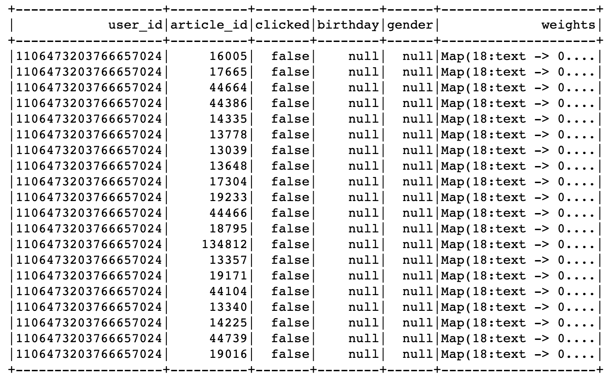
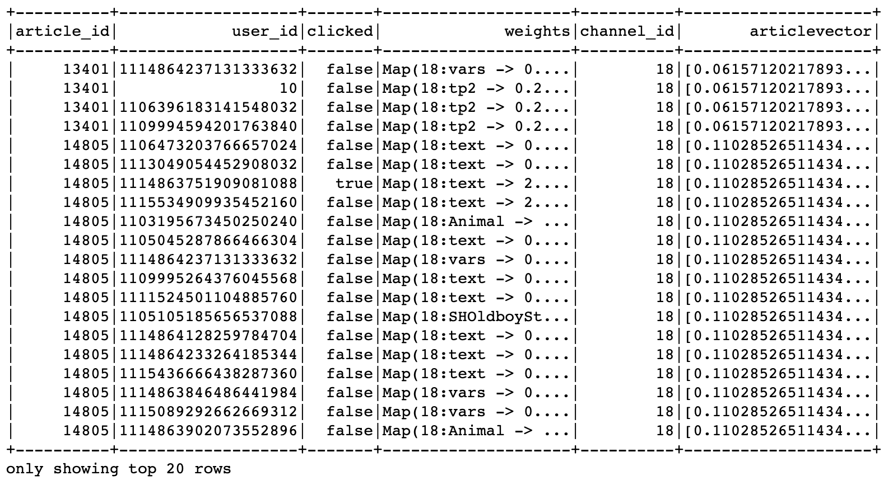
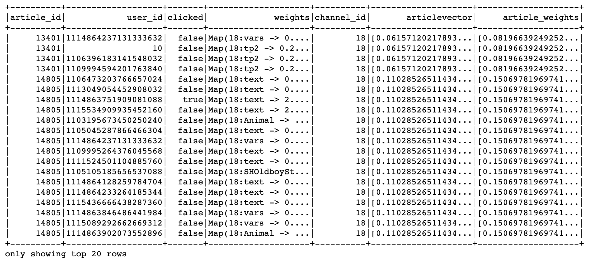

# 3.6 离线排序模型训练

## 学习目标

- 目标
  - 了解文章CTR预估主要作用
  - 知道常见点击率预测的种类和模型
  - 知道常见CTR中特征处理方式
- 应用
  - 应用spark lr完成模型训练预测评估

### 3.6.1 离线排序模型-CTR预估

* CTR（Click-Through Rate）预估：给定一个Item，预测该Item会被点击的概率

  * 离线的模型训练：排序的各种模型训练评估
  * 特征服务平台：为了提高模型在排序时候的特征读取处理速率，直接将处理好的特征写入HBASE 


### 3.6.2 排序模型

最基础的模型目前都是基于LR的点击率预估策略，目前在工业使用模型做预估的有这么几种类型

* 宽模型 + 特征⼯程
  * LR/MLR + 非ID类特征(⼈⼯离散/GBDT/FM) 
  * spark 中可以直接使用

* 宽模型 + 深模型
  * wide&deep,DeepFM
  * 使用TensorFlow进行训练
* 深模型：
  * DNN + 特征embedding
  * 使用TensorFlow进行训练

这里使用LR做基本模型使用先，去进行模型的评估，使用模型进行预测


### 3.6.3 特征处理原则

* 离散数据
  * one-hot编码
* 连续数据
  * 归一化
* 图片/文本
  * 文章标签/关键词提取
  * embedding


### 3.6.4 优化训练方式

* 使用Batch SGD优化
  * 加入正则化防止过拟合

### 3.6.5 spark LR 进行预估

* 目的：通过LR模型进行CTR预估
* 步骤：
  * 1、需要通过spark读取HIVE外部表，需要新的sparksession配置
    * 增加HBASE配置
  * 2、读取用户点击行为表，与用户画像和文章画像，构造训练样本
  * 3、LR模型进行训练
  * 4、LR模型预测、结果评估

创建环境

```python
import os
import sys
# 如果当前代码文件运行测试需要加入修改路径，避免出现后导包问题
BASE_DIR = os.path.dirname(os.path.dirname(os.getcwd()))
sys.path.insert(0, os.path.join(BASE_DIR))

PYSPARK_PYTHON = "/miniconda2/envs/reco_sys/bin/python"
# 当存在多个版本时，不指定很可能会导致出错
os.environ["PYSPARK_PYTHON"] = PYSPARK_PYTHON
os.environ["PYSPARK_DRIVER_PYTHON"] = PYSPARK_PYTHON

from pyspark.ml.feature import OneHotEncoder
from pyspark.ml.feature import StringIndexer
from pyspark.ml import Pipeline
from pyspark.sql.types import *
from pyspark.ml.feature import VectorAssembler
from pyspark.ml.classification import LogisticRegression
from pyspark.ml.classification import LogisticRegressionModel
from offline import SparkSessionBase

class CtrLogisticRegression(SparkSessionBase):

    SPARK_APP_NAME = "ctrLogisticRegression"
    ENABLE_HIVE_SUPPORT = True

    def __init__(self):

        self.spark = self._create_spark_hbase()

ctr = CtrLogisticRegression()
```

* **1、这里注意的是_create_spark_hbase，我们后面需要通过spark读取HIVE外部表，需要新的配置**

```python
    def _create_spark_hbase(self):

        conf = SparkConf()  # 创建spark config对象
        config = (
            ("spark.app.name", self.SPARK_APP_NAME),  # 设置启动的spark的app名称，没有提供，将随机产生一个名称
            ("spark.executor.memory", self.SPARK_EXECUTOR_MEMORY),  # 设置该app启动时占用的内存用量，默认2g
            ("spark.master", self.SPARK_URL),  # spark master的地址
            ("spark.executor.cores", self.SPARK_EXECUTOR_CORES),  # 设置spark executor使用的CPU核心数，默认是1核心
            ("spark.executor.instances", self.SPARK_EXECUTOR_INSTANCES),
            ("hbase.zookeeper.quorum", "192.168.19.137"),
            ("hbase.zookeeper.property.clientPort", "22181")
        )

        conf.setAll(config)

        # 利用config对象，创建spark session
        if self.ENABLE_HIVE_SUPPORT:
            return SparkSession.builder.config(conf=conf).enableHiveSupport().getOrCreate()
        else:
            return SparkSession.builder.config(conf=conf).getOrCreate()
```

- **2、读取用户点击行为表，与用户画像和文章画像，构造训练样本**
  - 目标值：clicked
  - 特征值：
    - 用户画像关键词权重：权重值排序TOPK，这里取10个
    - 文章频道号：channel_id, ID类型通常要做one_hot编码，变成25维度(25个频道)
      - **这里由于我们的历史点击日志测试时候是只有18号频道，所以不进行转换**
    - 文章向量：articlevector


进行行为日志数据读取

```python
ctr.spark.sql("use profile")
# +-------------------+----------+----------+-------+
# |            user_id|article_id|channel_id|clicked|
# +-------------------+----------+----------+-------+
# |1105045287866466304|     14225|         0|  false|
user_article_basic = ctr.spark.sql("select * from user_article_basic").select(
    ['user_id', 'article_id', 'channel_id', 'clicked'])
```

**用户画像读取处理**与日志数据合并

```python
user_profile_hbase = ctr.spark.sql(
    "select user_id, information.birthday, information.gender, article_partial, env from user_profile_hbase")
user_profile_hbase = user_profile_hbase.drop('env')

# +--------------------+--------+------+--------------------+
# |             user_id|birthday|gender|     article_partial|
# +--------------------+--------+------+--------------------+
# |              user:1|     0.0|  null|Map(18:Animal -> ...|

_schema = StructType([
    StructField("user_id", LongType()),
    StructField("birthday", DoubleType()),
    StructField("gender", BooleanType()),
    StructField("weights", MapType(StringType(), DoubleType()))
])

def get_user_id(row):
    return int(row.user_id.split(":")[1]), row.birthday, row.gender, row.article_partial
```

读取用户画像HIVE的外部表，构造样本

```python
user_profile_hbase_temp = user_profile_hbase.rdd.map(get_user_id)
user_profile_hbase_schema = ctr.spark.createDataFrame(user_profile_hbase_temp, schema=_schema)

train = user_article_basic.join(user_profile_hbase_schema, on=['user_id'], how='left').drop('channel_id')
```



**文章频道与向量读取合并，删除无用的特征**

* 由于黑马用户信息中，大多数没有相关特征，直接删除

```python
# +-------------------+----------+-------+--------+------+--------------------+
# |            user_id|article_id|clicked|birthday|gender|             weights|
# +-------------------+----------+-------+--------+------+--------------------+
# |1106473203766657024|     13778|  false|     0.0|  null|Map(18:text -> 0....|
ctr.spark.sql("use article")
article_vector = ctr.spark.sql("select * from article_vector")
train = train.join(article_vector, on=['article_id'], how='left').drop('birthday').drop('gender')

# +-------------------+-------------------+-------+--------------------+----------+--------------------+
# |         article_id|            user_id|clicked|             weights|channel_id|       articlevector|
# +-------------------+-------------------+-------+--------------------+----------+--------------------+
# |              13401|                 10|  false|Map(18:tp2 -> 0.2...|        18|[0.06157120217893...|
```



合并文章画像的权重特征

```python
ctr.spark.sql("use article")
article_profile = ctr.spark.sql("select * from article_profile")

def article_profile_to_feature(row):
    
    try:
        weights = sorted(row.keywords.values())[:10]
    except Exception as e:
        weights = [0.0] * 10
    return row.article_id, weights
article_profile = article_profile.rdd.map(article_profile_to_feature).toDF(['article_id', 'article_weights'])

article_profile.show()

train = train.join(article_profile, on=['article_id'], how='left')
```



**进行用户的权重特征筛选处理，类型处理**

* 用户权重排序筛选，缺失值
  * **获取用户对应文章频道号的关键词权重**
  * 若无：生成默认值

```python
columns = ['article_id', 'user_id', 'channel_id', 'articlevector', 'user_weights', 'article_weights', 'clicked']
def get_user_weights(row):

    from pyspark.ml.linalg import Vectors
    try:
        user_weights = sorted([row.article_partial[key] for key in row.article_partial.keys() if key.split(':')[0] == str(row.channel_id)])[
                  :10]
    except Exception:
        user_weights = [0.0] * 10

    return row.article_id, row.user_id, row.channel_id, Vectors.dense(row.articlevector), Vectors.dense(
        user_weights), Vectors.dense(row.article_weights), int(row.clicked)

train_vector = train_user_article.rdd.map(get_user_weights).toDF(columns)
```

结果：


输入模型的特征格式指定，通过VectorAssembler()收集

```python
train_version_two = VectorAssembler().setInputCols(cols[2:6]).setOutputCol("features").transform(train)
```

**合并特征向量(channel_id1个+用户特征权重10个+文章向量100个+文章关键词权重) = 121个特征**


```python
lr = LogisticRegression()
model = lr.setLabelCol("clicked").setFeaturesCol("features").fit(train_version_two)
model.save("hdfs://hadoop-master:9000/headlines/models/logistic_ctr_model.obj")
```

### 3.6.5 点击率预测结果

使用model模型加载预估

```python
online_model = LogisticRegressionModel.load("hdfs://hadoop-master:9000/headlines/models/logistic_ctr_model.obj")

res_transfrom = online_model.transform(train_version_two)

res_transfrom.select(["clicked", "probability", "prediction"]).show()
```

probability结果中有对某个文章点击(1为目标)的概率，和不点击（0为目标）的概率

```python
def vector_to_double(row):
    return float(row.clicked), float(row.probability[1]) 

score_label = res_transfrom.select(["clicked", "probability"]).rdd.map(vector_to_double)
```

### 3.6.6 模型评估-Accuracy与AUC

画出ROC图,使用训练的时候的模型model中会有

```python
import matplotlib.pyplot as plt
plt.figure(figsize=(5,5))
plt.plot([0, 1], [0, 1], 'r--')
plt.plot(model.summary.roc.select('FPR').collect(),
         model.summary.roc.select('TPR').collect())
plt.xlabel('FPR')
plt.ylabel('TPR')
plt.show()
```

结果


* from pyspark.mllib.evaluation import BinaryClassificationMetrics

```python
from pyspark.mllib.evaluation import BinaryClassificationMetrics
metrics = BinaryClassificationMetrics(score_label)
metrics.areaUnderROC
0.7364334522585716
```

其它方法

```python
from sklearn.metrics import roc_auc_score, accuracy_score
import numpy as np

arr = np.array(score_label.collect())
```

评估AUC与准确率

```python
accuracy_score(arr[:, 0], arr[:, 1].round())
0.9051438053097345


roc_auc_score(arr[:, 0], arr[:, 1])
0.719274521004087
```


