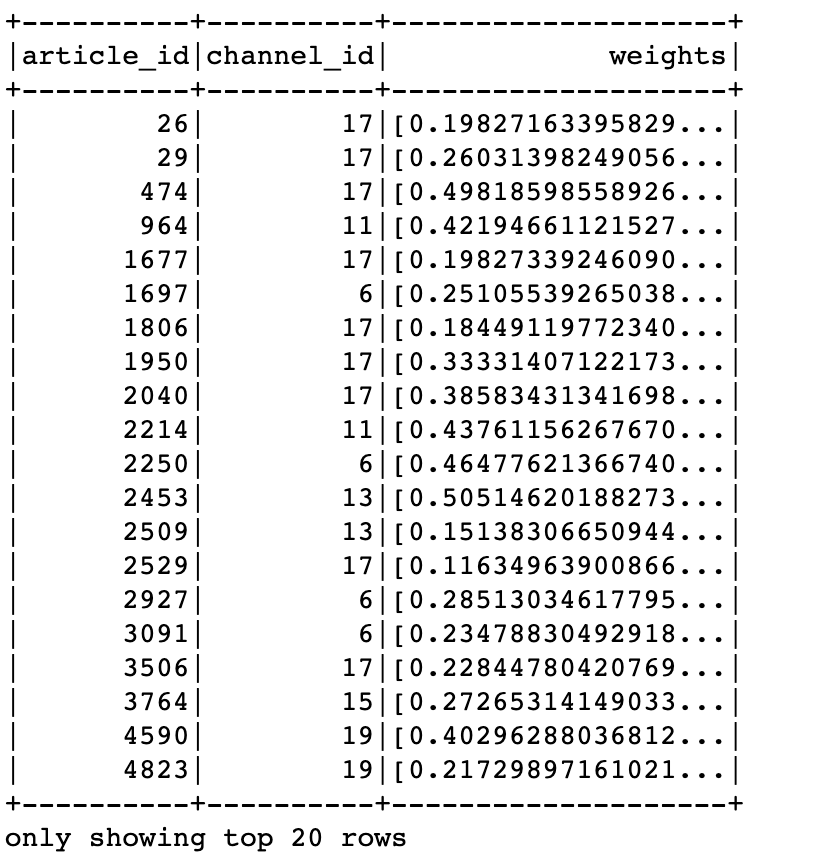

# 3.8 离线ctr特征中心更新

## 学习目标

- 目标
  - 了解特征服务中心的作用
  - 
- 应用
  - 无

### 3.8.1 特征服务中心


特征服务中心可以作为离线计算用户与文章的高级特征，充当着重要的角色。可以为程序提供快速的特征处理与特征结果，而且不仅仅提供给离线使用。还可以作为实时的特征供其他场景读取进行

原则是：用户，文章能用到的特征都进行处理进行存储，便于实时推荐进行读取

* 存储形式
  * **存储到数据库HBASE中**

首先确定创建特征结果HBASE表：

```mysql
create 'ctr_feature_user', 'channel'
 4                         column=channel:13, timestamp=1555647172980, value=[]                        
 4                         column=channel:14, timestamp=1555647172980, value=[]                        
 4                         column=channel:15, timestamp=1555647172980, value=[]                        
 4                         column=channel:16, timestamp=1555647172980, value=[]                        
 4                         column=channel:18, timestamp=1555647172980, value=[0.2156294170196073, 0.2156294170196073, 0.2156294170196073, 0.2156294170196073, 0.2156294170196073, 0.2156294170196073, 0.2156294170196073, 0.2156294170196073, 0.2156294170196073, 0.2156294170196073]                                                      
 4                         column=channel:19, timestamp=1555647172980, value=[]                        
 4                         column=channel:20, timestamp=1555647172980, value=[]                        
 4                         column=channel:2, timestamp=1555647172980, value=[]                         
 4                         column=channel:21, timestamp=1555647172980, value=[]

create 'ctr_feature_article', 'article'
 COLUMN                     CELL                                                                        
 article:13401             timestamp=1555635749357, value=[18.0,0.08196639249252607,0.11217275332895373,0.1353835167902181,0.16086650318453152,0.16356418791892943,0.16740082750337945,0.18091837445730974,0.1907214431716628,0.2........................-0.04634634410271921,-0.06451843378804649,-0.021564142420785692,0.10212902152136256] 
```

创建HIVE外部表,

```mysql
create external table ctr_feature_user_hbase(
user_id STRING comment "user_id",
user_channel map<string, string> comment "user_channel")
COMMENT "ctr table"
STORED BY 'org.apache.hadoop.hive.hbase.HBaseStorageHandler'
WITH SERDEPROPERTIES ("hbase.columns.mapping" = ":key,channel:")
TBLPROPERTIES ("hbase.table.name" = "ctr_feature_user");

create external table ctr_feature_article_hbase(
article_id STRING comment "article_id",
article_feature map<string, string> comment "article")
COMMENT "ctr table"
STORED BY 'org.apache.hadoop.hive.hbase.HBaseStorageHandler'
WITH SERDEPROPERTIES ("hbase.columns.mapping" = ":key,article:")
TBLPROPERTIES ("hbase.table.name" = "ctr_feature_article");
```

### 3.8.2 用户特征中心更新

* 目的：计算用户特征更新到HBASE
* 步骤：
  * 获取特征进行用户画像权重过滤
  * 特征批量存储

**获取特征进行用户画像权重过滤**

```python
# 构造样本
ctr.spark.sql("use profile")

user_profile_hbase = ctr.spark.sql(
    "select user_id, information.birthday, information.gender, article_partial, env from user_profile_hbase")

# 特征工程处理
# 抛弃获取值少的特征
user_profile_hbase = user_profile_hbase.drop('env', 'birthday', 'gender')

def get_user_id(row):
    return int(row.user_id.split(":")[1]), row.article_partial

user_profile_hbase_temp = user_profile_hbase.rdd.map(get_user_id)

from pyspark.sql.types import *

_schema = StructType([
    StructField("user_id", LongType()),
    StructField("weights", MapType(StringType(), DoubleType()))
])

user_profile_hbase_schema = ctr.spark.createDataFrame(user_profile_hbase_temp, schema=_schema)

def frature_preprocess(row):

    from pyspark.ml.linalg import Vectors

    channel_weights = []
    for i in range(1, 26):
        try:
            _res = sorted([row.weights[key] for key
                           in row.weights.keys() if key.split(':')[0] == str(i)])[:10]
            channel_weights.append(_res)
        except:
            channel_weights.append([0.0] * 10)

    return row.user_id, channel_weights

res = user_profile_hbase_schema.rdd.map(frature_preprocess).collect()
```

**特征批量存储，保存用户每个频道的特征**

```python
import happybase
# 批量插入Hbase数据库中
pool = happybase.ConnectionPool(size=10, host='hadoop-master', port=9090)
with pool.connection() as conn:
    ctr_feature = conn.table('ctr_feature_user')
    with ctr_feature.batch(transaction=True) as b:
        for i in range(len(res)):
            for j in range(25):
                b.put("{}".format(res[i][0]).encode(),{"channel:{}".format(j+1).encode(): str(res[i][1][j]).encode()})
    conn.close()
```

### 3.8.2 文章特征中心更新

文章特征有哪些？

* **关键词权重**
* **文章的频道**
* **文章向量结果**

存储这些特征以便于后面实时排序时候快速使用特征

* 步骤：
  * 1、读取相关文章画像
  * 2、进行文章相关特征处理和提取
  * 3、合并文章所有特征作为**模型训练或者预测的初始特征**
  * 4、文章特征存储到HBASE

**读取相关文章画像**

```python
ctr.spark.sql("use article")
article_profile = ctr.spark.sql("select * from article_profile")
```

**进行文章相关特征处理和提取**

```python
def article_profile_to_feature(row):
    try:
        weights = sorted(row.keywords.values())[:10]
    except Exception as e:
        weights = [0.0] * 10
    return row.article_id, row.channel_id, weights
article_profile = article_profile.rdd.map(article_profile_to_feature).toDF(['article_id', 'channel_id', 'weights'])

article_profile.show()
```



```python
article_vector = ctr.spark.sql("select * from article_vector")
article_feature = article_profile.join(article_vector, on=['article_id'], how='inner')
def feature_to_vector(row):
    from pyspark.ml.linalg import Vectors
    return row.article_id, row.channel_id, Vectors.dense(row.weights), Vectors.dense(row.articlevector)
article_feature = article_feature.rdd.map(feature_to_vector).toDF(['article_id', 'channel_id', 'weights', 'articlevector'])
```

指定所有文章特征进行合并

```python
# 保存特征数据
cols2 = ['article_id', 'channel_id', 'weights', 'articlevector']
# 做特征的指定指定合并
article_feature_two = VectorAssembler().setInputCols(cols2[1:4]).setOutputCol("features").transform(article_feature)
```

结果：

```mysql
+----------+----------+--------------------+--------------------+--------------------+
|article_id|channel_id|             weights|       articlevector|            features|
+----------+----------+--------------------+--------------------+--------------------+
|        26|        17|[0.19827163395829...|[0.02069368539384...|[17.0,0.198271633...|
|        29|        17|[0.26031398249056...|[-0.1446092289546...|[17.0,0.260313982...|
|       474|        17|[0.49818598558926...|[0.17293323921293...|[17.0,0.498185985...|
|      1677|        17|[0.19827339246090...|[-0.1303829028565...|[17.0,0.198273392...|
|      1697|         6|[0.25105539265038...|[0.05229978313861...|[6.0,0.2510553926...|
|      1806|        17|[0.18449119772340...|[0.02166337053188...|[17.0,0.184491197...|
|      1950|        17|[0.33331407122173...|[-0.3318378543653...|[17.0,0.333314071...|
|      2040|        17|[0.38583431341698...|[-0.0164312324191...|[17.0,0.385834313...|
|      2250|         6|[0.46477621366740...|[-0.0597617824653...|[6.0,0.4647762136...|
|      2453|        13|[0.50514620188273...|[-0.1038588426578...|[13.0,0.505146201...|
|      2509|        13|[0.15138306650944...|[0.04533940468085...|[13.0,0.151383066...|
|      2529|        17|[0.11634963900866...|[0.02575729180313...|[17.0,0.116349639...|
|      2927|         6|[0.28513034617795...|[0.09066218648052...|[6.0,0.2851303461...|
|      3091|         6|[0.23478830492918...|[0.08091488655859...|[6.0,0.2347883049...|
|      3506|        17|[0.22844780420769...|[0.08157531127196...|[17.0,0.228447804...|
|      3764|        15|[0.27265314149033...|[-0.1795835048850...|[15.0,0.272653141...|
|      4590|        19|[0.40296288036812...|[0.07013928253496...|[19.0,0.402962880...|
|      4823|        19|[0.21729897161021...|[0.04938335582130...|[19.0,0.217298971...|
|      4894|        19|[0.11699953656531...|[0.04255864598683...|[19.0,0.116999536...|
|      5385|        15|[0.34743921088686...|[0.10922433026109...|[15.0,0.347439210...|
+----------+----------+--------------------+--------------------+--------------------+
only showing top 20 rows
```

**保存到特征数据库中**

```python
# 保存到特征数据库中
def save_article_feature_to_hbase(partition):
    import happybase
    pool = happybase.ConnectionPool(size=10, host='hadoop-master')
    with pool.connection() as conn:
        table = conn.table('ctr_feature_article')
        for row in partition:
            table.put('{}'.format(row.article_id).encode(),
                     {'article:{}'.format(row.article_id).encode(): str(row.features).encode()})

article_feature_two.foreachPartition(save_article_feature_to_hbase)
```

### 3.8.3 离线特征中心定时更新

添加update.py更新程序

```python
def update_ctr_feature():
    """
    定时更新用户、文章特征
    :return:
    """
    fp = FeaturePlatform()
    fp.update_user_ctr_feature_to_hbase()
    fp.update_article_ctr_feature_to_hbase()
```

添加apscheduler定时运行

```python
# 添加定时更新用户文章特征结果的程序，每个4小时更新一次
scheduler.add_job(update_ctr_feature, trigger='interval', hours=4)
```

完整代码：

```python
import os
import sys
# 如果当前代码文件运行测试需要加入修改路径，否则后面的导包出现问题
BASE_DIR = os.path.dirname(os.path.dirname(os.path.abspath(__file__)))
sys.path.insert(0, os.path.join(BASE_DIR))
from offline import SparkSessionBase
# from offline.utils import textrank, segmentation
import happybase
import pyspark.sql.functions as F
from datetime import datetime
from datetime import timedelta
import time
import gc


class FeaturePlatform(SparkSessionBase):
    """特征更新平台
    """
    SPARK_APP_NAME = "featureCenter"
    ENABLE_HIVE_SUPPORT = True

    def __init__(self):
        # _create_spark_session
        # _create_spark_hbase用户spark sql 操作hive对hbase的外部表
        self.spark = self._create_spark_hbase()

    def update_user_ctr_feature_to_hbase(self):
        """
        :return:
        """
        clr.spark.sql("use profile")

        user_profile_hbase = self.spark.sql(
            "select user_id, information.birthday, information.gender, article_partial, env from user_profile_hbase")

        # 特征工程处理
        # 抛弃获取值少的特征
        user_profile_hbase = user_profile_hbase.drop('env', 'birthday', 'gender')

        def get_user_id(row):
            return int(row.user_id.split(":")[1]), row.article_partial

        user_profile_hbase_temp = user_profile_hbase.rdd.map(get_user_id)

        from pyspark.sql.types import *

        _schema = StructType([
            StructField("user_id", LongType()),
            StructField("weights", MapType(StringType(), DoubleType()))
        ])

        user_profile_hbase_schema = self.spark.createDataFrame(user_profile_hbase_temp, schema=_schema)

        def frature_preprocess(row):

            from pyspark.ml.linalg import Vectors

            channel_weights = []
            for i in range(1, 26):
                try:
                    _res = sorted([row.weights[key] for key
                                   in row.weights.keys() if key.split(':')[0] == str(i)])[:10]
                    channel_weights.append(_res)
                except:
                    channel_weights.append([])

            return row.user_id, channel_weights

        res = user_profile_hbase_schema.rdd.map(frature_preprocess).collect()

        # 批量插入Hbase数据库中
        pool = happybase.ConnectionPool(size=10, host='hadoop-master', port=9090)
        with pool.connection() as conn:
            ctr_feature = conn.table('ctr_feature_user')
            with ctr_feature.batch(transaction=True) as b:
                for i in range(len(res)):
                    for j in range(25):
                        b.put("{}".format(res[i][0]).encode(),
                              {"channel:{}".format(j + 1).encode(): str(res[i][1][j]).encode()})
            conn.close()

    def update_article_ctr_feature_to_hbase(self):
        """
        :return:
        """
        # 文章特征中心
        self.spark.sql("use article")
        article_profile = self.spark.sql("select * from article_profile")

        def article_profile_to_feature(row):
            try:
                weights = sorted(row.keywords.values())[:10]
            except Exception as e:
                weights = [0.0] * 10
            return row.article_id, row.channel_id, weights

        article_profile = article_profile.rdd.map(article_profile_to_feature).toDF(
            ['article_id', 'channel_id', 'weights'])

        article_vector = self.spark.sql("select * from article_vector")
        article_feature = article_profile.join(article_vector, on=['article_id'], how='inner')

        def feature_to_vector(row):
            from pyspark.ml.linalg import Vectors
            return row.article_id, row.channel_id, Vectors.dense(row.weights), Vectors.dense(row.articlevector)

        article_feature = article_feature.rdd.map(feature_to_vector).toDF(
            ['article_id', 'channel_id', 'weights', 'articlevector'])

        # 保存特征数据
        cols2 = ['article_id', 'channel_id', 'weights', 'articlevector']
        # 做特征的指定指定合并
        article_feature_two = VectorAssembler().setInputCols(cols2[1:4]).setOutputCol("features").transform(
            article_feature)

        # 保存到特征数据库中
        def save_article_feature_to_hbase(partition):
            import happybase
            pool = happybase.ConnectionPool(size=10, host='hadoop-master')
            with pool.connection() as conn:
                table = conn.table('ctr_feature_article')
                for row in partition:
                    table.put('{}'.format(row.article_id).encode(),
                              {'article:{}'.format(row.article_id).encode(): str(row.features).encode()})

        article_feature_two.foreachPartition(save_article_feature_to_hbase)
```

