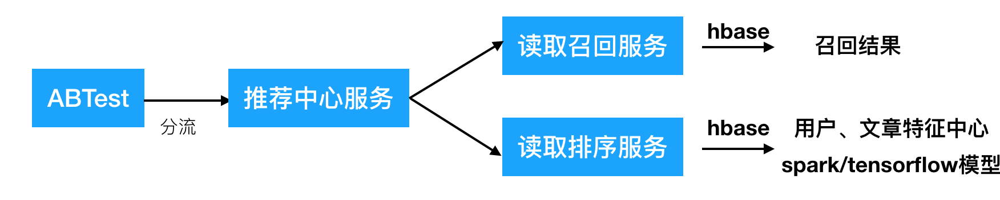

# 5.1 实时推荐业务介绍

## 学习目标

- 目标
  - 无
- 应用
  - 无

### 5.1.1 实时推荐逻辑

* 逻辑流程
  * 1、后端发送推荐请求，实时推荐系统拿到请求参数
    * grpc对接
  * 2、根据用户进行ABTest分流
    * ABTest实验中心，用于进行分流任务，方便测试调整不同的模型上线
  * 3、推荐中心服务
    * 根据用户在ABTest分配的算法进行召回服务和排序服务读取返回结果
  * 4、返回推荐结果和埋点参数封装

* 实时推荐的流程

* ABTest与推荐中心逻辑

