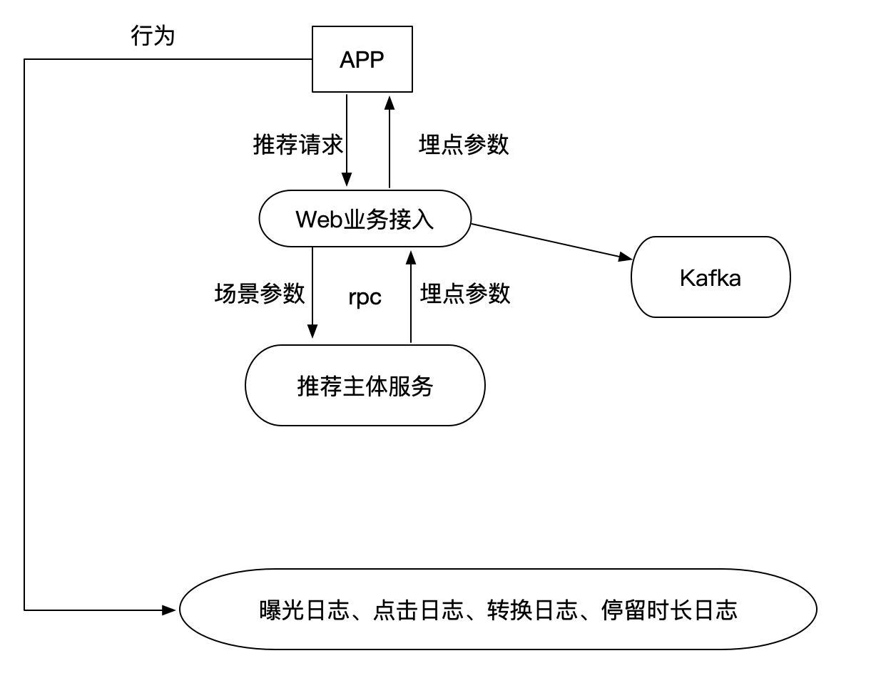

# 5.2 grpc接口对接

## 学习目标

- 目标
  - 无
- 应用
  - 无

### 5.2.1 头条推荐接口对接

* 请求参数：

  * feed流推荐：用户ID，频道ID，推荐文章数量，请求推荐时间戳
  * 相似文章获取：文章ID，推荐文章数量

* 返回参数：

  * feed流推荐：曝光参数，每篇文章的所有行为参数，上一条时间戳

  * ```
    # 埋点参数参考：
    # {
    #     "param": '{"action": "exposure", "userId": 1, "articleId": [1,2,3,4],  "algorithmCombine": "c1"}',
    #     "recommends": [
    #         {"article_id": 1, "param": {"click": "{"action": "click", "userId": "1", "articleId": 1, "algorithmCombine": 'c1'}", "collect": "", "share": "","read":""}},
    #         {"article_id": 2, "param": {"click": "", "collect": "", "share": "", "read":""}},
    #         {"article_id": 3, "param": {"click": "", "collect": "", "share": "", "read":""}},
    #         {"article_id": 4, "param": {"click": "", "collect": "", "share": "", "read":""}}
    #     ]
    #     "timestamp": 1546391572
    # }
    ```

  * 相似文章获取：文章ID列表



### 5.2.2 简介

- gRPC是由Google公司开源的高性能RPC框架。

- gRPC支持多语言

  gRPC原生使用C、Java、Go进行了三种实现，而C语言实现的版本进行封装后又支持C++、C#、Node、ObjC、 Python、Ruby、PHP等开发语言

- gRPC支持多平台

  支持的平台包括：Linux、Android、iOS、MacOS、Windows

- gRPC的消息协议使用Google自家开源的Protocol Buffers协议机制（proto3）  序列化

- gRPC的传输使用HTTP/2标准，支持双向流和连接多路复用

### 使用方法

1. 使用Protocol Buffers（proto3）的IDL接口定义语言定义接口服务，编写在文本文件（以`.proto`为后缀名）中。
2. 使用protobuf编译器生成服务器和客户端使用的stub代码

**在gRPC中推荐使用proto3版本。**

### 5.2.3 代码结构

#### Protocol Buffers版本

Protocol Buffers文档的第一行非注释行，为版本申明，不填写的话默认为版本2。

```
syntax = "proto3";
或者
syntax = "proto2";
```

* 消息类型

Protocol Buffers使用message定义消息数据。在Protocol Buffers中使用的数据都是通过message消息数据封装基本类型数据或其他消息数据，**对应Python中的类。**

```protobuf
message SearchRequest {
  string query = 1;
  int32 page_number = 2;
  int32 result_per_page = 3;
}
```

* 字段编号

消息定义中的每个字段都有唯一的编号。**这些字段编号用于以消息二进制格式标识字段，并且在使用消息类型后不应更改。** 请注意，**1到15范围内的字段编号需要一个字节进行编码，包括字段编号和字段类型**。**16到2047范围内的字段编号占用两个字节**。因此，您应该为非常频繁出现的消息元素保留数字1到15。请记住为将来可能添加的常用元素留出一些空间。

最小的标识号可以从1开始，最大到2^29 - 1,或 536,870,911。不可以使用其中的[19000－19999]的标识号， Protobuf协议实现中对这些进行了预留。如果非要在.proto文件中使用这些预留标识号，编译时就会报警。同样你也不能使用早期保留的标识号。

* 指定字段规则

消息字段可以是以下之一：

- singular：格式良好的消息可以包含该字段中的零个或一个（但不超过一个）。

- repeated：此字段可以在格式良好的消息中重复任意次数（包括零）。将保留重复值的顺序。对应Python的列表。

  ```protobuf
  message Result {
    string url = 1;
    string title = 2;
    repeated string snippets = 3;
  }
  ```

* 添加更多消息类型

可以在单个.proto文件中定义多个消息类型。

```protobuf
message SearchRequest {
  string query = 1;
  int32 page_number = 2;
  int32 result_per_page = 3;
}

message SearchResponse {
 ...
}
```

* 安装protobuf编译器和grpc库

```shell
pip install grpcio-tools
```

* 编译生成代码

```shell
python -m grpc_tools.protoc -I. --python_out=.. --grpc_python_out=.. itcast.proto
```

- `-I`表示搜索proto文件中被导入文件的目录
- `--python_out`表示保存生成Python文件的目录，生成的文件中包含**接口定义中的数据类型**
- `--grpc_python_out`表示保存生成Python文件的目录，生成的文件中包含**接口定义中的服务类型**

### 5.2.4 黑马头条推荐接口protoco协议定义

**创建abtest目录，将相关接口代码放入user_reco.proto协议文件**

* 用户刷新feed流接口
  * user_recommend(User) returns (Track)
* 文章相似(猜你喜欢)接口
  * article_recommend(Article) returns(Similar)

```python
syntax = "proto3";

message User {

    string user_id = 1;
    int32 channel_id = 2;
    int32 article_num = 3;
    int64 time_stamp = 4;
}
// int32 ---> int64 article_id
message Article {

    int64 article_id = 1;
    int32 article_num = 2;

}

message param2 {
    string click = 1;
    string collect = 2;
    string share = 3;
    string read = 4;
}

message param1 {
    int64 article_id = 1;
    param2 params = 2;
}

message Track {
    string exposure = 1;
    repeated param1 recommends = 2;
    int64 time_stamp = 3;
}

message Similar {
    repeated int64 article_id = 1;
}

service UserRecommend {
    // feed recommend
    rpc user_recommend(User) returns (Track) {}
    rpc article_recommend(Article) returns(Similar) {}
}
```

通过命令生成

```
python -m grpc_tools.protoc -I. --python_out=. --grpc_python_out=. user_reco.proto
```

### 5.2.4 黑马头条grpc服务端编写

创建routing.py文件，填写服务端代码：

相关包

````python
import os
import sys

BASE_DIR = os.path.dirname(os.path.dirname(os.path.abspath(__file__)))
sys.path.insert(0, os.path.join(BASE_DIR))
from concurrent import futures
from abtest import user_reco_pb2
from abtest import user_reco_pb2_grpc
from setting.default import DefaultConfig
import grpc
import time
import json
````

完整程序代码

需要添加grpc服务配置：

```python
# rpc
RPC_SERVER = '192.168.19.137:9999'
```

完整代码：

```python
# 基于用户推荐的rpc服务推荐
# 定义指定的rpc服务输入输出参数格式proto
class UserRecommendServicer(user_reco_pb2_grpc.UserRecommendServicer):
    """
    对用户进行技术文章推荐
    """
    def user_recommend(self, request, context):
        """
        用户feed流推荐
        :param request:
        :param context:
        :return:
        """
        # 选择C4组合
        user_id = request.user_id
        channel_id = request.channel_id
        article_num = request.article_num
        time_stamp = request.time_stamp

        # 解析参数，并进行推荐中心推荐(暂时使用假数据替代)
        class Temp(object):
            user_id = -10
            algo = 'test'
            time_stamp = -10

        tp = Temp()
        tp.user_id = user_id
        tp.time_stamp = time_stamp
        _track = add_track([], tp)

        # 解析返回参数到rpc结果参数
        # 参数如下
        # [       {"article_id": 1, "param": {"click": "", "collect": "", "share": "", 'detentionTime':''}},
        #         {"article_id": 2, "param": {"click": "", "collect": "", "share": "", 'detentionTime':''}},
        #         {"article_id": 3, "param": {"click": "", "collect": "", "share": "", 'detentionTime':''}},
        #         {"article_id": 4, "param": {"click": "", "collect": "", "share": "", 'detentionTime':''}}
        #     ]
        # 第二个rpc参数
        _param1 = []
        for _ in _track['recommends']:
            # param的封装
            _params = user_reco_pb2.param2(click=_['param']['click'],
                                           collect=_['param']['collect'],
                                           share=_['param']['share'],
                                           read=_['param']['read'])
            _p2 = user_reco_pb2.param1(article_id=_['article_id'], params=_params)
            _param1.append(_p2)
        # param
        return user_reco_pb2.Track(exposure=_track['param'], recommends=_param1, time_stamp=_track['timestamp'])

#    def article_recommend(self, request, context):
#        """
#       文章相似推荐
#       :param request:
#       :param context:
#       :return:
#       """
#       # 获取web参数
#       article_id = request.article_id
#       article_num = request.article_num
#
#        # 进行文章相似推荐,调用推荐中心的文章相似
#       _article_list = article_reco_list(article_id, article_num, 105)
#
#       # rpc参数封装
#       return user_reco_pb2.Similar(article_id=_article_list)


def serve():

    # 多线程服务器
    server = grpc.server(futures.ThreadPoolExecutor(max_workers=10))
    # 注册本地服务
    user_reco_pb2_grpc.add_UserRecommendServicer_to_server(UserRecommendServicer(), server)
    # 监听端口
    server.add_insecure_port(DefaultConfig.RPC_SERVER)

    # 开始接收请求进行服务
    server.start()
    # 使用 ctrl+c 可以退出服务
    _ONE_DAY_IN_SECONDS = 60 * 60 * 24
    try:
        while True:
            time.sleep(_ONE_DAY_IN_SECONDS)
    except KeyboardInterrupt:
        server.stop(0)


if __name__ == '__main__':
    # 测试grpc服务
    serve()
```

埋点参数的接口封装：

其中：

```
class Temp(object):
    user_id = '1115629498121846784'
    algo = 'test'
    time_stamp = int(time.time() * 1000)
_track = add_track([], Temp())
```

web后台请求传入的时间戳是time.time(),Out[3]: int(1558128143.8735564) * 1000的大小

```python
def add_track(res, temp):
    """
    封装埋点参数
    :param res: 推荐文章id列表
    :param cb: 合并参数
    :param rpc_param: rpc参数
    :return: 埋点参数
        文章列表参数
        单文章参数
    """
    # 添加埋点参数
    track = {}

    # 准备曝光参数
    # 全部字符串形式提供，在hive端不会解析问题
    _exposure = {"action": "exposure", "userId": temp.user_id, "articleId": json.dumps(res),
                 "algorithmCombine": temp.algo}

    track['param'] = json.dumps(_exposure)
    track['recommends'] = []

    # 准备其它点击参数
    for _id in res:
        # 构造字典
        _dic = {}
        _dic['article_id'] = _id
        _dic['param'] = {}

        # 准备click参数
        _p = {"action": "click", "userId": temp.user_id, "articleId": str(_id),
              "algorithmCombine": temp.algo}

        _dic['param']['click'] = json.dumps(_p)
        # 准备collect参数
        _p["action"] = 'collect'
        _dic['param']['collect'] = json.dumps(_p)
        # 准备share参数
        _p["action"] = 'share'
        _dic['param']['share'] = json.dumps(_p)
        # 准备detentionTime参数
        _p["action"] = 'read'
        _dic['param']['read'] = json.dumps(_p)

        track['recommends'].append(_dic)

    track['timestamp'] = temp.time_stamp
    return track
```

提供客户端测试代码：

* 测试客户端

```python
import os
import sys

BASE_DIR = os.path.dirname(os.path.dirname(os.path.abspath(__file__)))
sys.path.insert(0, os.path.join(BASE_DIR))
from abtest import user_reco_pb2_grpc
from abtest import user_reco_pb2
import grpc
from setting.default import DefaultConfig
import time


def test():
    article_dict = {}
    # 构造传入数据

    req_article = user_reco_pb2.User()
    req_article.user_id = '1115629498121846784'
    req_article.channel_id = 18
    req_article.article_num = 10
    req_article.time_stamp = int(time.time() * 1000)
    # req_article.time_stamp = 1555573069870

    with grpc.insecure_channel(DefaultConfig.RPC_SERVER) as rpc_cli:
        print('''''')
        try:
            stub = user_reco_pb2_grpc.UserRecommendStub(rpc_cli)
            resp = stub.user_recommend(req_article)
        except Exception as e:
            print(e)
            article_dict['param'] = []
        else:

            # 解析返回结果参数
            article_dict['exposure_param'] = resp.exposure

            reco_arts = resp.recommends

            reco_art_param = []
            reco_list = []
            for art in reco_arts:
                reco_art_param.append({
                    'artcle_id': art.article_id,
                    'params': {
                        'click': art.params.click,
                        'collect': art.params.collect,
                        'share': art.params.share,
                        'read': art.params.read
                    }
                })

                reco_list.append(art.article_id)
            article_dict['param'] = reco_art_param

            # 文章列表以及参数（曝光参数 以及 每篇文章的点击等参数）
            print(reco_list, article_dict)

if __name__ == '__main__':
    test()
```


