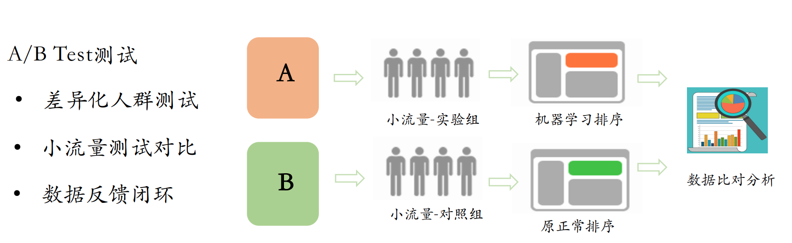

# 5.3 ABTest实验中心

## 学习目标

- 目标
  - 无
- 应用
  - 无

个性化推荐系统、搜索引擎、广告系统，这些系统都需要在线上不断上线，不断优化，优化之后怎么确定是好是坏。这时就需要ABTest来确定，最近想的办法、优化的算法、优化的逻辑数据是正向的，是有意义的，是提升数据效果的。

### 5.3.1 ABTest

有几个重要的功能

*  一个是ABTest实时分流服务，根据用户设备信息、用户信息进行ab分流。

* 实时效果分析统计，将分流后程序点击、浏览等通过hive、hadoop程序统计后，在统计平台上进行展示。



### 5.3.2 流量切分

A/B测试的流量切分是在Rank Server端完成的。我们根据用户ID将流量切分为多个桶（Bucket），每个桶对应一种排序策略，桶内流量将使用相应的策略进行排序。使用ID进行流量切分，是为了保证用户体验的一致性。


* 实验参数

```python
from collections import namedtuple

# abtest参数信息
# ABTest参数
param = namedtuple('RecommendAlgorithm', ['COMBINE',
                                          'RECALL',
                                          'SORT',
                                          'CHANNEL',
                                          'BYPASS']
                   )

RAParam = param(
    COMBINE={
        'Algo-1': (1, [100, 101, 102, 103, 104], []),  # 首页推荐，所有召回结果读取+LR排序
        'Algo-2': (2, [100, 101, 102, 103, 104], [])  # 首页推荐，所有召回结果读取 排序
    },
    RECALL={
        100: ('cb_recall', 'als'),  # 离线模型ALS召回，recall:user:1115629498121 column=als:18
        101: ('cb_recall', 'content'),  # 离线word2vec的画像内容召回 'recall:user:5', 'content:1'
        102: ('cb_recall', 'online'),  # 在线word2vec的画像召回 'recall:user:1', 'online:1'
        103: 'new_article',  # 新文章召回 redis当中    ch:18:new
        104: 'popular_article',  # 基于用户协同召回结果 ch:18:hot
        105: ('article_similar', 'similar')  # 文章相似推荐结果 '1' 'similar:2'
    },
    SORT={
        200: 'LR',
    },
    CHANNEL=25,
    BYPASS=[
            {
                "Bucket": ['0', '1', '2', '3', '4', '5', '6', '7', '8', '9', 'a', 'b', 'c', 'd'],
                "Strategy": "Algo-1"
            },
            {
                "BeginBucket": ['e', 'f'],
                "Strategy": "Algo-2"
            }
        ]
)
```

### 5.3.3 实验中心流量切分

* 哈希分桶，md5
* 推荐刷新逻辑(通过时间戳区分主要逻辑)
* ABTest分流逻辑实现代码如下
  * import hashlib
  * from setting.default import DefaultConfig, RAParam 

```python
def feed_recommend(user_id, channel_id, article_num, time_stamp):
    """
    1、根据web提供的参数，进行分流
    2、找到对应的算法组合之后，去推荐中心调用不同的召回和排序服务
    3、进行埋点参数封装
    :param user_id:用户id
    :param article_num:推荐文章个数
    :return: track:埋点参数结果: 参考上面埋点参数组合
    """

    #  产品前期推荐由于较少的点击行为，所以去做 用户冷启动 + 文章冷启动
    # 用户冷启动：'推荐'频道：热门频道的召回+用户实时行为画像召回（在线的不保存画像）  'C2'组合
    #            # 其它频道：热门召回 + 新文章召回   'C1'组合
    # 定义返回参数的类
    class TempParam(object):
        user_id = -10
        channel_id = -10
        article_num = -10
        time_stamp = -10
        algo = ""

    temp = TempParam()
    temp.user_id = user_id
    temp.channel_id = channel_id
    temp.article_num = article_num
    # 请求的时间戳大小
    temp.time_stamp = time_stamp

    # 先读取缓存数据redis+待推荐hbase结果
    # 如果有返回并加上埋点参数
    # 并且写入hbase 当前推荐时间戳用户（登录和匿名）的历史推荐文章列表

    # 传入用户id为空的直接召回结果
    if temp.user_id == "":
        temp.algo = ""
        return add_track([], temp)
    # 进行分桶实现分流，制定不同的实验策略
    bucket = hashlib.md5(user_id.encode()).hexdigest()[:1]
    if bucket in RAParam.BYPASS[0]['Bucket']:
        temp.algo = RAParam.BYPASS[0]['Strategy']
    else:
        temp.algo = RAParam.BYPASS[1]['Strategy']

    # 推荐服务中心推荐结果(这里做测试)
    track = add_track([], temp)

    return track
```
