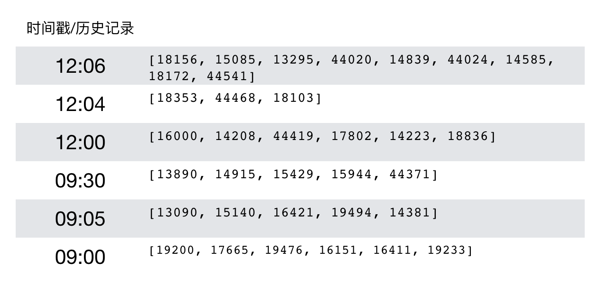

# 5.4 推荐中心逻辑

## 学习目标

- 目标
  - 无
- 应用
  - 无

### 5.4.1 推荐中心

推荐中一般作为整体召回结果读取与排序模型进行排序过程的作用，主要是产生推荐结果的部分。

### 推荐目录


* server目录为整个推荐中心建立的目录
  * recall_service.:召回数据读取目录
  * reco_centor:推荐中心逻辑代码
  * redis_cache:推荐结果缓存目录
  * utils：**装有自己封装的hbase数据库读取存储工具**

### 5.4.2 推荐中心推荐存储设计


* HBASE 数据库表设计
  * wait_recommend: 经过各种多路召回，**排序之后的待推荐结果保存**
    *  **只要刷新一次，没有缓存，才主动收集各种召回集合一起给wait_recommend写入，所以不用设置多个版本**
  * history_recommend: 每次真正推荐出去给用户的历史推荐结果列表
    * **1、按照频道存储用户的历史推荐结果**
    * **2、需要保留多个版本，才需要建立版本信息**

```mysql
create 'wait_recommend', 'channel'

put 'wait_recommend', 'reco:1', 'channel:18', [17283, 140357, 14668, 15182, 17999, 13648, 12884, 17302, 13846, 18135]
put 'wait_recommend', 'reco:1', 'channel:0', [17283, 140357, 14668, 15182, 17999, 13648, 12884, 17302, 13846, 18135]
```

创建一个历史hbase结果

```mysql
create 'history_recommend', {NAME=>'channel', TTL=>7776000, VERSIONS=>999999}   86400
# 每次指定一个时间戳,可以达到不同版本的效果
put 'history_recommend', 'reco:his:1', 'channel:18', [17283, 140357, 14668, 15182, 17999, 13648, 12884, 17302, 13846, 18135]


# 修改的时候必须指定family名称
hbase(main):084:0> alter 'history_recommend',NAME => 'channel', TTL => '7776000'
Updating all regions with the new schema...
1/1 regions updated.
Done.
Took 2.0578 seconds

alter 'history_recommend',NAME => 'channel', VERSIONS=>999999, TTL=>7776000
```

放入历史数据，存在时间戳，到时候取出历史数据就是每个用户的历史时间戳可以

```mysql
get "history_recommend", 'reco:his:1', {COLUMN=>'channel:18',VERSIONS=>1000, TIMESTAMP=>1546242869000}
```

这里与上次召回cb_recall以及history_recall有不同用处：

* history_recall:存放召回过的数据，用户过滤推荐初始的产生结果

* history_recommend:存放的是某个用户在某频道的真正推荐过的历史记录
  * 同时过滤掉新文章和热门文章的推荐结果

### 5.4.3 feed流 推荐中心逻辑

* 目的：根据ABTest分流之后的用户，进行制定算法的召回和排序读取
* 步骤：
  * 1、Hbase数据库工具封装介绍
  * 2、feed时间戳进行推荐逻辑判断
  * 2、读取召回结果(无实时排序)

创建特征中心类：

```python
import os
import sys

BASE_DIR = os.path.dirname(os.path.dirname(os.path.abspath(__file__)))
sys.path.insert(0, os.path.join(BASE_DIR))
import hashlib
from setting.default import RAParam
from server.utils import HBaseUtils
from server import pool
from server import recall_service
from datetime import datetime
import logging
import json

logger = logging.getLogger('recommend')


def add_track(res, temp):
    """
    封装埋点参数
    :param res: 推荐文章id列表
    :param cb: 合并参数
    :param rpc_param: rpc参数
    :return: 埋点参数
        文章列表参数
        单文章参数
    """
    # 添加埋点参数
    track = {}

    # 准备曝光参数
    # 全部字符串形式提供，在hive端不会解析问题
    _exposure = {"action": "exposure", "userId": temp.user_id, "articleId": json.dumps(res),
                 "algorithmCombine": temp.algo}

    track['param'] = json.dumps(_exposure)
    track['recommends'] = []

    # 准备其它点击参数
    for _id in res:
        # 构造字典
        _dic = {}
        _dic['article_id'] = _id
        _dic['param'] = {}

        # 准备click参数
        _p = {"action": "click", "userId": temp.user_id, "articleId": str(_id),
              "algorithmCombine": temp.algo}

        _dic['param']['click'] = json.dumps(_p)
        # 准备collect参数
        _p["action"] = 'collect'
        _dic['param']['collect'] = json.dumps(_p)
        # 准备share参数
        _p["action"] = 'share'
        _dic['param']['share'] = json.dumps(_p)
        # 准备detentionTime参数
        _p["action"] = 'read'
        _dic['param']['read'] = json.dumps(_p)

        track['recommends'].append(_dic)

    track['timestamp'] = temp.time_stamp
    return track


class RecoCenter(object):
    """推荐中心
    """
    def __init__(self):
        self.hbu = HBaseUtils(pool)
        # self.recall_service = recall_service.ReadRecall()
```

并且添加了获取结果打印日志设置

```python
# 实施推荐日志
# 离线处理更新打印日志
trace_file_handler = logging.FileHandler(
  os.path.join(logging_file_dir, 'recommend.log')
)
trace_file_handler.setFormatter(logging.Formatter('%(message)s'))
log_trace = logging.getLogger('recommend')
log_trace.addHandler(trace_file_handler)
log_trace.setLevel(logging.INFO)
```

### Hbase读取存储等工具类封装

为什么封装?

**在写happybase代码的时候会有过多的重复代码，将这些封装成简便的工具，减少代码冗余**

- 包含方法
  - get_table_row(self, table_name, key_format, column_format=None, include_timestamp=False):
    - 获取具体表中的键、列族中的行数据
  - get_table_cells(self, table_name, key_format, column_format=None, timestamp=None, include_timestamp=False):
    - 获取Hbase中多个版本数据
  - get_table_put(self, table_name, key_format, column_format, data, timestamp=None):
    - 存储数据到Hbase当中
  - get_table_delete(self, table_name, key_format, column_format):
    - 删除Hbase中的数据

```python
class HBaseUtils(object):
    """HBase数据库读取工具类
    """
    def __init__(self, connection):
        self.pool = connection

    def get_table_row(self, table_name, key_format, column_format=None, include_timestamp=False):
        """
        获取HBase数据库中的行记录数据
        :param table_name: 表名
        :param key_format: key格式字符串, 如表的'user:reco:1', 类型为bytes
        :param column_format: column, 列族字符串,如表的 column 'als:18',类型为bytes
        :param include_timestamp: 是否包含时间戳
        :return: 返回数据库结果data
        """
        if not isinstance(key_format, bytes):
            raise KeyError("key_format or column type error")

        if not isinstance(table_name, str):
            raise KeyError("table_name should str type")

        with self.pool.connection() as conn:
            table = conn.table(table_name)

            if column_format:
                data = table.row(row=key_format, columns=[column_format], include_timestamp=include_timestamp)
            else:
                data = table.row(row=key_format)
            conn.close()

        if column_format:
            return data[column_format]
        else:
            # [(b'[141440]', 1555519429582)]
            # {'[141440]'}
            return data

    def get_table_cells(self, table_name, key_format, column_format=None, timestamp=None, include_timestamp=False):
        """
        获取HBase数据库中多个版本数据
        :param table_name: 表名
        :param key_format: key格式字符串, 如表的'user:reco:1', 类型为bytes
        :param column_format: column, 列族字符串,如表的 column 'als:18',类型为bytes
        :param timestamp: 指定小于该时间戳的数据
        :param include_timestamp: 是否包含时间戳
        :return: 返回数据库结果data
        """
        if not isinstance(key_format, bytes) or not isinstance(column_format, bytes):
            raise KeyError("key_format or column type error")

        if not isinstance(table_name, str):
            raise KeyError("table_name should str type")

        with self.pool.connection() as conn:
            table = conn.table(table_name)

            data = table.cells(row=key_format, column=column_format, timestamp=timestamp,
                               include_timestamp=include_timestamp)

            conn.close()
        # [(,), ()]
        return data

    def get_table_put(self, table_name, key_format, column_format, data, timestamp=None):
        """

        :param table_name: 表名
        :param key_format: key格式字符串, 如表的'user:reco:1', 类型为bytes
        :param column_format: column, 列族字符串,如表的 column 'als:18',类型为bytes
        :param data: 插入的数据
        :param timestamp: 指定拆入数据的时间戳
        :return: None
        """
        if not isinstance(key_format, bytes) or not isinstance(column_format, bytes) or not isinstance(data, bytes):
            raise KeyError("key_format or column or data type error")

        if not isinstance(table_name, str):
            raise KeyError("table_name should str type")

        with self.pool.connection() as conn:
            table = conn.table(table_name)

            table.put(key_format, {column_format: data}, timestamp=timestamp)

            conn.close()
        return None

    def get_table_delete(self, table_name, key_format, column_format):
        """
        删除列族中的内容
        :param table_name: 表名称
        :param key_format: key
        :param column_format: 列格式
        :return:
        """
        if not isinstance(key_format, bytes) or not isinstance(column_format, bytes):
            raise KeyError("key_format or column type error")

        if not isinstance(table_name, str):
            raise KeyError("table_name should str type")
        with self.pool.connection() as conn:
            table = conn.table(table_name)
            table.delete(row=key_format, columns=[column_format])
            conn.close()
        return None
```

**增加feed_recommend_logic函数，进行时间戳逻辑判断**

**根据时间戳**

- 时间戳T小于HBASE历史推荐记录
  - **则获取历史记录，返回该时间戳T上次的时间戳T-1**
- 时间戳T大于HBASE历史推荐记录，则获取新推荐，则获取HBASE数据库中最近的一次时间戳
  - 如果有缓存，从缓存中拿，并且写入推荐历史表中
  - 如果没有缓存，就进行一次指定算法组合的召回结果读取，排序，然后写入待推荐wait_recommend中，其中推荐出去的放入历史推荐表中



**获取这个用户该频道的历史结果**

```python
# 判断用请求的时间戳大小决定获取历史记录还是刷新推荐文章
        try:
            last_stamp = self.hbu.get_table_row('history_recommend', 'reco:his:{}'.format(temp.user_id).encode(),
                                                'channel:{}'.format(temp.channel_id).encode(), include_timestamp=True)[
                1]
            logger.info("{} INFO get user_id:{} channel:{} history last_stamp".format(
                datetime.now().strftime('%Y-%m-%d %H:%M:%S'), temp.user_id, temp.channel_id))
        except Exception as e:
            logger.warning("{} WARN read history recommend exception:{}".format(
                datetime.now().strftime('%Y-%m-%d %H:%M:%S'), e))
            last_stamp = 0
```

如果历史时间戳最近的一次小于用户请求时候的时间戳，Hbase的时间戳是time.time() * 1000这个值的大小，与Web后台传入的一样类型，如果Web后台传入的不是改大小，注意修改

* **然后返回推荐结果以及此次请求的上一次时间戳**
  * **用于用户获取历史记录**

```python
if last_stamp < temp.time_stamp:
            # 1、获取缓存
            # res = redis_cache.get_reco_from_cache(temp, self.hbu)
            #
            # # 如果没有，然后走一遍算法推荐 召回+排序，同时写入到hbase待推荐结果列表
            # if not res:
            #     logger.info("{} INFO get user_id:{} channel:{} recall/sort data".
            #                 format(datetime.now().strftime('%Y-%m-%d %H:%M:%S'), temp.user_id, temp.channel_id))
            #
            #     res = self.user_reco_list(temp)

            # 2、直接拿推荐结果
            # res = self.user_reco_list(temp)

            #temp.time_stamp = int(last_stamp)

            track = add_track([], temp)
```

**如果历史时间戳大于用户请求的这次时间戳，那么就是在获取历史记录，用户请求的历史时间戳是具体某个历史记录的时间戳T，Hbase当中不能够直接用T去获取，而需要去（T+N）>T的时间戳获取，才能拿到包含T时间的结果，并且使用get_table_cells去获取**

* 分以下情况考虑
  * 1、如果没有历史数据，返回时间戳0以及结果空列表
  * 2、如果历史数据只有一条，返回这一条历史数据以及时间戳正好为请求时间戳，修改时间戳为0，表示后面请求以后就没有历史数据了(APP的行为就是翻历史记录停止了)
  * 3、如果历史数据多条，返回最近的第一条历史数据，然后返回之后第二条历史数据的时间戳

```python
        else:

            logger.info("{} INFO read user_id:{} channel:{} history recommend data".format(
                datetime.now().strftime('%Y-%m-%d %H:%M:%S'), temp.user_id, temp.channel_id))

            try:
                row = self.hbu.get_table_cells('history_recommend',
                                               'reco:his:{}'.format(temp.user_id).encode(),
                                               'channel:{}'.format(temp.channel_id).encode(),
                                               timestamp=temp.time_stamp + 1,
                                               include_timestamp=True)
            except Exception as e:
                logger.warning("{} WARN read history recommend exception:{}".format(
                    datetime.now().strftime('%Y-%m-%d %H:%M:%S'), e))
                row = []
                res = []

            # 1、如果没有历史数据，返回时间戳0以及结果空列表
            # 2、如果历史数据只有一条，返回这一条历史数据以及时间戳正好为请求时间戳，修改时间戳为0
            # 3、如果历史数据多条，返回最近一条历史数据，然后返回
            if not row:
                temp.time_stamp = 0
                res = []
            elif len(row) == 1 and row[0][1] == temp.time_stamp:
                res = eval(row[0][0])
                temp.time_stamp = 0
            elif len(row) >= 2:
                res = eval(row[0][0])
                temp.time_stamp = int(row[1][1])

            res = list(map(int, res))
            logger.info(
                "{} INFO history:{}, {}".format(datetime.now().strftime('%Y-%m-%d %H:%M:%S'), res, temp.time_stamp))
            track = add_track(res, temp)
            # 曝光参数设置为空
            track['param'] = ''

        return track
```

* 完整代码：

```python
    def feed_recommend_logic(self, temp):
        """推荐流业务逻辑
        :param temp:ABTest传入的业务请求参数
        """

        # 判断用请求的时间戳大小决定获取历史记录还是刷新推荐文章
        try:
            last_stamp = self.hbu.get_table_row('history_recommend', 'reco:his:{}'.format(temp.user_id).encode(),
                                                'channel:{}'.format(temp.channel_id).encode(), include_timestamp=True)[1]
            logger.info("{} INFO get user_id:{} channel:{} history last_stamp".format(
                datetime.now().strftime('%Y-%m-%d %H:%M:%S'), temp.user_id, temp.channel_id))
        except Exception as e:
            logger.warning("{} WARN read history recommend exception:{}".format(
                datetime.now().strftime('%Y-%m-%d %H:%M:%S'), e))
            last_stamp = 0

        # 如果小于，走一遍正常的推荐流程，缓存或者召回排序
        logger.info("{} INFO history last_stamp:{},temp.time_stamp:{}".
                    format(datetime.now().strftime('%Y-%m-%d %H:%M:%S'), last_stamp, temp.time_stamp))
        if last_stamp < temp.time_stamp:

            # 获取
            res = redis_cache.get_reco_from_cache(temp, self.hbu)

            # 如果没有，然后走一遍算法推荐 召回+排序，同时写入到hbase待推荐结果列表
            if not res:
                logger.info("{} INFO get user_id:{} channel:{} recall/sort data".
                            format(datetime.now().strftime('%Y-%m-%d %H:%M:%S'), temp.user_id, temp.channel_id))

                res = self.user_reco_list(temp)

            temp.time_stamp = int(last_stamp)

            track = add_track(res, temp)

        else:

            logger.info("{} INFO read user_id:{} channel:{} history recommend data".format(
                datetime.now().strftime('%Y-%m-%d %H:%M:%S'), temp.user_id, temp.channel_id))

            try:
                row = self.hbu.get_table_cells('history_recommend',
                                          'reco:his:{}'.format(temp.user_id).encode(),
                                          'channel:{}'.format(temp.channel_id).encode(),
                                          timestamp=temp.time_stamp + 1,
                                          include_timestamp=True)
            except Exception as e:
                logger.warning("{} WARN read history recommend exception:{}".format(
                    datetime.now().strftime('%Y-%m-%d %H:%M:%S'), e))
                row = []
                res = []

            # 1、如果没有历史数据，返回时间戳0以及结果空列表
            # 2、如果历史数据只有一条，返回这一条历史数据以及时间戳正好为请求时间戳，修改时间戳为0
            # 3、如果历史数据多条，返回最近一条历史数据，然后返回
            if not row:
                temp.time_stamp = 0
                res = []
            elif len(row) == 1 and row[0][1] == temp.time_stamp:
                res = eval(row[0][0])
                temp.time_stamp = 0
            elif len(row) >= 2:
                res = eval(row[0][0])
                temp.time_stamp = int(row[1][1])

            res = list(map(int, res))
            logger.info(
                "{} INFO history:{}, {}".format(datetime.now().strftime('%Y-%m-%d %H:%M:%S'), res, temp.time_stamp))
            track = add_track(res, temp)
            # 曝光参数设置为空
            track['param'] = ''
        return track
```

**修改ABTest中的推荐调用**

```python
from server.reco_center import RecoCenter

# 推荐
track = RecoCenter().feed_recommend_logic(temp)
```

### 5.4.4 推荐中心时间戳获取逻辑测试

获取多版本历史记录：

```
hbase(main):045:0> get 'history_recommend', 'reco:his:1115629498121846784', {COLUMN=>'channel:18', VERSIONS=>999999}
COLUMN                     CELL                                                                        
 channel:18                timestamp=1559148615353, value=[15140, 16421, 19494, 14381, 17966]          
 channel:18                timestamp=1558236647437, value=[18904, 14300, 44412, 18238, 18103, 43986, 44
                           339, 17454, 14899, 18335]                                                   
 channel:18                timestamp=1558236629309, value=[43997, 14299, 17632, 17120]                 
 channel:18                timestamp=1558236535794, value=[44657, 15085, 18156, 44654, 19052, 44652, 18
                           795, 17385, 44137, 17889] 
```

GRPC接口测试，使用不同的时间戳进行测试