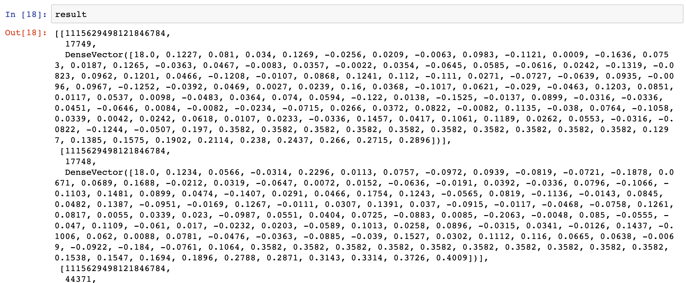

# 5.7 排序模型在线预测

## 学习目标

- 目标
  - 无
- 应用
  - 应用spark完成

### 5.7.1排序模型服务


* 提供多种不同模型排序逻辑
  * SPARK LR/Tensorflow

###  5.7.2 排序模型在线预测

* 召回之后的文章结果进行排序
* 步骤：
  * 1、读取用户特征中心特征
  * 2、读取文章特征中心特征、合并用户文章特征构造预测样本
  * 4、预测并进行排序是筛选

```python
import os
import sys
# 如果当前代码文件运行测试需要加入修改路径，避免出现后导包问题
BASE_DIR = os.path.dirname(os.path.dirname(os.getcwd()))
sys.path.insert(0, os.path.join(BASE_DIR))

PYSPARK_PYTHON = "/miniconda2/envs/reco_sys/bin/python"
os.environ["PYSPARK_PYTHON"] = PYSPARK_PYTHON
os.environ["PYSPARK_DRIVER_PYTHON"] = PYSPARK_PYTHON
from pyspark import SparkConf
from pyspark.sql import SparkSession
from server.utils import HBaseUtils
from server import pool
from pyspark.ml.linalg import DenseVector
from pyspark.ml.classification import LogisticRegressionModel
import pandas as pd


conf = SparkConf()
config = (
    ("spark.app.name", "sort"),
    ("spark.executor.memory", "2g"),    # 设置该app启动时占用的内存用量，默认1g
    ("spark.master", 'yarn'),
    ("spark.executor.cores", "2"),   # 设置spark executor使用的CPU核心数
)

conf.setAll(config)
spark = SparkSession.builder.config(conf=conf).getOrCreate()
```

**1、读取用户特征中心特征**

```python
hbu = HBaseUtils(pool)
# 排序
# 1、读取用户特征中心特征
try:
    user_feature = eval(hbu.get_table_row('ctr_feature_user',
                                               '{}'.format(1115629498121846784).encode(),
                                               'channel:{}'.format(18).encode()))
except Exception as e:
    user_feature = []
```

**2、读取文章特征中心特征，并与用户特征进行合并，构造要推荐文章的样本**

* **合并特征向量(channel_id1个+文章向量100个+用户特征权重10个+文章关键词权重) = 121个特征**


```python
if user_feature:
    # 2、读取文章特征中心特征
    result = []

    for article_id in [17749, 17748, 44371, 44368]:
        try:
            article_feature = eval(hbu.get_table_row('ctr_feature_article',
                                                     '{}'.format(article_id).encode(),
                                                     'article:{}'.format(article_id).encode()))
        except Exception as e:
            article_feature = [0.0] * 111
        f = []
        # 第一个channel_id
        f.extend([article_feature[0]])
        # 第二个article_vector
        f.extend(article_feature[11:])
        # 第三个用户权重特征
        f.extend(user_feature)
        # 第四个文章权重特征
        f.extend(article_feature[1:11])
        vector = DenseVector(f)

        result.append([1115629498121846784, article_id, vector])
```

文章特征中心存的顺序

```python
+----------+----------+--------------------+--------------------+--------------------+
|article_id|channel_id|             weights|       articlevector|            features|
+----------+----------+--------------------+--------------------+--------------------+
|        26|        17|[0.19827163395829...|[0.02069368539384...|[17.0,0.198271633...|
|        29|        17|[0.26031398249056...|[-0.1446092289546...|[17.0,0.260313982...|
```

最终结果：



****

**3、处理样本格式，模型加载预测**

```python
# 4、预测并进行排序是筛选
df = pd.DataFrame(result, columns=["user_id", "article_id", "features"])
test = spark.createDataFrame(df)

# 加载逻辑回归模型
model = LogisticRegressionModel.load("hdfs://hadoop-master:9000/headlines/models/LR.obj")
predict = model.transform(test)
```

**预测结果进行筛选**

```python
def vector_to_double(row):
    return float(row.article_id), float(row.probability[1])
res = predict.select(['article_id', 'probability']).rdd.map(vector_to_double).toDF(['article_id', 'probability']).sort('probability', ascending=False)
```

获取排序之后前N个文章

```python
article_list = [i.article_id for i in res.collect()]
if len(article_list) > 100:
    article_list = article_list[:100]
reco_set = list(map(int, article_list))
```

### 5.7.3 添加实时排序的模型预测

* 添加spark配置

grpc启动灰将spark相关信息初始化

```python
from pyspark import SparkConf
from pyspark.sql import SparkSession
# spark配置
conf = SparkConf()
conf.setAll(DefaultConfig.SPARK_GRPC_CONFIG)

SORT_SPARK = SparkSession.builder.config(conf=conf).getOrCreate()


# SPARK grpc配置
SPARK_GRPC_CONFIG = (
  ("spark.app.name", "grpcSort"),  # 设置启动的spark的app名称，没有提供，将随机产生一个名称
  ("spark.master", "yarn"),
  ("spark.executor.instances", 4)
)
```

* 添加模型服务预测模块，sort_service, 增加以下预测逻辑

```python
from server import SORT_SPARK
from pyspark.ml.linalg import DenseVector
from pyspark.ml.classification import LogisticRegressionModel
import pandas as pd
import numpy as np
from datetime import datetime
import logging

logger = logging.getLogger("recommend")
```

预测函数

```python
def lr_sort_service(reco_set, temp, hbu):
    """
    排序返回推荐文章
    :param reco_set:召回合并过滤后的结果
    :param temp: 参数
    :param hbu: Hbase工具
    :return:
    """
    # 排序
    # 1、读取用户特征中心特征
    try:
        user_feature = eval(hbu.get_table_row('ctr_feature_user',
                                              '{}'.format(temp.user_id).encode(),
                                              'channel:{}'.format(temp.channel_id).encode()))
        logger.info("{} INFO get user user_id:{} channel:{} profile data".format(
            datetime.now().strftime('%Y-%m-%d %H:%M:%S'), temp.user_id, temp.channel_id))
    except Exception as e:
        user_feature = []

    if user_feature:
        # 2、读取文章特征中心特征
        result = []

        for article_id in reco_set:
            try:
                article_feature = eval(hbu.get_table_row('ctr_feature_article',
                                                         '{}'.format(article_id).encode(),
                                                         'article:{}'.format(article_id).encode()))
            except Exception as e:

                article_feature = [0.0] * 111
            f = []
            # 第一个channel_id
            f.extend([article_feature[0]])
            # 第二个article_vector
            f.extend(article_feature[11:])
            # 第三个用户权重特征
            f.extend(user_feature)
            # 第四个文章权重特征
            f.extend(article_feature[1:11])
            vector = DenseVector(f)
            result.append([temp.user_id, article_id, vector])

        # 4、预测并进行排序是筛选
        df = pd.DataFrame(result, columns=["user_id", "article_id", "features"])
        test = SORT_SPARK.createDataFrame(df)

        # 加载逻辑回归模型
        model = LogisticRegressionModel.load("hdfs://hadoop-master:9000/headlines/models/LR.obj")
        predict = model.transform(test)

        def vector_to_double(row):
            return float(row.article_id), float(row.probability[1])

        res = predict.select(['article_id', 'probability']).rdd.map(vector_to_double).toDF(
            ['article_id', 'probability']).sort('probability', ascending=False)
        article_list = [i.article_id for i in res.collect()]
        logger.info("{} INFO sorting user_id:{} recommend article".format(datetime.now().strftime('%Y-%m-%d %H:%M:%S'),
                                                                          temp.user_id))
        # 排序后，只将排名在前100个文章ID返回给用户推荐
        if len(article_list) > 100:
            article_list = article_list[:100]
        reco_set = list(map(int, article_list))

    return reco_set
```

**推荐中心加入排序**

```python
# 配置default
RAParam = param(
    COMBINE={
        'Algo-1': (1, [100, 101, 102, 103, 104], [200]),  # 首页推荐，所有召回结果读取+LR排序
        'Algo-2': (2, [100, 101, 102, 103, 104], [200])  # 首页推荐，所有召回结果读取 排序
    },

# reco_center
from server.sort_service import lr_sort_service
sort_dict = {
    'LR': lr_sort_service,
}

# 排序代码逻辑
_sort_num = RAParam.COMBINE[temp.algo][2][0]
reco_set = sort_dict[RAParam.SORT[_sort_num]](reco_set, temp, self.hbu)
```

为了测试,原来的数据重新插入一份，历史记录也删除掉，缓存也删掉，

```python
hbase(main):016:0* put 'cb_recall', 'recall:user:1115629498121846784', 'als:18', [19200, 17665, 16151, 16411, 19233, 13090,15140, 16421, 19494, 14381, 17966, 17454, 14125, 16174, 14899, 44339, 16437, 18743, 44090, 18238, 13890, 14915, 15429, 15944, 44371, 18005, 15196, 13410, 13672, 44137, 18795, 19052, 44652, 44654, 44657, 14961, 17522, 43894, 44412, 16000, 14208, 44419, 17802, 14223, 18836, 140956, 18335, 13728, 14498, 44451, 44456, 18609, 18353, 44468, 18103, 135869, 16062, 14015, 13757, 13249, 44483, 17605, 14021, 15309, 18127, 43983, 44754, 43986, 19413, 14805, 18904, 44761, 17114, 13272, 14810, 18907, 13022, 14299, 17120, 17632, 43997, 17889, 17385, 18156, 15085, 13295, 44020, 14839, 44024, 14585, 18172, 44541]
Took 0.2007 seconds                                                                                 
hbase(main):017:0> get 'cb_recall', 'recall:user:1115629498121846784'
COLUMN                     CELL                                                                      als:13                    timestamp=1558041571134, value=[141431]                                   als:18                    timestamp=1559205376286, value=[19200, 17665, 16151, 16411, 19233, 13090,                            15140, 16421, 19494, 14381, 17966, 17454, 14125, 16174, 14899, 44339, 16                           437, 18743, 44090, 18238, 13890, 14915, 15429, 15944, 44371, 18005, 15196                           , 13410, 13672, 44137, 18795, 19052, 44652, 44654, 44657, 14961, 17522, 4                           3894, 44412, 16000, 14208, 44419, 17802, 14223, 18836, 140956, 18335, 137
                           28, 14498, 44451, 44456, 18609, 18353, 44468, 18103, 135869, 16062, 14015
                           , 13757, 13249, 44483, 17605, 14021, 15309, 18127, 43983, 44754, 43986, 1
                           9413, 14805, 18904, 44761, 17114, 13272, 14810, 18907, 13022, 14299, 1712
                           0, 17632, 43997, 17889, 17385, 18156, 15085, 13295, 44020, 14839, 44024, 
                           14585, 18172, 44541]                                                     
 als:5                     timestamp=1558041564668, value=[141440]                                  
 als:7                     timestamp=1558041564688, value=[141437]                                  
1 row(s)
Took 0.1108 seconds
```

### 5.7.4 supervisor添加grpc实时推荐程序

```
[program:online]
environment=JAVA_HOME=/root/bigdata/jdk,SPARK_HOME=/root/bigdata/spark,HADOOP_HOME=/root/bigdata/hadoop,PYSPARK_PYTHON=/miniconda2/envs/reco_sys/bin/python ,PYSPARK_DRIVER_PYTHON=/miniconda2/envs/reco_sys/bin/python
command=/miniconda2/envs/reco_sys/bin/python /root/toutiao_project/reco_sys/abtest/routing.py
directory=/root/toutiao_project/reco_sys/abtest
user=root
autorestart=true
redirect_stderr=true
stdout_logfile=/root/logs/recommendsuper.log
loglevel=info
stopsignal=KILL
stopasgroup=true
killasgroup=true
```

update,开启实时排序测试