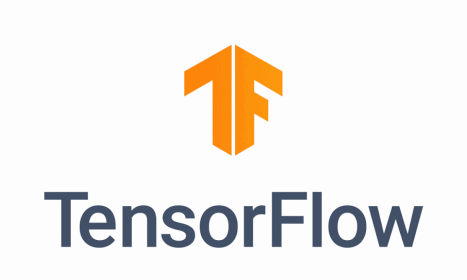

# 6.2 深度学习应用简介

## 学习目标

- 目标
  - 无
- 应用
  - 无

## 6.2.1 区别


**特征提取方面**

- 机器学习的**特征工程步骤是要靠手动完成的，而且需要大量领域专业知识**
- 深度学习**通常由多个层组成，它们通常将更简单的模型组合在一起，通过将数据从一层传递到另一层来构建更复杂的模型。通过大量数据的训练自动得到模型，不需要人工设计特征提取环节**。

> 深度学习算法试图从数据中学习高级功能，这是深度学习的一个非常独特的部分。因此，减少了为每个问题开发新特征提取器的任务。**适合用在难提取特征的图像、语音、自然语言领域** 

**数据量**

机器学习需要的执行时间远少于深度学习，深度学习参数往往很庞大，需要通过大量数据的多次优化来训练参数。 


> 第一、它们需要大量的训练数据集
>
> 第二、是训练深度神经网络需要大量的算力
>
> 可能要花费数天、甚至数周的时间，才能使用数百万张图像的数据集训练出一个深度网络。所以以后
>
> - 需要强大对的GPU服务器来进行计算
> - 全面管理的分布式训练与预测服务——比如[谷歌 TensorFlow 云机器学习平台](https://cloud.google.com/ml/)——可能会解决这些问题，为大家提供成本合理的基于云的 CPU 和 GPU

**算法代表**

- 机器学习
  - 朴素贝叶斯、决策树等
- 深度学习
  - 神经网络

### 6.2.2 深度学习主要应用

- 图像识别
  - 物体识别
  - 场景识别
  - 车型识别
  - 人脸检测跟踪
  - 人脸关键点定位
  - 人脸身份认证
- 自然语言处理技术
  - 机器翻译
  - 文本识别
  - 聊天对话
- 语音技术
  - 语音识别
- 推荐系统


前几年一直关注AI框架，但是近年来框架的同质化说明了它不再是一个需要花大精力解决的问题，TensorFlow、Pytorch这样的框架在工业界的广泛应用，以及各种框架利用 Python 在建模领域的优秀表现，已经可以帮助我们解决很多以前需要自己编程实现的问题，如果作为 AI 工程师，我们应该跳出框架的桎梏，往更广泛的领域寻找价值。

### 6.2.3 常见深度学习框架对比


tensorflow的github：


## 1.2.2 TensorFlow的特点



官网：https://www.tensorflow.org/

- 语言多样（Language Options）

  - TensorFlow使用C++实现的，然后用Python封装。谷歌号召社区通过SWIG开发更多的语言接口来支持TensorFlow

- 使用分发策略进行分发训练

  - 对于大型 ML 训练任务，分发策略 API使在不更改模型定义的情况下，可以轻松地在不同的硬件配置上分发和训练模型。由于 TensorFlow 支持一系列硬件加速器，如 CPU、GPU 和 TPU

- Tensorboard可视化

  - TensorBoard是TensorFlow的一组Web应用，用来监控TensorFlow运行过程

- 在任何平台上的生产中进行强大的模型部署

  一旦您训练并保存了模型，就可以直接在应用程序中执行它，或者使用部署库为其提供服务：

  - [**TensorFlow 服务**](https://www.tensorflow.org/tfx/serving/)：允许模型通过 HTTP/REST 或 GRPC/协议缓冲区提供服务的 TensorFlow 库构建。
  - [**TensorFlow Lite**](https://www.tensorflow.org/mobile/tflite/)：TensorFlow 针对移动和嵌入式设备的轻量级解决方案提供了在 Android、iOS 和嵌入式系统上部署模型的能力。
  - [**tensorflow.js**](https://js.tensorflow.org/)：支持在 JavaScript 环境中部署模型，例如在 Web 浏览器或服务器端通过 Node.js 部署模型。TensorFlow.js 还支持在 JavaScript 中定义模型，并使用类似于 Kera 的 API 直接在 Web 浏览器中进行训练。

## 1.2.3 TensorFlow的安装

安装 TensorFlow在64 位系统上测试这些系统支持 TensorFlow：

- Ubuntu 16.04 或更高版本
- Windows 7 或更高版本
- macOS 10.12.6 (Sierra) 或更高版本（不支持 GPU）

进入虚拟环境当中再安装。刚开始的环境比较简单，只要下载tensorflow即可

- 环境包：

安装较慢，指定镜像源，请在带有numpy等库的虚拟环境中安装

- ubuntu安装

```
pip install tensorflow==1.13 -i https://mirrors.aliyun.com/pypi/simple
```

- MacOS安装

```
pip install tensorflow==1.13 -i https://mirrors.aliyun.com/pypi/simple
```

> 注：如果需要下载GPU版本的（TensorFlow只提供windows和linux版本的，没有Macos版本的）参考官网https://www.tensorflow.org/install/gpu?hl=zh-cn, 
>
> > 1、虚拟机下linux也是用不了GPU版本TensorFlow
> >
> > 2、本机单独的windows和本机单独的unbuntu可以使用GPU版本TensorFlow，需要安装相关驱动

### 1.2.4 Tenssorlfow使用技巧

- 使用**[ tf.keras](https://www.tensorflow.org/guide/keras) **构建、训练和验证您的模型，tf相关API用于损失计算修改等
- tensorflow提供模型训练模型部署

