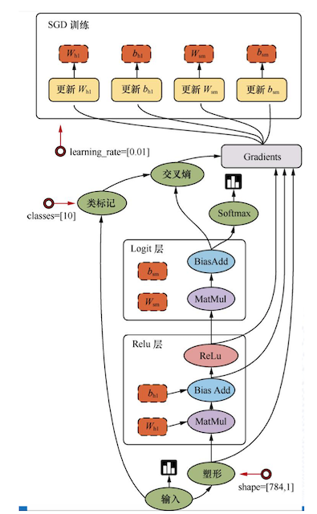

# 2.1 TF数据流图

## 学习目标

- 目标
  - 说明TensorFlow的数据流图结构
- 应用
  - 无
- 内容预览
  - 2.1.1 案例：TensorFlow实现一个加法运算
    - 1 代码
    - 2 TensorFlow结构分析
  - 2.1.2 数据流图介绍

## 2.1.1 案例：TensorFlow实现一个加法运算

### 2.1.1.1  代码

```python
def tensorflow_demo():
    """
    通过简单案例来了解tensorflow的基础结构
    :return: None
    """
    # 一、原生python实现加法运算
    a = 10
    b = 20
    c = a + b
    print("原生Python实现加法运算方法1：\n", c)
    def add(a, b):
        return a + b
    sum = add(a, b)
    print("原生python实现加法运算方法2：\n", sum)

    # 二、tensorflow实现加法运算
    a_t = tf.constant(10)
    b_t = tf.constant(20)
    # 不提倡直接运用这种符号运算符进行计算
    # 更常用tensorflow提供的函数进行计算
    # c_t = a_t + b_t
    c_t = tf.add(a_t, b_t)
    print("tensorflow实现加法运算：\n", c_t)
    # 如何让计算结果出现？
    # 开启会话
    with tf.Session() as sess:
        sum_t = sess.run(c_t)
        print("在sess当中的sum_t:\n", sum_t)
        
    return None
```

> 注意问题：警告指出你的CPU支持AVX运算加速了线性代数计算，即点积，矩阵乘法，卷积等。可以从源代码安装TensorFlow来编译，当然也可以选择关闭
>
> ```python
> import os
> os.environ['TF_CPP_MIN_LOG_LEVEL']='2'
> ```

### 2.1.1.2  TensorFlow结构分析

TensorFlow 程序通常被组织成**一个构建图阶段和一个执行图阶段。**

在构建阶段，数据与操作的执行步骤被描述成一个图。

在执行阶段，使用会话执行构建好的图中的操作。

* 图和会话 ：
  * 图：这是 TensorFlow 将计算表示为指令之间的依赖关系的一种表示法
  * 会话：TensorFlow 跨一个或多个本地或远程设备运行数据流图的机制
* 张量：TensorFlow 中的基本数据对象
* 节点：提供图当中执行的操作

## 2.1.2 数据流图介绍

<figure class="half">
     
    
</figure>


TensorFlow是一个采用数据流图（data flow graphs），用于数值计算的开源框架。

节点（Operation）在图中表示数学操作，线（edges）则表示在节点间相互联系的多维数据数组，即张量（tensor）。


