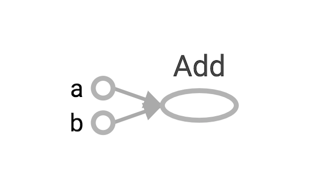

# 2.2 图与TensorBoard

## 学习目标

- 目标
  * 说明图的基本使用
  * 应用tf.Graph创建图、tf.get_default_graph获取默认图
  * 知道开启TensorBoard过程
  * 知道图当中op的名字以及命名空间
- 应用
  - 无
- 内容预览
  - 2.2.1 什么是图结构
  - 2.2.2 图相关操作
    - 1 默认图
    - 2 创建图
  - 2.2.3 TensorBoard:可视化学习
    - 1 数据序列化-events文件 
    - 2 启动TensorBoard
  - 2.2.4 OP
    - 1 常见OP
    - 2 指令名称


## 2.2.1 什么是图结构

图包含了一组tf.Operation代表的计算单元对象和tf.Tensor代表的计算单元之间流动的数据。

## 2.2.2 图相关操作

### 1 默认图

通常TensorFlow会默认帮我们创建一张图。

查看默认图的两种方法：

- 通过调用tf.get_default_graph()访问 ，要将操作添加到默认图形中，直接创建OP即可。
- op、sess都含有graph属性 ，默认都在一张图中

```python
def graph_demo():
    # 图的演示
    a_t = tf.constant(10)
    b_t = tf.constant(20)
    # 不提倡直接运用这种符号运算符进行计算
    # 更常用tensorflow提供的函数进行计算
    # c_t = a_t + b_t
    c_t = tf.add(a_t, b_t)
    print("tensorflow实现加法运算：\n", c_t)

    # 获取默认图
    default_g = tf.get_default_graph()
    print("获取默认图：\n", default_g)

    # 数据的图属性
    print("a_t的graph:\n", a_t.graph)
    print("b_t的graph:\n", b_t.graph)
    # 操作的图属性
    print("c_t的graph:\n", c_t.graph)

    # 开启会话
    with tf.Session() as sess:
        sum_t = sess.run(c_t)
        print("在sess当中的sum_t:\n", sum_t)
        # 会话的图属性
        print("会话的图属性：\n", sess.graph)

    return None
```

### 2 创建图

- 可以通过tf.Graph()自定义创建图

- 如果要在这张图中创建OP，典型用法是使用tf.Graph.as_default()上下文管理器

```python
def graph_demo():
    # 图的演示
    a_t = tf.constant(10)
    b_t = tf.constant(20)
    # 不提倡直接运用这种符号运算符进行计算
    # 更常用tensorflow提供的函数进行计算
    # c_t = a_t + b_t
    c_t = tf.add(a_t, b_t)
    print("tensorflow实现加法运算：\n", c_t)

    # 获取默认图
    default_g = tf.get_default_graph()
    print("获取默认图：\n", default_g)

    # 数据的图属性
    print("a_t的graph:\n", a_t.graph)
    print("b_t的graph:\n", b_t.graph)
    # 操作的图属性
    print("c_t的graph:\n", c_t.graph)

    # 自定义图
    new_g = tf.Graph()
    print("自定义图：\n", new_g)
    # 在自定义图中去定义数据和操作
    with new_g.as_default():
        new_a = tf.constant(30)
        new_b = tf.constant(40)
        new_c = tf.add(new_a, new_b)

    # 数据的图属性
    print("new_a的graph:\n", new_a.graph)
    print("new_b的graph:\n", new_b.graph)
    # 操作的图属性
    print("new_c的graph:\n", new_c.graph)

    # 开启会话
    with tf.Session() as sess:
        sum_t = sess.run(c_t)
        print("在sess当中的sum_t:\n", sum_t)
        # 会话的图属性
        print("会话的图属性：\n", sess.graph)
        # 不同的图之间不能互相访问
        # sum_new = sess.run(new_c)
        # print("在sess当中的sum_new:\n", sum_new)

    with tf.Session(graph=new_g) as sess2:
        sum_new = sess2.run(new_c)
        print("在sess2当中的sum_new:\n", sum_new)
        print("会话的图属性：\n", sess2.graph)

    # 很少会同时开启不同的图，一般用默认的图就够了
    return None
```

**TensorFlow有一个亮点就是，我们能看到自己写的程序的可视化效果，这个功能就是Tensorboard。在这里我们先简单介绍一下其基本功能。**

## 2.2.3 TensorBoard:可视化学习

TensorFlow 可用于训练大规模深度神经网络所需的计算，使用该工具涉及的计算往往复杂而深奥。为了更方便 TensorFlow 程序的理解、调试与优化，TensorFlow提供了TensorBoard 可视化工具。


实现程序可视化过程：

### 1 数据序列化-events文件 

TensorBoard 通过读取 TensorFlow 的事件文件来运行，需要将数据生成一个序列化的 Summary  protobuf 对象。

```python
# 返回filewriter,写入事件文件到指定目录(最好用绝对路径)，以提供给tensorboard使用
tf.summary.FileWriter('./tmp/summary/test/', graph=sess.graph)
```

这将在指定目录中生成一个 event 文件，其名称格式如下：

```python
events.out.tfevents.{timestamp}.{hostname}
```

### 2 启动TensorBoard

```python
tensorboard  --logdir="./tmp/tensorflow/summary/test/"
```

在浏览器中打开 TensorBoard 的图页面 [127.0.0.1:6006 ](http://127.0.0.1:6006 )，会看到与以下图形类似的图,在GRAPHS模块我们可以看到以下图结构

<center></center>

## 2.2.4 OP

### 2.2.4.1 常见OP

哪些是OP？

| 类型           | 实例                                                 |
| -------------- | ---------------------------------------------------- |
| 标量运算       | add, sub, mul, div, exp, log, greater, less, equal   |
| 向量运算       | concat, slice, splot, constant, rank, shape, shuffle |
| 矩阵运算       | matmul, matrixinverse, matrixdateminant              |
| 带状态的运算   | Variable, assgin, assginadd                          |
| 神经网络组件   | softmax, sigmoid, relu,convolution,max_pool          |
| 存储, 恢复     | Save, Restroe                                        |
| 队列及同步运算 | Enqueue, Dequeue, MutexAcquire, MutexRelease         |
| 控制流         | Merge, Switch, Enter, Leave, NextIteration           |

> 一个操作对象（Operation）是TensorFlow图中的一个节点, 可以接收0个或者多个输入Tensor, 并且可以输出0个或者多个Tensor，**Operation**对象是通过op构造函数（如tf.matmul()）创建的。
>
> 例如: **c = tf.matmul(a, b)** 创建了一个Operation对象，类型为 **MatMul**类型, 它将张量a, b作为输入，c作为输出,，并且输出数据，打印的时候也是打印的数据。其中tf.matmul()是函数，在执行matmul函数的过程中会通过MatMul类创建一个与之对应的对象

```python
# 实现一个加法运算
con_a = tf.constant(3.0)
con_b = tf.constant(4.0)

sum_c = tf.add(con_a, con_b)

print("打印con_a：\n", con_a)
print("打印con_b：\n", con_b)
print("打印sum_c：\n", sum_c)
```

打印语句会生成：

```python
打印con_a：
 Tensor("Const:0", shape=(), dtype=float32)
打印con_b：
 Tensor("Const_1:0", shape=(), dtype=float32)
打印sum_c：
 Tensor("Add:0", shape=(), dtype=float32)
```

注意，**打印出来的是张量值，可以理解成OP当中包含了这个值。并且每一个OP指令都对应一个唯一的名称，如上面的Const:0，这个在TensorBoard上面也可以显示**

请注意，tf.Tensor 对象以输出该张量的 tf.Operation 明确命名。张量名称的形式为 "&lt;OP_NAME&gt;:&lt;i&gt;"，其中：

- "&lt;OP_NAME&gt;" 是生成该张量的指令的名称
- "&lt;i&gt;" 是一个整数，它表示该张量在指令的输出中的索引

### 2.2.4.2 指令名称

tf.Graph对象为其包含的 tf.Operation对象定义的一个**命名空间**。TensorFlow 会自动为图中的每个指令选择一个唯一名称，用户也可以指定描述性名称，使程序阅读起来更轻松。我们可以以以下方式改写指令名称

* 每个创建新的 tf.Operation 或返回新的 tf.Tensor 的 API 函数可以接受可选的 name 参数。

例如，tf.constant(42.0, name="answer") 创建了一个名为 "answer" 的新 tf.Operation 并返回一个名为 "answer:0" 的 tf.Tensor。如果默认图已包含名为 "answer" 的指令，则 TensorFlow 会在名称上附加 "1"、"2" 等字符，以便让名称具有唯一性。


* 当修改好之后，我们在Tensorboard显示的名字也会被修改

```python
a = tf.constant(3.0, name="a")
b = tf.constant(4.0, name="b" )
```

