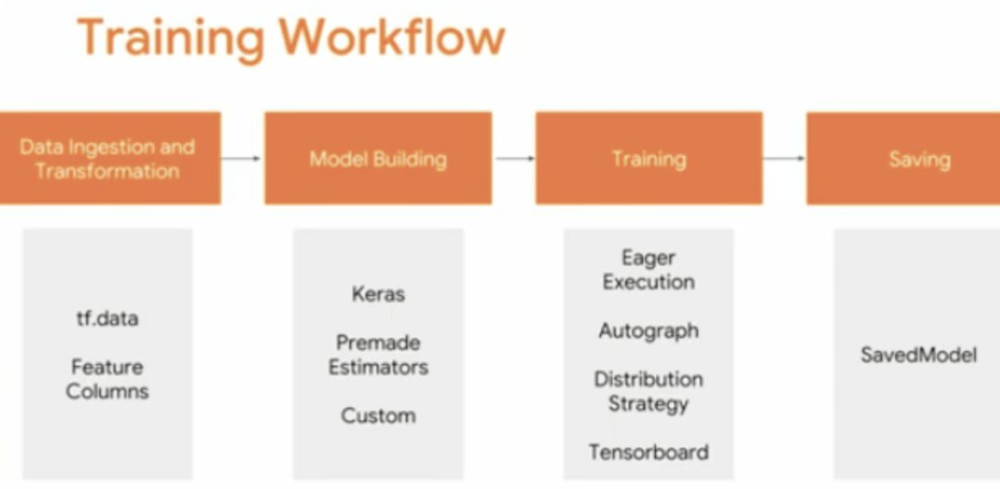
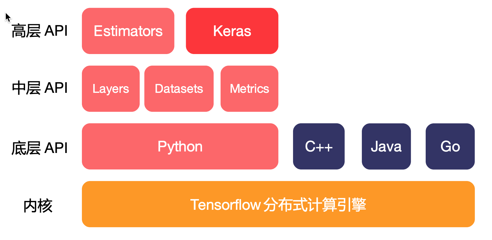

# 2.5 TFAPI使用2.0建议

## 学习目标

- 目标
  - 无
- 应用
  - 无

### 2.5.2 TF2.0最新架构图

* 饱受诟病TF1.0的API混乱
  * 删除 queue runner 以支持 tf.data。
  * 删除图形集合。
  * API 符号的移动和重命名。
  * tf.contrib 将从核心 TensorFlow 存储库和构建过程中移除

TensorFlow 2.0 将专注于 简单性 和 易用性，具有以下更新：

- 使用 Keras 和 eager execution，轻松构建模型
- 在任意平台上实现生产环境的稳健模型部署
- 为研究提供强大的实验工具
- 通过清理废弃的 API 和减少重复来简化 API

**1、使用tf.data加载数据。**使用输入管道读取训练数据，输入管道使用tf.data创建。利用tf.feature_column描述特征，**如分段和特征交叉。**

**2、使用tf.keras构建、训练并验证模型，或者使用Premade Estimators。**

* Keras与TensorFlow的其余部分紧密集成，因此用户可以随时访问TensorFlow的函数。如线性或逻辑回归、梯度上升树、随机森林等也可以直接使用（使用tf.estimatorAPI实现）。
* 如果不想从头开始训练模型，用户也可以很快利用迁移学习来训练使用TensorFlow Hub模块的Keras或Estimator模型。(迁移学习)

**3、使用分布式策略进行分布式训练。**对于大型机器学习训练任务，分布式策略API可以轻松地在不同硬件配置上分配和训练模型，无需更改模型的定义。由于TensorFlow支持各种硬件加速器，如CPU，GPU和TPU，因此用户可以将训练负载分配到单节点/多加速器以及多节点/多加速器配置上（包括TPU Pod）。

**4、导出到Saved Model。** TensorFlow将对Saved Model进行标准化，作为TensorFlow服务的一部分，他将成为TensorFlow Lite、TensorFlow.js、TensorFlow Hub等格式的可互换格式。

**工作流程**

### 2.5.3 API 

1. **高层API (High level)**: 包括Estimators、Keras以及预构建好的Premade estimator(如线性回归、逻辑回归这些、推荐排序模型wide&deep)；
2. **中层API (Mid level)**: 包括layers, datasets, loss和metrics等具有功能性的函数，例如网络层的定义，Loss Function，对结果的测量函数等；
3. **底层API (Low level)**: 包括具体的加减乘除、具有解析式的数学函数、卷积、对Tensor属性的测量等。

