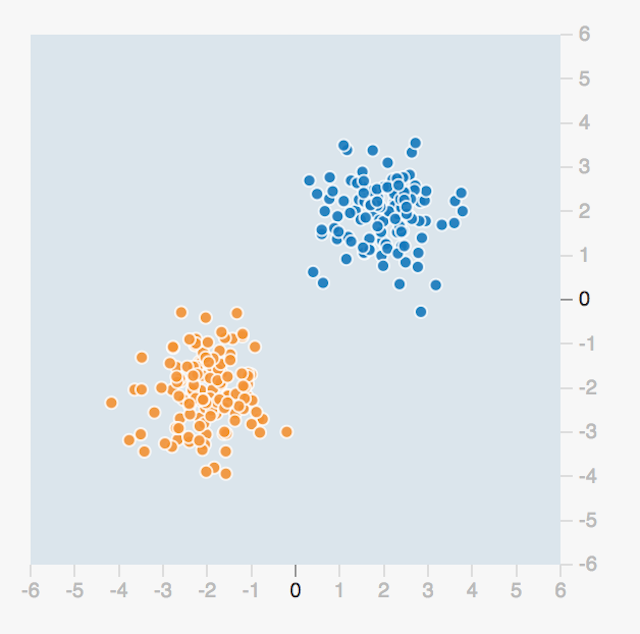
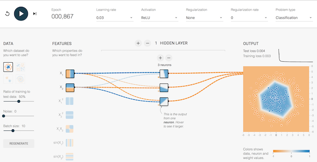
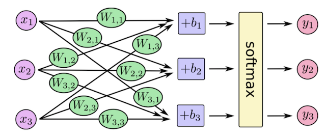
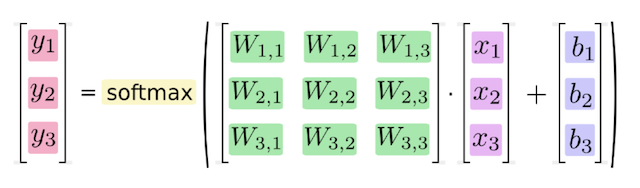
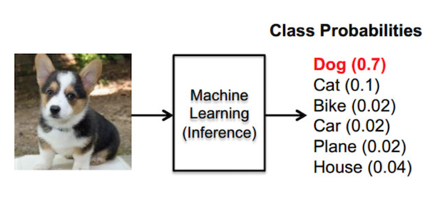
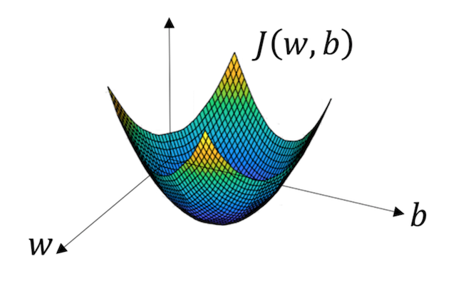
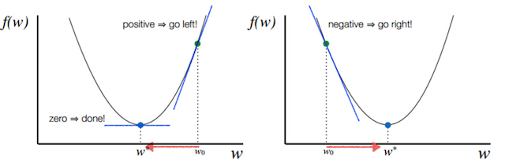

# 7.1 神经网络基础与原理

## 学习目标

- 目标
  - 了解感知机结构、作用以及优缺点
  - 了解tensorflow playground的使用
  - 说明感知机与神经网络的联系
  - 说明神经网络的组成
  - 说明神经网络的分类原理
  - 说明softmax回归
  - 说明交叉熵损失
- 应用
  - 无

## 7.1.1 神经网络

**人工神经网络（ Artificial Neural Network， 简写为ANN）也简称为神经网络（NN）**。是一种模仿生物神经网络（动物的中枢神经系统，特别是大脑）结构和功能的 **计算模型**。经典的神经网络结构包含三个层次的神经网络。**分别输入层，输出层以及隐藏层。**


**其中每层的圆圈代表一个神经元，隐藏层和输出层的神经元有输入的数据计算后输出，输入层的神经元只是输入。**

- 神经网络的特点
  - 每个连接都有个权值 
  - 同一层神经元之间没有连接
  - 最后的输出结果对应的层也称之为**全连接层**

> 神经网络是深度学习的重要算法，用途在图像（如图像的分类、检测）和自然语言处理（如文本分类、聊天等）

那么为什么设计这样的结构呢？首先从一个最基础的结构说起，神经元。以前也称之为感知机。神经元就是要模拟人的神经元结构。


> 一个神经元通常具有多个**树突**，主要用来接受传入信息；而**轴突**只有一条，轴突尾端有许多轴突末梢可以给其他多个神经元传递信息。轴突末梢跟其他神经元的树突产生连接，从而传递信号。这个连接的位置在生物学上叫做“**突触**”。

要理解神经网络，其实要从感知机开始。

### 7.1.1.1 感知机(PLA: Perceptron Learning Algorithm))

感知机就是模拟这样的大脑神经网络处理数据的过程。感知机模型如下图：


感知机是一种最基础的分类模型，前半部分类似于回归模型。感知机最基础是这样的函数，而逻辑回归用的sigmoid。**这个感知机具有连接的权重和偏置**


我们通过一个平台去演示，就是tensorflow playground 

## 7.1.2 playground使用


> 网址：http://playground.tensorflow.org

那么在这整个分类过程当中，是怎么做到这样的效果那要受益于神经网络的一些特点



要区分一个数据点是橙色的还是蓝色的，你该如何编写代码？也许你会像下面一样任意画一条对角线来分隔两组数据点，定义一个阈值以确定每个数据点属于哪一个组。

其中 b 是确定线的位置的阈值。通过分别为 x1 和 x2 赋予权重 w1 和 w2，你可以使你的代码的复用性更强。


此外，如果你调整 w1 和 w2 的值，你可以按你喜欢的方式调整线的角度。你也可以调整 b 的值来移动线的位置。所以你可以重复使用这个条件来分类任何可以被一条直线分类的数据集。但问题的关键是程序员必须为 w1、w2 和 b 找到合适的值——即所谓的参数值，然后指示计算机如何分类这些数据点。

### 7.1.2.1 playground简单两类分类结果


#### 但是这种结构的线性的二分类器，但不能对非线性的数据并不能进行有效的分类。

> 感知机结构，能够很好去解决与、或等问题，但是并不能很好的解决异或等问题。我们通过一张图来看，有四个样本数据
>
> 与问题：每个样本的两个特征同时为1，结果为1
>
> 或问题：每个样本的两个特征一个为1，结果为1
>
> 异或：每个样本的两个特征相同为0， 不同为1
>
> 根据上述的规则来进行划分，我们很容易建立一个线性模型
>
> 

#### 相当于给出这样的数据


### 7.1.2.2 单神经元复杂的两类-playground演示


#### 那么怎么解决这种问题呢？其实我们多增加几个感知机即可解决？也就是下图这样的结构，组成一层的结构？


### 7.1.2.3 多个神经元效果演示



神经网络的主要用途在于分类，那么整个神经网络分类的原理是怎么样的？我们还是围绕着损失、优化这两块去说。神经网络输出结果如何分类？


 **神经网络解决多分类问题最常用的方法是设置n个输出节点，其中n为类别的个数。**

任意事件发生的概率都在0和1之间，且总有某一个事件发生（概率的和为1）。如果将分类问题中“一个样例属于某一个类别”看成一个概率事件，那么训练数据的正确答案就符合一个概率分布。如何将神经网络前向传播得到的结果也变成概率分布呢？Softmax回归就是一个常用的方法。

## 7.1.3 softmax回归

Softmax回归将神经网络输出转换成概率结果






- softmax特点

如何理解这个公式的作用呢？看一下计算案例

```python
假设输出结果为：2.3, 4.1, 5.6
softmax的计算输出结果为：
y1_p = e^2.3/(e^2.3+e^4.1+e^5.6)
y1_p = e^4.1/(e^2.3+e^4.1+e^5.6)
y1_p = e^5.6/(e^2.3+e^4.1+e^5.6)
```

**这样就把神经网络的输出也变成了一个概率输出**



#### 那么如何去衡量神经网络预测的概率分布和真实答案的概率分布之间的距离？

## 7.1.4 交叉熵损失

### 7.1.4.1 公式


为了能够衡量距离，目标值需要进行one-hot编码，能与概率值一一对应，如下图


它的损失如何计算？

```python
0log(0.10)+0log(0.05)+0log(0.15)+0log(0.10)+0log(0.05)+0log(0.20)+1log(0.10)+0log(0.05)+0log(0.10)+0log(0.10)
```

**上述的结果为1log(0.10)，那么为了减少这一个样本的损失。神经网络应该怎么做？**所以会提高对应目标值为1的位置输出概率大小，由于softmax公式影响，其它的概率必定会减少。只要这样进行调整这样是不是就预测成功了！！！！！

### 提高对应目标值为1的位置输出概率大小

### 7.1.4.2 损失大小

神经网络最后的损失为平均每个样本的损失大小。对所有样本的损失求和取其平均值

## 7.1.5 梯度下降算法

目的：使损失函数的值找到最小值

方式：梯度下降

函数的**梯度（gradient）**指出了函数的最陡增长方向。**梯度的方向走，函数增长得就越快。那么按梯度的负方向走，函数值自然就降低得最快了**。模型的训练目标即是寻找合适的 w 与 b 以最小化代价函数值。假设 **w 与 b 都是一维实数**，那么可以得到如下的 J 关于 w 与 b 的图：



可以看到，此成本函数 J 是一个**凸函数**

参数w和b的更新公式为：

$$w := w - \alpha\frac{dJ(w, b)}{dw}$$，$$b := b - \alpha\frac{dJ(w, b)}{db}$$

> 注：其中 α 表示学习速率，即每次更新的 w 的步伐长度。当 w 大于最优解 w′ 时，导数大于 0，那么 w 就会向更小的方向更新。反之当 w 小于最优解 w′ 时，导数小于 0，那么 w 就会向更大的方向更新。迭代直到收敛。

通过平面来理解梯度下降过程：



## 7.1.6 网络原理总结

我们不会详细地讨论可以如何使用反向传播和梯度下降等算法训练参数。**训练过程中的计算机会尝试一点点增大或减小每个参数，看其能如何减少相比于训练数据集的误差，以望能找到最优的权重、偏置参数组合**。


## 7.1.7 Sequential构建简单单层神经网络模型

`Sequential`模型是层的线性堆栈。我们可以`Sequential`通过将层实例列表传递给构造函数来创建模型：

```python
from keras.models import Sequential
from keras.layers import Dense, Activation

model = Sequential([
    Dense(32, input_shape=(784,)),
])
```

同样可以用add方法来添加模型

```python
model = Sequential()
model.add(Dense(32, input_dim=784))
```

