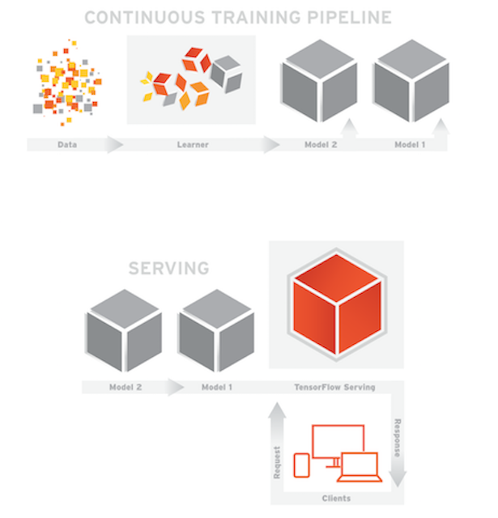

# 7.7 TensorFlow Serving模型部署

### 学习目标

- 目标
  - 无
- 应用
  - 应用TensorFlow Serving完成模型服务运行

## 7.7.1 TensorFlow Serving

TensorFlow Serving是一种灵活的高性能服务系统，适用于机器学习模型，专为生产环境而设计。TensorFlow Serving可以轻松部署新算法和实验，同时保持相同的服务器架构和API。TensorFlow Serving提供与TensorFlow模型的开箱即用集成，但可以轻松扩展以提供其他类型的模型和数据。



### 7.7.1.1 安装Tensorflow Serving

安装过程详细参考官网

> https://www.tensorflow.org/serving/setup

- 使用Docker安装进行，首先你的电脑当中已经安装过docker容器
  - 下载桌面版本：https://www.docker.com/products/docker-desktop

## 7.7.2 TensorFlow Serving Docker

1. 获取最新TF Serving docker镜像

   ```shell
   docker pull tensorflow/serving
   ```

2. 查看docker镜像

   ```shell
   docker images
   ```

3. 运行tf serving（即创建一个docker容器来运行）

   ```shell
   docker run -p 8501:8501 -p 8500:8500 --mount type=bind,source=/home/ubuntu/detectedmodel/commodity,target=/models/commodity -e MODEL_NAME=commodity -t tensorflow/serving
   ```

   说明：

   - `-p 8501:8501` 为端口映射，`-p 主机端口:docker容器程序(tf serving)使用端口`，访问主机8501端口就相当于访问了tf serving程序的8501端口
   - tf serving 使用8501端口对外提供HTTP服务，使用8500对外提供gRPC服务，这里同时开放了两个端口的使用
   - `--mount type=bind,source=/home/ubuntu/detectedmodel/commodity,target=/models/commodity` 为文件映射，将主机(source)的模型文件映射到docker容器程序（target)的位置，以便tf serving使用模型，`target`参数为`/models/我的模型`
   - `-e MODEL_NAME=commodity`设置了一个环境变量，名为`MODEL_NAME`，此变量被tf serving读取，用来按名字寻找模型，与上面target参数中`我的模型`对应
   - `-t` 为tf serving创建一个伪终端，供程序运行
   - `tensorflow/serving`为镜像名

## 7.7.3 案例操作：wdl模型服务运行

- 1、运行命令

```python
docker run -p 8501:8501 -p 8500:8500 --mount type=bind,source=/root/toutiao_project/reco_sys/server/models/serving_model/wdl,target=/models/wdl -e MODEL_NAME=wdl -t tensorflow/serving
```

- 2、查看是否运行

```python
itcast:~$ docker ps
CONTAINER ID        IMAGE                COMMAND                  CREATED              STATUS              PORTS                              NAMES
ed3a36a07ba8        tensorflow/serving   "/usr/bin/tf_serving…"   About a minute ago   Up About a minute   0.0.0.0:8500-8501->8500-8501/tcp   vigorous_goodall
```


