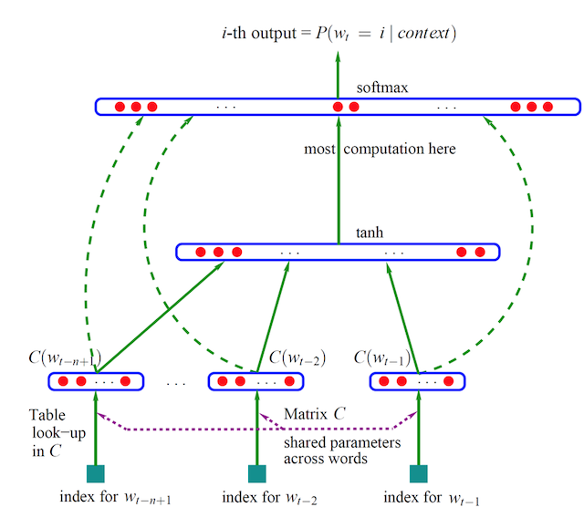
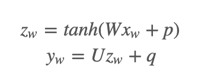
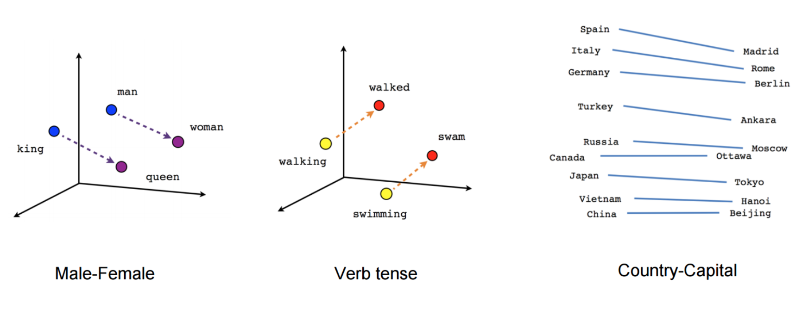

# 7.3 词向量-word2vec

## 学习目标

- 目标
  * 无
- 应用
  - 无

### 7.3.1 Word2Vec模型介绍

#### 7.3.1.1 为什么介绍Word2Vec

图像和音频处理系统采用的是庞大的高维度数据集，对于图像数据来说，此类数据集会编码为单个原始像素强度的向量。不过，自然语言处理系统一直以来都将字词视为离散的原子符号，将字词表示为唯一的离散 ID 还会导致数据稀疏性，并且通常意味着我们可能需要更多数据才能成功训练统计模型。使用向量表示法可以扫除其中一些障碍。

- 计算相似度：寻找相似词、或者用于文章之间的相似度
- 文本生成、机器翻译等

#### 7.3.1.2 词向量是什么

定义：将**文字**通过一串数字向量表示

- **词的独热表示**：One-hot Representation
  - 采用稀疏方式 存储，简单易实现
  - 灯泡:[0,0,0,0,0,1,0,0,0,0,0,0,0,0,0,0]、灯管：[0,0,0,0,0,0,0,1,0,0,0,0,0,0,0,0]

维度过大词汇鸿沟现象：任意两个词之间都是孤立的。光从这两个向量中看不出两个词是否有关系，哪怕”灯泡”和”灯管”这两个词是同义词也不行

- **词的分布式表示**：Distributed representation
  - 传统的独热表示（ one-hot representation）仅仅将词符号化，不包含任何语义信息
  - Distributed representation 最早由 Hinton在 1986 年提出。它是一种低维实数向量，这种向量一般长成这个样子： [0.792, −0.177, −0.107, 0.109, −0.542, …]
  - **最大的贡献就是让相关或者相似的词，在距离上更接近了**

#### 7.3.1.3 词向量来源思想

- 统计语言模型： 统计语言模型把语言（词的序列）看作一个随机事件，并赋予相应的概率来描述其属于某种语言集合的可能性

例如：一个句子由w1,w2,w3,w4,w5,…….这些词组，使得P(w1,w2,w3,w4,w5……)概率大(可以从训练语料中得出)

- N-Gram(CBOW方式)
  - 语言是一种序列，词与词之间并不是相互独立
  - 一元模型(unigram model)：假设某个出现的概率与前面所有词无关
    - P(s) = P(w1)P(w2)P(w3)…P(w4)
  - 二元模型(bigram model)：假设某个出现的概率与前面一个词相关
    - P(s) = P(w1)P(w2|w1)P(w3|w2)…P(w_i|w_i-1)
  - 三元模型(trigram model)：假设某个出现的概率与前面两个词相关
    - P(s) = P(w1)P(w2|w1)P(w3|w1,w2)…P(w_i|w_i-2,w_i-1)

> 注：目前使用较多的是三元模型，由于训练语料限制,无法追求更大的N，并且N越大导致计算量越来越大
>
> 模型：CBOW模型、Skip-gram都是能够训练出词向量，cbow和skip-gram都是在word2vec中用于将文本进行向量表示的实现方法。

#### 7.3.1.4  训练词向量的神经网络模型

* 原理公式：

神经概率语言模型一直以来都使用最大似然率 (ML) 原则进行训练，以最大限度地提高使用 softmax函数根据之前的字词 h（表示“历史”字词）正确预测出下一个字词 wt（表示“目标”字词）的概率。


- 通过一个三层神经网络得出，由约书亚.本吉奥（Yoshua Bengio）提出word2vec模型神经网络雏形



- 通过窗口输入句子中的连续三个词，w1,w2,w3
  - 输入网络中已是**随机初始化的向量**，如w1:[0,0,0,0,…..,0]，值的向量长度自定义，三个词向量，输入到网络中。(词向量作为参数)
  - 目标值为原句子的后面一个w4，通过onehot编码定义
  - 网络训练，网络参数更新，自动调整w1,w2,w3的向量值，达到经过最后的softmax(多分类概率)，输出预测概率，与目标值计算损失



以下面的数据集为例

```
the quick brown fox jumped over the lazy dog
```

首先形成一个数据集，其中包含字词以及字词在其中出现的上下文。我们可以通过任何有意义的方式定义“上下文”，事实上人们研究了语法上下文（、目标左侧的字词、目标右侧的字词等。暂时我们使用 vanilla 定义，将“上下文”定义为目标字词左侧和右侧的字词窗口。使用大小为 1 的窗口，我们将获得以下数据集

```
([the, brown], quick), ([quick, fox], brown), ([brown, jumped], fox), ...
```



#### 关于word2vec

分布式词向量并不是word2vec的作者发明的，word2vec就是实现词向量的一种工具。具体实现通过cbow等方式


### 7.3.2 案例：IMDB电影评论文本的神经网络分类

* 目的：对IMDB电影评论数据进行训练，预测分类
* 步骤：
  * 1、电影评论数据读取
  * 2、模型输入特征列指定
  * 3、模型训练与保存

**1、电影评论数据读取**

我们将要使用的数据集是 IMDB Large Movie Review Dataset，包含用于训练的 25000 段带有明显情感倾向的电影评论，测试集有 25000 段。我们将会用此数据集训练一个二分类模型，用于判断一篇评论是积极的还是消极的。

比如一个负面评论（2 颗星）的片段：

> Now, I LOVE Italian horror films. The cheesier they are, the better. However, this is not cheesy Italian. This is week-old spaghetti sauce with rotting meatballs. It is amateur hour on every level. There is no suspense, no horror, with just a few drops of blood scattered around to remind you that you are in fact watching a horror film.

我们用 0 将所有句子补齐到相同长度（这里是 200），这样对于训练集和测试集我们就分别有一个两维的 25000×200 的数组。

```python
# 指定总共多少不同的词，每个样本的序列长度最大多少
vocab_size = 5000
sentence_size = 200
imdb = keras.datasets.imdb

(x_train_variable, y_train), (x_test_variable, y_test) = imdb.load_data(num_words=vocab_size)
x_train = keras.preprocessing.sequence.pad_sequences(
    x_train_variable,
    maxlen=sentence_size,
    padding='post',
    value=0)
x_test = keras.preprocessing.sequence.pad_sequences(
    x_test_variable,
    maxlen=sentence_size,
    padding='post',
    value=0)
```

- 填充序列pad_sequences

```
keras.preprocessing.sequence.pad_sequences(sequences, maxlen=None, dtype='int32',
    padding='pre', truncating='pre', value=0.)
```

将长为`nb_samples`的序列转化为形如`(nb_samples,nb_timesteps)`2D numpy array。如果提供了参数`maxlen`，`nb_timesteps=maxlen`，否则其值为最长序列的长度。其他短于该长度的序列都会在后部填充0以达到该长度。长于`nb_timesteps`的序列将会被截断，以使其匹配目标长度。padding和截断发生的位置分别取决于`padding`和`truncating`.

### 参数

- sequences：浮点数或整数构成的两层嵌套列表
- maxlen：None或整数，为序列的最大长度。大于此长度的序列将被截短，小于此长度的序列将在后部填0.
- dtype：返回的numpy array的数据类型
- padding：‘pre’或‘post’，确定当需要补0时，在序列的起始还是结尾补
- truncating：‘pre’或‘post’，确定当需要截断序列时，从起始还是结尾截断
- value：浮点数，此值将在填充时代替默认的填充值0

Input Functions的定义

```python
def parser(x, y):
    features = {"x": x}
    return features, y

def train_input_fn():
    dataset = tf.data.Dataset.from_tensor_slices((x_train, y_train))
    dataset = dataset.shuffle(buffer_size=len(x_train_variable))
    dataset = dataset.batch(100)
    dataset = dataset.map(parser)
    dataset = dataset.repeat()
    iterator = dataset.make_one_shot_iterator()
    return iterator.get_next()


def eval_input_fn():
    dataset = tf.data.Dataset.from_tensor_slices((x_test, y_test))
    dataset = dataset.batch(100)
    dataset = dataset.map(parser)
    iterator = dataset.make_one_shot_iterator()
    return iterator.get_next()
```

> 注：要在 `input_fn` 中使用 `Dataset`（input_fn 属于 [`tf.estimator.Estimator`](https://www.tensorflow.org/api_docs/python/tf/estimator/Estimator?hl=zh-CN)），只需返回 `Dataset` 即可，框架将负责创建和初始化迭代器。

**2、模型输入特征列指定**

指定特征列

```python
column = tf.feature_column.categorical_column_with_identity('feature', vocab_size)

embedding_size = 50
word_embedding_column = tf.feature_column.embedding_column(
    column, dimension=embedding_size
)
```

**3、进行模型训练**

指定模型的神经网络的神经元数量，以及几层；特征列；模型输出目录

```python
classifier = tf.estimator.DNNClassifier(
    hidden_units=[100],
    feature_columns=[word_embedding_column],
    model_dir='./tmp/embeddings'
)

classifier.train(input_fn=train_input_fn, steps=25000)
eval_results = classifier.evaluate(input_fn=eval_input_fn)
print(eval_results)
```