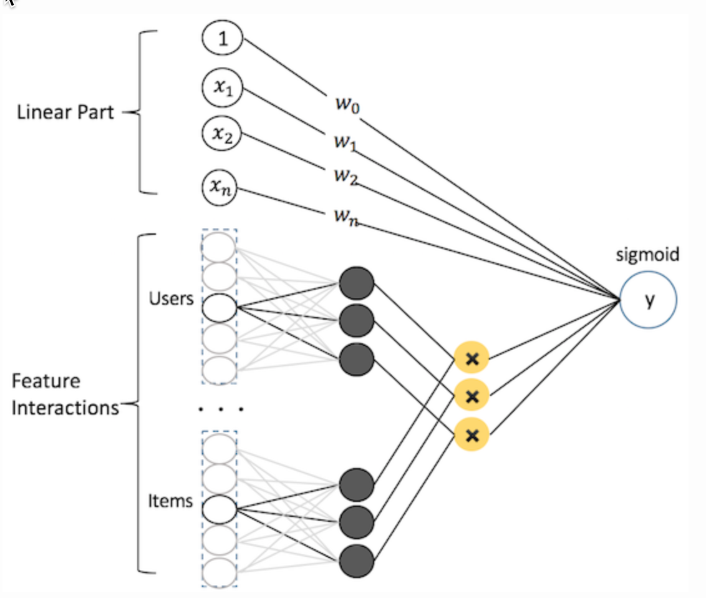

# 8.5 深度学习与排序模型发展

## 学习目标

- 目标
  - 了解深度学习排序模型的发展
- 应用
  - 无

### 8.5.1 工程开发实践流程

**整体训练流程**

对于线下训练，采取如下训练流程：

* Spark原始数据整合 -> Spark/TF生成TFRecord -> TF数据并行训练 -> TensorFlow Serving线下评估 -> CPU线上预测

### 8.5.2 模型发展

CTR/CVR预估经历了从传统机器学习模型到深度学习模型的过渡。下面先简单介绍下传统机器学习模型（GBDT、LR、到深度模型及应用，然后再详细介绍在深度学习模型的迭代。

#### LR

$$y(\mathbf{x}) = sigmoid(w_0+ \sum_{i=1}^n w_i x_i)$$

LR可以视作单层单节点的“DNN”, 是一种宽而不深的结构，所有的特征直接作用在最后的输出结果上。模型优点是简单、可控性好，但是效果的好坏直接取决于特征工程的程度，需要非常精细的连续型、离散型、时间型等特征处理及特征组合。通常通过正则化等方式控制过拟合。

#### FM & FFM

FM可以看做带特征交叉的LR，如下图所示：

$$y(\mathbf{x}) = w_0 + \sum_{i=1}^n w_i x_i + \sum_{i=1}^n \sum_{j=i+1}^n \langle \mathbf{v}_{i, f_j}, \mathbf{v}_{j, f_i} \rangle x_i x_j$$

模型覆盖了LR的宽模型结构，同时也引入了交叉特征，增加模型的非线性，提升模型容量，能捕捉更多的信息，对于CTR预估等复杂场景有更好的捕捉。

* 特征交叉：
  * 例子：年龄：[1990,2000],[2000,2010]
  * 性别：male, female
  * 交叉特征：male and [1990，2000]，female and [1990，2000] ,male and [2000，2010], female and [2000, 2010]
* 特征交叉问题：如果是简单的进行组合，会造成特征列数量过多，大量特征列
  * 解决问题：对于交叉特征采用哈希分桶

#### DNN

**实验表明从线性的LR到具备非线性交叉的FM，到具备Field信息交叉的FFM**，模型复杂度（模型容量）的提升，带来的都是结果的提升。而LR和FM/FFM可以视作简单的浅层神经网络模型，基于下面一些考虑，我们在把CTR模型切换到深度学习神经网络模型：

- 通过改进模型结构，**加入深度结构，利用端到端的结构挖掘高阶非线性特征**，以及浅层模型无法捕捉的潜在模式。
- 对于某些ID类特别稀疏的特征，可以在模型中学习到保持分布关系的稠密表达（embedding）。
- 充分利用图片和文本等在简单模型中不好利用的信息。

#### Wide & Deep

首先尝试的是Google提出的经典模型Wide & Deep Model，模型包含Wide和Deep两个部分(LR+DNN的结合)

* 其中Wide部分可以很好地学习样本中的高频部分，在LR中使用到的特征可以直接在这个部分使用，但对于没有见过的ID类特征，模型学习能力较差，同时合理的人工特征工程对于这个部分的表达有帮助。
  * **根据人工经验、业务背景，将我们认为有价值的、显而易见的特征及特征组合，喂入Wide侧**。
* Deep部分可以补充学习样本中的长尾部分，同时提高模型的泛化能力。Wide和Deep部分在这个端到端的模型里会联合训练。
  * **通过embedding将tag向量化，变tag的精确匹配，为tag向量的模糊查找，使自己具备了良好的“扩展”能力**。

### 8.5.3 类别特征在推荐系统中作用

深度学习的这一波热潮，发源于CNN在图像识别上所取得的巨大成功，后来才扩展到推荐、搜索等领域。但是实际上，推荐系统中所使用的深度学习与计算机视觉中用到的深度学习有很大不同。其中一个重要不同，就是图像都是稠密特征，而推荐、搜索中大量用到的是稀疏的类别/ID类特

优点：

- LR, DNN在底层还是一个线性模型，但是实际工业中，**标签y与特征x之间较少存在线性关系，而往往是分段的**。以“点击率~历史曝光次数”之间的关系为例，之前曝光过1、2次的时候，“点击率~历史曝光次数”之间一般是正相关的，再多曝光1、2次，用户由于好奇，没准就点击了；但是，如果已经曝光过8、9次了，由于用户已经失去了新鲜感，越多曝光，用户越不可能再点，这时“点击率~历史曝光次数”就表现出负相关性。因此，categorical特征相比于numeric特征，更加符合现实场景。
- 推荐、搜索一般都是基于用户、商品的标签画像系统，而标签大多数都是categorical的
- 稀疏的类别/ID类特征，可以**稀疏地存储、传输、运算，提升运算效率**。

缺点：

稀疏的categorical/ID类特征，也有着**单个特征表达能力弱、特征组合爆炸、分布不均匀导致受训程度不均匀**的缺点。但是**对于CTR预估和排序学习的领域，目前深度学习尚未在自动特征挖掘上对人工特征工程形成碾压之势，因此人工特征工程依然很重要**。当然，深度学习在特征工程上与传统模型的特征工程也存在着一些区别，工作主要集中在如下几个方面。为此，一系列的新技术被提出来：

- 1、算法上，FTRL这样的算法，充分利用输入的稀疏性在线更新模型，训练出的模型也是稀疏的，便于快速预测。

- **2、特征预处理**

  - **特征归一化**：深度网络的学习几乎都是基于反向传播，而此类梯度优化的方法对于特征的尺度非常敏感。因此，需要对特征进行归一化或者标准化以促使模型更好的收敛。
  - **特征离散化**
    - 工业界一般很少直接使用连续值作为特征，而是将特征离散化后再输入到模型中。一方面因为离散化特征对于异常值具有更好的鲁棒性，其次可以为特征引入非线性的能力。**并且，离散化可以更好的进行Embedding**，我们主要使用如下两种离散化方法：
    - **等频分桶**：按样本频率进行等频切分，缺失值可以选择给一个默认桶值或者单独设置分桶。

  - **特征组合**：基于业务场景对基础特征进行组合，形成更丰富的行为表征，为模型提供先验信息，可加速模型的收敛速度。典型示例如下：
    - 用户性别与类目之间的交叉特征，能够刻画出不同性别的用户在类目上的偏好差异，比如男性用户可能会较少关注“丽人”相关的商户。
    - 时间与类目之间的交叉特征，能够刻画出不同类目商户在时间上的差异，例如，酒吧在夜间会更容易被点击。
  - **多考虑Embedding**
    - 通过Embedding去表征用户的个性化偏好和商户的精准画像

- 3、增加模型的DNN层级也会增加效果

