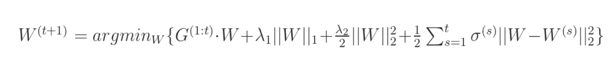

# 5.8 排序模型进阶-FTRL

## 学习目标

- 目标
  - 无
- 应用
  - 无

### 5.8.1 问题

在实际项目的时候，经常会遇到训练数据非常大导致一些算法实际上不能操作的问题。比如在推荐行业中，因为DSP的请求数据量特别大，一个星期的数据往往有上百G，这种级别的数据在训练的时候，直接套用一些算法框架是没办法训练的，基本上在特征工程的阶段就一筹莫展。通常采用采样、截断的方式获取更小的数据集，或者使用大数据集群的方式进行训练，但是这两种方式在作者看来目前存在两个问题：

- 采样数据或者截断数据的方式，非常的依赖前期的数据分析以及经验。
- 大数据集群的方式，目前spark原生支持的机器学习模型比较少；使用第三方的算法模型的话，需要spark集群的2.3以上；而且spark训练出来的模型往往比较复杂，实际线上运行的时候，对内存以及QPS的压力比较大。


### 5.8.2 在线优化算法-Online-learning

1. 模型更新周期慢，不能有效反映线上的变化，最快小时级别，一般是天级别甚至周级别。
2. 模型参数多线上predict的时候需要内存大，QPS无法保证。
   * 对1采用On-line-learning的算法。
   * 对2采用一些优化的方法，在保证精度的前提下，尽量获取稀疏解，从而降低模型参数的数量。

比较出名的在线最优化的方法有：

- TG(Truncated Gradient)
- FOBOS(Forward-Backward Splitting)
- RDA(Regularized Dual Averaging)
- **FTRL(Follow the Regularized Leader)**

SGD算法是常用的online learning算法，它能学习出不错的模型，但学出的模型不是稀疏的。为此，学术界和工业界都在研究这样一种online learning算法，它能学习出有效的且稀疏的模型

### 5.8.2 Follow The Regularized Leader(FTLR)

* 一种获得稀疏模型并且防止过拟合的优化方法



### 正则化(Regularization)

**正则化**，**即在成本函数中加入一个正则化项(惩罚项)，惩罚模型的复杂度，防止网络过拟合**

#### 逻辑回归的L1与L2正则化

逻辑回归的参数W数量根据特征的数量而定，那么正则化如下

* 逻辑回归的损失函数中增加L2正则化

$$J(w,b) = \frac{1}{m}\sum_{i=1}^mL(\hat{y}^{(i)},y^{(i)})+\frac{\lambda}{2m}{||w||}^2_2$$

其中的L2范数可以理解：$$\frac{\lambda}{2m}{||w||}^2_2=\frac{\lambda}{2m}\sum_{j=1}^{n_x}w^2_j = \frac{\lambda}{2m}w^Tw$$

解释：所有w参数的平方和的结果

* 逻辑回归的损失函数中增加L1正则化

$$J(w,b) = \frac{1}{m}\sum_{i=1}^mL(\hat{y}^{(i)},y^{(i)}) + \frac{\lambda}{2m}{||w||}_1$$

其中L2范数可以理解为：$$\frac{\lambda}{2m}{||w||}_1 = \frac{\lambda}{2m}\sum_{j=1}^{n_x}{|w_j|}$$

注：其中，λ 为正则化因子，是**超参数**。由于 L1 正则化最后得到 w 向量中将存在大量的 0，使模型变得稀疏化，因此 L2 正则化更加常用。

#### 正则化项的理解

在损失函数中增加一项，那么其实梯度下降是要减少损失函数的大小，对于L2或者L1来讲都是要去减少这个正则项的大小，那么也就是会减少W权重的大小。这是我们一个直观上的感受。

* 接下来我们通过方向传播来理解这个其中的L2，对于损失函数我们要反向传播求参数梯度：

(1) $$dW = \frac{\partial L}{\partial w}+ \frac{\lambda}{m} {W}$$

前面的默认损失函数的梯度计算结果默认为backprop，那么更新的参数就为

(2) $$W := W - \alpha dW$$
那么我们将第一个公式带入第二个得到

$$-->W := W - \alpha(\frac{\partial L}{\partial w} + \frac{\lambda}{m}W)$$

$$-->=W - \frac{\alpha \lambda}{m}W - \alpha*\frac{\partial L}{\partial w}$$

所以每次更新的时候都会让$$W(1 - \frac{\alpha \lambda}{m})$$,这个系数永远小于1，所以我们通常称L2范数为**权重衰减**。

FTRL算法的设计思想其实并不复杂，就是**每次找到让之前所有目标函数（损失函数加正则项）之和最小的参数**。该算法在处理诸如逻辑回归之类的带非光滑正则化项（如L1正则项）的凸优化问题上表现出色，在计算精度和特征的稀疏性上做到了很好的trade-off，而且在工程实现上做了大量优化，性能优异。

- **正则项**：众所周知，**目标函数添加L1正则项可增加模型解的稀疏性，添加L2正则项有利于防止模型过拟合**。也可以将两者结合使用，即混合正则，FTRL就是这样设计的。
  - **稀疏性**：模型解的稀疏性在机器学习中是很重要的，尤其是在工程应用领域。稀疏的模型解会大大减少预测时的内存和时间复杂度。常用的稀疏性方法包括：

### 5.8.3 案例：美国普查数据-FTRL使用

####TensorFlow FTRL 读取训练

- 算法参数
  - lambda1：L1正则系数，参考值：10 ~ 15
  - lambda2：L2正则系数，参考值：10 ~ 15
  - alpha：FTRL参数，参考值：0.1
  - beta：FTRL参数，参考值：1.0
  - batchSize: mini-batch的大小，参考值：10000
- 性能评测
  - 设置参数：
    - lambda1 = 15，lambda2 = 15， alpha = 0.1， beta = 1.0

* 使用FTRL算法训练模型

```python
classifiry = tf.estimator.LinearClassifier(feature_columns=feature_cl,
                                               optimizer=tf.train.FtrlOptimizer(
                                                   learning_rate=0.01,
                                                   l1_regularization_strength=10,
                                                   l2_regularization_strength=15,
                                               ))
```

但是会发现，加上正则化之后效果并不一定得到显著提升，这也是在于FTRL更适合大量的稀疏特征和大量数据场景。

|          | baseline   | Feature intersection | FTRL      |
| -------- | ---------- | -------------------- | --------- |
| accuracy | 0.8323813  | 0.8401818            | 0.8191143 |
| auc      | 0.87850624 | 0.89078486           | 0.8677618 |

### 5.8.4 黑马离线数据训练FTRL模型

* 目的：通过离线TFRecords样本数据，训练FTRL模型
* 步骤：
  * 1、构建TFRecords的输入数据
  * 2、使用模型进行特征列指定
  * 3、模型训练以及预估

**1、构建TFRecords的输入数据**

* feature: 121列值，1channel_id, 100 vector, 10user_weights, 10 article_weights
  * (1)给每个值指定一个类型
  * (2)后面三种，计算平均值，作为一个特征(少量代码)
* 解析example:tf.parse_single_example(example_proto, features)
  * features = {
    "label": tf.FixedLenFeature([], tf.int64),
    "feature": tf.FixedLenFeature([], tf.string)
    }
  * 针对每一个样本指定，string类型需要解析
  * tf.decode_raw(parsed_features['feature'], tf.float64)

```python
FEATURE_COLUMNS = ['channel_id', 'vector', 'user_weigths', 'article_weights']


@staticmethod
def read_ctr_records():
    # 定义转换函数,输入时序列化的
    def parse_tfrecords_function(example_proto):
        features = {
            "label": tf.FixedLenFeature([], tf.int64),
            "feature": tf.FixedLenFeature([], tf.string)
        }
        parsed_features = tf.parse_single_example(example_proto, features)

        feature = tf.decode_raw(parsed_features['feature'], tf.float64)
        feature = tf.reshape(tf.cast(feature, tf.float32), [1, 121])
        # 特征顺序 1 channel_id,  100 article_vector, 10 user_weights, 10 article_weights
        # 1 channel_id类别型特征， 100维文章向量求平均值当连续特征，10维用户权重求平均值当连续特征
        channel_id = tf.cast(tf.slice(feature, [0, 0], [1, 1]), tf.int32)
        vector = tf.reduce_sum(tf.slice(feature, [0, 1], [1, 100]), axis=1)
        user_weights = tf.reduce_sum(tf.slice(feature, [0, 101], [1, 10]), axis=1)
        article_weights = tf.reduce_sum(tf.slice(feature, [0, 111], [1, 10]), axis=1)

        label = tf.cast(parsed_features['label'], tf.float32)

        # 构造字典 名称-tensor
        tensor_list = [channel_id, vector, user_weights, article_weights]

        feature_dict = dict(zip(FEATURE_COLUMNS, tensor_list))

        return feature_dict, label

    dataset = tf.data.TFRecordDataset(["./train_ctr_20190605.tfrecords"])
    dataset = dataset.map(parse_tfrecords_function)
    dataset = dataset.batch(64)
    dataset = dataset.repeat(10)
    return dataset
```

2、使用模型进行特征列指定

```python
def train_eval(self):
    """
    训练模型
    :return:
    """
    # 离散分类
    article_id = tf.feature_column.categorical_column_with_identity('channel_id', num_buckets=25)
    # 连续类型
    vector = tf.feature_column.numeric_column('vector')
    user_weigths = tf.feature_column.numeric_column('user_weigths')
    article_weights = tf.feature_column.numeric_column('article_weights')

    feature_columns = [article_id, vector, user_weigths, article_weights]
```

3、模型训练以及预估

```python
classifiry = tf.estimator.LinearClassifier(feature_columns=feature_columns,
                                           optimizer=tf.train.FtrlOptimizer(learning_rate=0.1,
                                                                            l1_regularization_strength=10,
                                                                            l2_regularization_strength=10))
classifiry.train(LrWithFtrl.read_ctr_records, steps=10000)
result = classifiry.evaluate(LrWithFtrl.read_ctr_records)
print(result)
```

完整代码：

```python
import tensorflow as tf

FEATURE_COLUMNS = ['channel_id', 'vector', 'user_weigths', 'article_weights']


class LrWithFtrl(object):
    """LR以FTRL方式优化
    """
    def __init__(self):
        pass

    @staticmethod
    def read_ctr_records():
        # 定义转换函数,输入时序列化的
        def parse_tfrecords_function(example_proto):
            features = {
                "label": tf.FixedLenFeature([], tf.int64),
                "feature": tf.FixedLenFeature([], tf.string)
            }
            parsed_features = tf.parse_single_example(example_proto, features)

            feature = tf.decode_raw(parsed_features['feature'], tf.float64)
            feature = tf.reshape(tf.cast(feature, tf.float32), [1, 121])
            # 特征顺序 1 channel_id,  100 article_vector, 10 user_weights, 10 article_weights
            # 1 channel_id类别型特征， 100维文章向量求平均值当连续特征，10维用户权重求平均值当连续特征
            channel_id = tf.cast(tf.slice(feature, [0, 0], [1, 1]), tf.int32)
            vector = tf.reduce_sum(tf.slice(feature, [0, 1], [1, 100]), axis=1)
            user_weights = tf.reduce_sum(tf.slice(feature, [0, 101], [1, 10]), axis=1)
            article_weights = tf.reduce_sum(tf.slice(feature, [0, 111], [1, 10]), axis=1)

            label = tf.cast(parsed_features['label'], tf.float32)

            # 构造字典 名称-tensor
            tensor_list = [channel_id, vector, user_weights, article_weights]

            feature_dict = dict(zip(FEATURE_COLUMNS, tensor_list))

            return feature_dict, label

        dataset = tf.data.TFRecordDataset(["./train_ctr_20190605.tfrecords"])
        dataset = dataset.map(parse_tfrecords_function)
        dataset = dataset.batch(64)
        dataset = dataset.repeat(10)
        return dataset

    def train_eval(self):
        """
        训练模型
        :return:
        """
        # 离散分类
        article_id = tf.feature_column.categorical_column_with_identity('channel_id', num_buckets=25)
        # 连续类型
        vector = tf.feature_column.numeric_column('vector')
        user_weigths = tf.feature_column.numeric_column('user_weigths')
        article_weights = tf.feature_column.numeric_column('article_weights')

        feature_columns = [article_id, vector, user_weigths, article_weights]

        classifiry = tf.estimator.LinearClassifier(feature_columns=feature_columns,
                                                   optimizer=tf.train.FtrlOptimizer(learning_rate=0.1,
                                                                                    l1_regularization_strength=10,
                                                                                    l2_regularization_strength=10))
        classifiry.train(LrWithFtrl.read_ctr_records, steps=10000)
        result = classifiry.evaluate(LrWithFtrl.read_ctr_records)
        print(result)


if __name__ == '__main__':
    lwf = LrWithFtrl()
    lwf.train_eval()
```

**拓展：**

keras版本代码完整代码：

```python
import tensorflow as tf
from tensorflow.python import keras


class LrWithFtrl(object):
    """LR以FTRL方式优化
    """
    def __init__(self):
        self.model = keras.Sequential([
            keras.layers.Dense(1, activation='sigmoid', input_shape=(121,))
        ])

    @staticmethod
    def read_ctr_records():
        # 定义转换函数,输入时序列化的
        def parse_tfrecords_function(example_proto):
            features = {
                "label": tf.FixedLenFeature([], tf.int64),
                "feature": tf.FixedLenFeature([], tf.string)
            }
            parsed_features = tf.parse_single_example(example_proto, features)

            feature = tf.decode_raw(parsed_features['feature'], tf.float64)
            feature = tf.reshape(tf.cast(feature, tf.float32), [1, 121])
            label = tf.reshape(tf.cast(parsed_features['label'], tf.float32), [1, 1])
            return feature, label

        dataset = tf.data.TFRecordDataset(["./train_ctr_201904.tfrecords"])
        dataset = dataset.map(parse_tfrecords_function)
        dataset = dataset.shuffle(buffer_size=10000)
        dataset = dataset.repeat(10000)
        return dataset

    def train(self, dataset):

        self.model.compile(optimizer=tf.train.FtrlOptimizer(0.03, l1_regularization_strength=0.01,
                                                            l2_regularization_strength=0.01),
                           loss='binary_crossentropy',
                           metrics=['binary_accuracy'])
        self.model.fit(dataset, steps_per_epoch=10000, epochs=10)
        self.model.summary()
        self.model.save_weights('./ckpt/ctr_lr_ftrl.h5')

    def predict(self, inputs):
        """预测
        :return:
        """
        # 首先加载模型
        self.model.load_weights('/root/toutiao_project/reco_sys/offline/models/ckpt/ctr_lr_ftrl.h5')
        init = tf.global_variables_initializer()

        with tf.Session() as sess:
            sess.run(init)
            predictions = self.model.predict(sess.run(inputs))
        return predictions


if __name__ == '__main__':
    lwf = LrWithFtrl()
    dataset = lwf.read_ctr_records()
    inputs, labels = dataset.make_one_shot_iterator().get_next()
    print(inputs, labels)
    lwf.predict(inputs)
```

### 在线预测

```python
def lrftrl_sort_service(reco_set, temp, hbu):
    """
    排序返回推荐文章
    :param reco_set:召回合并过滤后的结果
    :param temp: 参数
    :param hbu: Hbase工具
    :return:
    """
    print(344565)
    # 排序
    # 1、读取用户特征中心特征
    try:
        user_feature = eval(hbu.get_table_row('ctr_feature_user',
                                              '{}'.format(temp.user_id).encode(),
                                              'channel:{}'.format(temp.channel_id).encode()))
        logger.info("{} INFO get user user_id:{} channel:{} profile data".format(
            datetime.now().strftime('%Y-%m-%d %H:%M:%S'), temp.user_id, temp.channel_id))
    except Exception as e:
        user_feature = []
        logger.info("{} WARN get user user_id:{} channel:{} profile data failed".format(
            datetime.now().strftime('%Y-%m-%d %H:%M:%S'), temp.user_id, temp.channel_id))
    reco_set = [13295, 44020, 14335, 4402, 2, 14839, 44024, 18427, 43997, 17375]
    if user_feature and reco_set:
        # 2、读取文章特征中心特征
        result = []
        for article_id in reco_set:
            try:
                article_feature = eval(hbu.get_table_row('ctr_feature_article',
                                                         '{}'.format(article_id).encode(),
                                                         'article:{}'.format(article_id).encode()))
            except Exception as e:
                article_feature = []

            if not article_feature:
                article_feature = [0.0] * 111
            f = []
            f.extend(user_feature)
            f.extend(article_feature)

            result.append(f)

        # 4、预测并进行排序是筛选
        arr = np.array(result)

        # 加载逻辑回归模型
        lwf = LrWithFtrl()
        print(tf.convert_to_tensor(np.reshape(arr, [len(reco_set), 121])))
        predictions = lwf.predict(tf.constant(arr))

        df = pd.DataFrame(np.concatenate((np.array(reco_set).reshape(len(reco_set), 1), predictions),
                                          axis=1),
                          columns=['article_id', 'prob'])

        df_sort = df.sort_values(by=['prob'], ascending=True)

        # 排序后，只将排名在前100个文章ID返回给用户推荐
        if len(df_sort) > 100:
            reco_set = list(df_sort.iloc[:100, 0])
        reco_set = list(df_sort.iloc[:, 0])

    return reco_set
```
