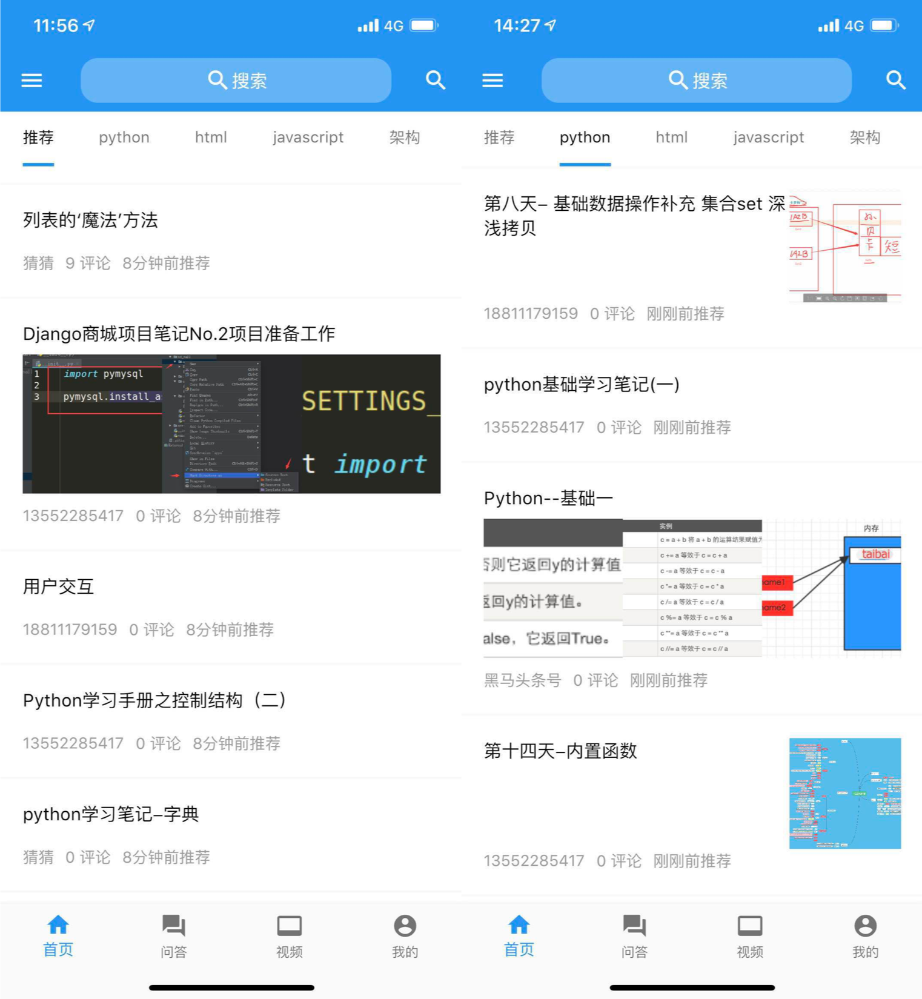

# 1.1 黑马头条推荐业务架构介绍

## 学习目标

- 目标
  - 无
- 应用
  - 无

### 1.1.1业务

- 简介

黑马头条推荐系统建立在头条APP海量用户与海量文章之上，使用lambda大数据实时和离线计算整体架构，利用黑马头条用户在APP上的点击行为、浏览行为、收藏行为等建立用户与文章之间的画像关系，通过机器学习推荐算法进行智能推荐。增加热门文章和新文章的推荐占比，达到千人千面的用户推荐效果。

- 主要推荐场景
  - 首页频道推荐
  - 文章相似结果

### 1.1.2 架构与业务流

* 基础数据层：
  - 包括业务数据和用户行为日志数据。
    - 业务数据主要包含用户数据和文章数据，用户数据即黑马头条注册**用户的基础数据**，文章数据在自媒体平台上传的**文章的基本信息**。
    - **用户行为日志数据**来源于前端埋点
  - 业务批量存储在HDFS上以用作离线分析
  - 日志数据实时流向Kafka以用作实时计算
* 数据处理层：
  - 基础计算：基于离线和实时数据，对各类基础数据计算成用户画像、文章画像
  - 召回与排序
    - **召回环节使用各种算法逻辑从海量的文章中筛选出用户感兴趣的文章候选集合，集合大小：上千级别。排序即对候选集合中的文章进行用户相对的模型结果排序，生成一个排序列表。**
    - 召回
    - 排序
      - 点击率预估模型
      - 特征处理、模型评价
* 推荐业务层：通过对外提供rpc接口来实现推荐业务的接入
  - Feed流推荐：今日推荐场景，用户可以在这些页面中不断下拉刷新

