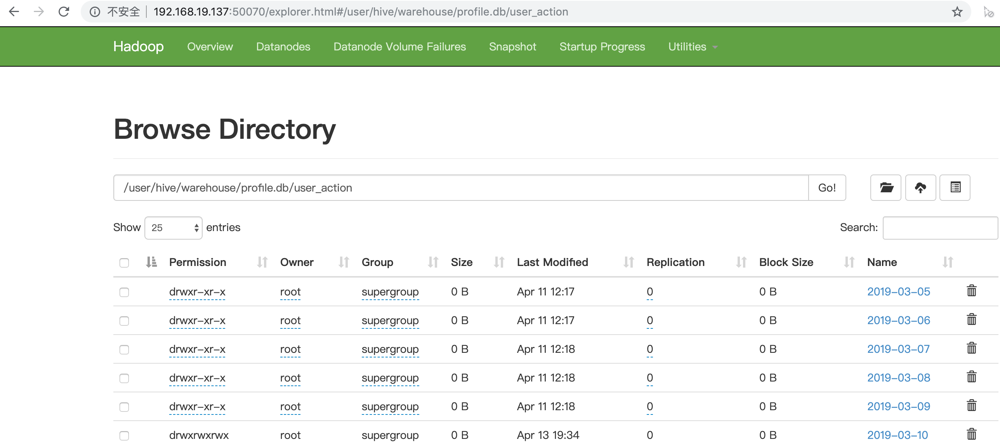
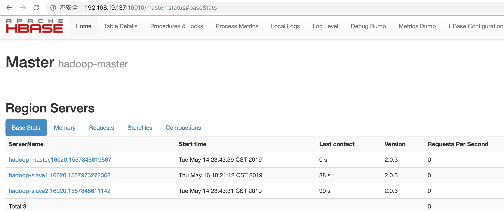
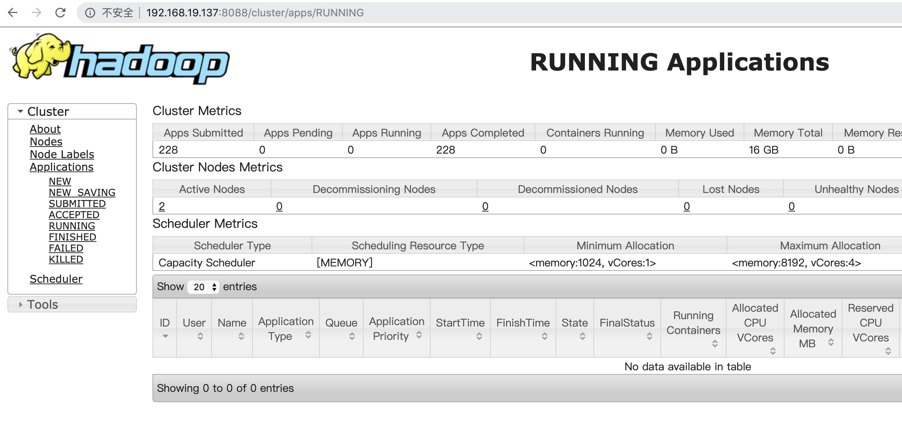

# 1.3 开发环境介绍

## 学习目标

- 目标
  - 了解黑马头条推荐系统基本环境
- 应用
  - 无

### 1.3.1 虚拟机设备

### 单机版环境

* **配置低的，建议大家使用单机版**
* 一台centos hadoop-master， 192.168.19.137

### 分布式环境

**三台虚拟机，觉得硬盘可以，配置可以使用**

分别已配置好装有大数据计算环境，并且相应的数据都已经存在数据库和文件中

* hadoop-master

已经开启hadoop、hbase、spark、hive

```python
20160 Jps
18786 Master
4131 RunJar # hive
17395 ResourceManager
19219 Worker
16757 NameNode
17206 SecondaryNameNode
18683 HRegionServer
8637 ThriftServer # happybase使用
18253 HMaster
18159 HQuorumPeer
```

* hadoop-slave1、hadoop-slave2

开启hadoop、hbase、spark

```python
3857 NodeManager
4290 Worker
4680 Jps
3740 DataNode
3980 HQuorumPeer
4093 HRegionServers
```

默认都打开过了

### 前提：VM虚拟机设置NAT模式，VM虚拟网卡固定好IP不变

* windows修改虚拟机设置去固定centos的IP
* Mac参考：<https://kb.vmware.com/s/article/1026510>

**两种配置当中，都在scripts目录下有一键启动hadoop,hbase,spark的脚本，也有一键关闭hadoop,hbase,spark的脚本**

```python
[root@hadoop-master scripts]# pwd
/root/scripts
[root@hadoop-master scripts]# ls
all.sh  my.cnf  start.sh  stop.sh
[root@hadoop-master scripts]# 
```

如果出现相关启动失败,三台hbase同步下时间：

```
# 时间有误差问题同步一下：
[root@hadoop-master ~]# ntpdate 0.cn.pool.ntp.org
[root@hadoop-slave1 ~]# ntpdate 0.cn.pool.ntp.org
[root@hadoop-slave2 ~]# ntpdate 0.cn.pool.ntp.org

# 然后指定全部关闭
[root@hadoop-master ~]#. stop.sh
# 全部启动
[root@hadoop-master ~]#. start.sh
```

上课之前确定你的本地库都已经启动：

hadoop



hbase



spark




### 1.3.3 python环境

装有anaconda系列虚拟环境即可，在这里先创建一个用于后面项目使用的虚拟环境，centos已提供miniconda2环境

以下环境：都在三台centos中安装

```python
conda create -n reco_sys python=3.6.7

pip install -r requirements.txt --ignore-installed
```

### 开发配置 

pycharm关联连接本地项目与centos项目目录开发，配置如下，添加远程机器的IP和用户名，往后密码以及python环境位置，本地关联远程工程目录


本地项目选定远程环境开发：


